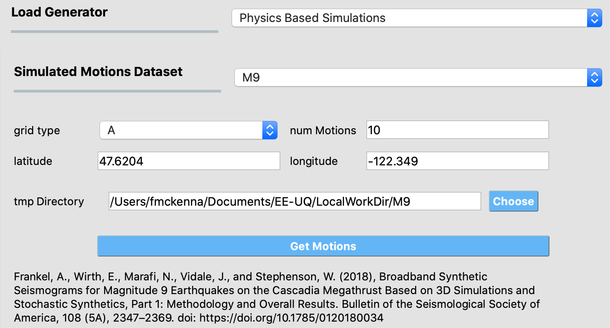

Physics Based Ground Motions
----------------------------

This panel allows users to use the results of previously run physics-based earthquake rupture simulations that generated suites of ground motions for the
areas studied. As more datasets are made available, more options will be added to the options in the pull-down menu.

M9 Dataset
==========

With funding support from the National Science Foundation, the United States Geological Survey and the University of Washington team studying the impacts of large magnitude, megathrust earthquakes on the Cascadia subduction zone as part of the `M9 Project <https://sites.uw.edu/pnet/m9-simulations/about-m9-simulations/>`_ . The researchers used physics-based simulations to generate possible ground motions for the entire Pacific Northwest region during a magnitude-9 (M9) event. Broadband ground motions were developed from these M9 simulations for seven grids (A, B, C, D, E, Y and Z), each corresponding to a particular combination of region and/or `grid resolution <https://sites.uw.edu/pnet/m9-simulations/about-m9-simulations/extent-of-model/>`_. It is these motions developed as part of the `M9 Project <https://sites.uw.edu/pnet/m9-simulations/about-m9-simulations/>`_ that are made available through this option.

With funding support from the National Science Foundation, a United States Geological Survey and University of Washington team studied the impacts of
large magnitude, megathrust earthquakes on the Cascadia subduction zone as part of the `M9 Project <https://sites.uw.edu/pnet/m9-simulations/about-m9-simulations/>`_ . The researchers used physics-based simulations to generate possible ground motions for the entire Pacific Northwest region during a magnitude-9 (M9) event. Broadband ground motions were developed from these M9 simulations for a number of grids (A, B, C, D, E, Y and Z), each corresponding to a particular combination of region and/or `grid resolution <https://sites.uw.edu/pnet/m9-simulations/about-m9-simulations/extent-of-model/>`_. 

.. list-table:: Title
   :widths: 10 30 10 25 25
   :header-rows: 1

   * - Grid
     - Location
     - Grid Spacing
     - Latitude Range
     - Longitude Range
   * - A
     - Pugent Sound
     - 1 km
     - 46.9 to 48.3
     - -123.2 to -121.1
   * - B
     - Entire Area
     - 20 km
     - 40.3 to 48.6
     - -127.7 to -125.4
   * - C
     - Portland, Oregon
     - 1 km
     - 45.2 to 45.9
     - -123.3 to -122.2
   * - D
     - Vancouver, BC
     - 1 km
     - 49.0 to 49.4
     - -123.3 to -122.4
   * - E
     - Victoria, BC
     - 1 km
     - 48.3 to 48.7
     - -123.9 to -123.2

M9 Grids

To use the dataset, the user inputs a number of options: **latitude** and **longitude** being the locations for which the motions are sought, and **numMotions** for the number of motions desired, and the **grid type**.  The location in the user's computer that the motions will be downloaded to is specified by the user in **tmp Directory**, by default it is in the user's **Documents/EE-UQ/LocalWorkDir** directory. 

Once the user has entered the inputs they press the ``Get Motions`` button. This will start the download process in the background. This process is painfully slow, a few minutes per ground motion. While the motions are downloading the user can work on other parts of the interface. If the user attempts to run a simulation before motions are downloaded, pop-ups will appear informing the user that the run should be canceled.

      M9 Interface

.. .. bibliography:: ../../../../references.bib
