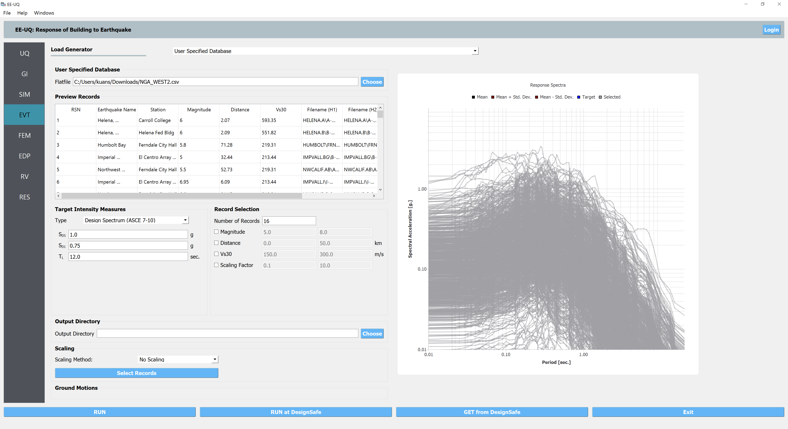
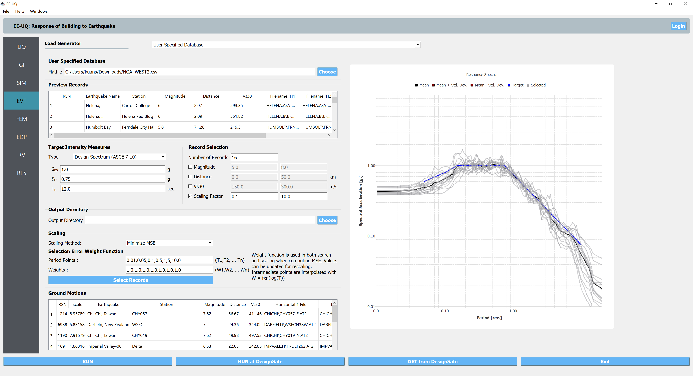

.. lblUSER_SPECIFIED_DATABASE:

User Specified Database
-------------------------

This event allows the user to perform ground motion records selection and scaling using a user-specified flatfile. 
The flatfile should have the minimum required columns as shown in the :download:`example flatfile format <figures/flatfile_format.csv>`. 
Note any missing attributes can be left to 
be empty, if the data are not available for some records. Users can use the **Choose** button to 
load the formatted flatfile. Once the file is successfully loaded, the **Preview Records** table will show the loaded file 
(for up to 1000 records) and the unscaled response spectra will be plotted in the figure panel on the right. 

.. _fig-user-specified-init:

	Preview user-specified ground motion flatfile.

Similar to the **PEER NGA** event panel, the suite of records can be selected from the database to represent the uncertainty in the ground motion. users must enter the following information for this event type:

#. A target response spectrum must be specified by the user to be used for record selection and scaling.
#. The user specifies selection criteria, such as the number of records and optional ranges of earthquake magnitude, distance to rupture (:math:`R_{rup}`), shear wave velocity in the top 30 meters of soil (:math:`V_{s 30}`), and scaling factor.

Once the selection criteria have been entered, the user selects the  **Select Records** button. 
The Application at this point will start selecting a suite of records to minimize the error between the averaged spectrum and the target spectrum. 
After the suite of records is selected from the database, the list of records is shown in tabular form for the user to inspect their information, 
as shown in :numref:`fig-user-specified-res`. Additionally, a plot is generated showing the target spectrum, the average of the selected suite of records and the selected scaled ground motion spectra. 
Users can also highlight particular spectra on the plot by selecting one or more records in the table provided. This enables the user to inspect the suite of records used to characterize the ground motions before running the building simulation.

.. _fig-user-specified-res:

	Ground motion selection results.

.. note::

   Record selection is always done to minimize the mean square error between the target spectrum and the selected scaled spectrum. It is also important to note that the current version allows the user to specify the ASCE 7-10 design spectrum, a user-provided target spectrum or a target spectrum obtained from seismic hazard analysis, such as the uniform hazard spectrum (UHS) as the target spectrum. Future releases will also add the option for using the conditional mean spectrum (CMS) and conditional spectrum (CS).

.. note::

   It is important to note that this event is more geared toward advanced users, so it does not require a PEER NGA West 2 account. As the record selection is conducted based on the user-specified flatfile, the selected records may not be available via 
   PEER NGA West data. In the meantime, users could specify the **Output Director** to save the selection results (information about selected records) and are responsible for preparing time history traces for them.

.. note::

   The record-to-record uncertainty in assessing the structural responses under earthquakes is taken into account by running 
   a set of ground motion records. This can be realized by using the **Forward Propagation** method under the **UQ** tab. Once the 
   ground motion records are selected, users have control of how many records to be run in the time history analyses by selecting 
   the Latin Hypercube Sample (**LHS**) and specifying the number of samples (**# Sample**). Note that with the LHS algorithm, when 
   the number of samples is the total number of selected records, each record will be used once in the time history analyses.  
