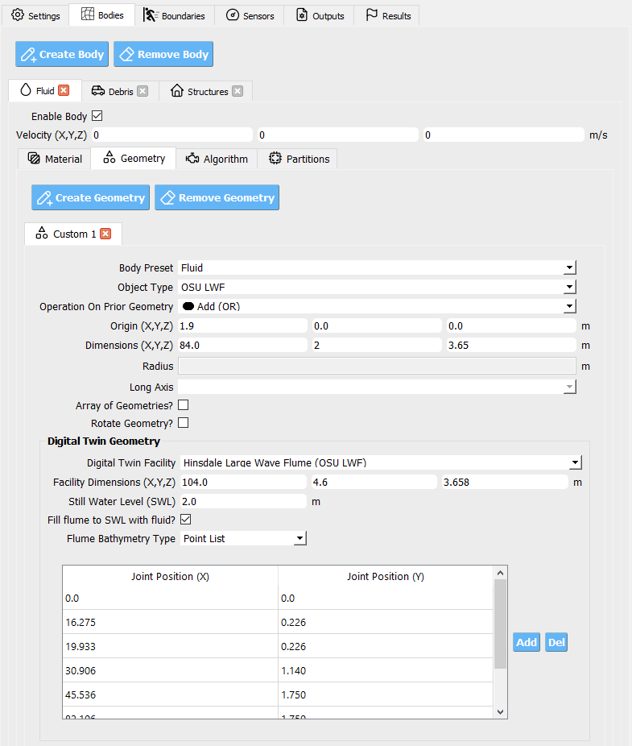
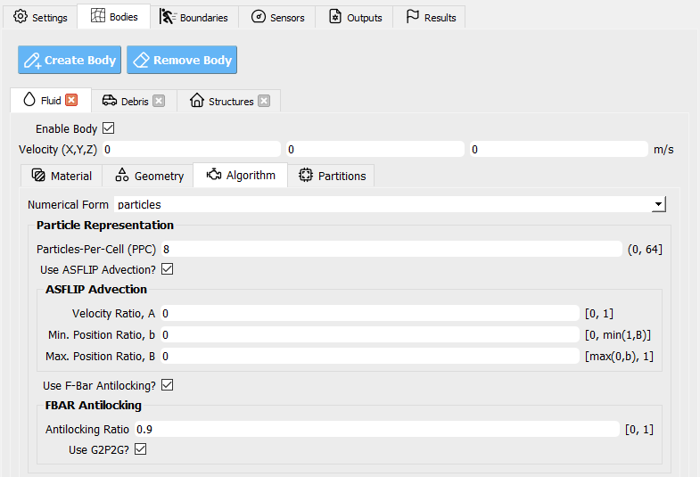
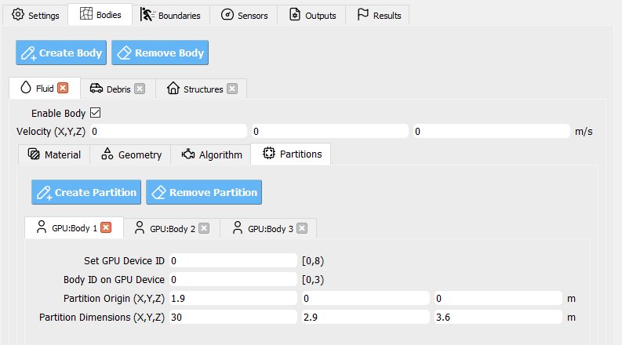

.. _lbl-BodiesMPM:

======
Bodies
======

Bodies are any physical object that is not represented as a boundary condition.
They can be water, debris, structures, etc., but not, for instance, a moving
velocity boundary condition.

This section discusses the setup of bodies in the model.

.. contents::
   :local:
   :backlinks: none

.. include:: MaterialMPM.rst

.. _lbl-GeometriesMPM:

----------
Geometries
----------

**Geometries** is a collection of geometry tabs which you can **add** and **delete**
using the corresponding buttons. 

Each geometry is defined by an **object**
(e.g., *box*, *sphere*, …) and object-specific parameters for **position** and
**size**. When defining each geometry, you also select an **operation** that
**composes it in order** with the previously listed geometry tabs:

- **Add** — union with the current aggregate
- **Subtract** — remove this shape from the aggregate
- **Intersection** — keep only the overlap with the aggregate
- **Difference** — boolean difference (variant of subtract, if provided)

.. tip::
   Use small, simple primitives first, then refine with additional tabs. The
   final geometry is the **ordered composition** of all rows in the list.

.. note::
   If two tabs produce unexpected results, check their **order**, **coordinate
   frames**, and **dimensions**. Composition is **order-dependent**.

.. _lbl-AlgorithmMPM:

---------
Algorithm
---------

This advanced panel selects the numerical options used to simulate the material
body.

.. list-table::
   :header-rows: 1
   :widths: 26 58 16

   * - Setting
     - What it does
     - Guidance
   * - **F-Bar Antilocking**
     - Relieves **volumetric locking** artifacts in MPM to improve near-incompressible
       behavior and stress accuracy.
     - Enable for materials prone to locking; verify stability.
   * - **ASFLIP**
     - **Affine Separable FLIP** advection scheme that reduces grid–particle transfer
       null-space errors, typically lowering artificial damping and improving
       debris–debris contact behavior.
     - Often beneficial for highly dynamic flows.
   * - **PPC (Particles-Per-Cell)**
     - Sets the **number of particles** sampled per grid cell at body creation.
     - Higher PPC → better resolution but higher cost.

.. important::
   These options target expert users. Changing them can materially affect
   **stability**, **accuracy**, and **performance**. Prefer defaults unless you
   have validation data or a clear need.

.. tip::
   If you increase **PPC**, consider refining the **grid-cell size** and revisiting
   **time-step** limits (CFL) to maintain stability and accuracy.

.. _lbl-PartitionsMPM:

----------
Partitions
----------

This is an advanced configuration used to **distribute a body** across available
hardware partitions (e.g., GPUs or compute nodes) for parallel computation.

- Define a **set of partitions**; each partition is assigned a **Model ID** and a
  **GPU/Device ID**, allowing multiple bodies per device if desired.
- Each partition specifies a **spatial domain** that constrains where particles
  for this body may be generated or migrated.
- The **union** of all partitions should reconstruct the **full body** without
  gaps; optional overlaps can improve load transitions (if supported).

.. warning::
   Misaligned or disjoint domains can cause missing particles or load imbalance.
   Verify that partitions **cover the full body** and align with the global grid.

.. tip::
   Partition optimization can significantly improve **load balancing** and
   **throughput**. Start with a single partition per device, inspect utilization,
   then refine domains to equalize work across devices.

.. note::
   Major changes here are recommended only for users familiar with the target
   cluster’s hardware and scheduling behavior.