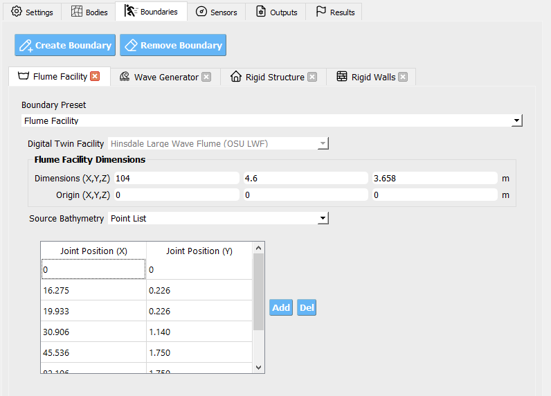
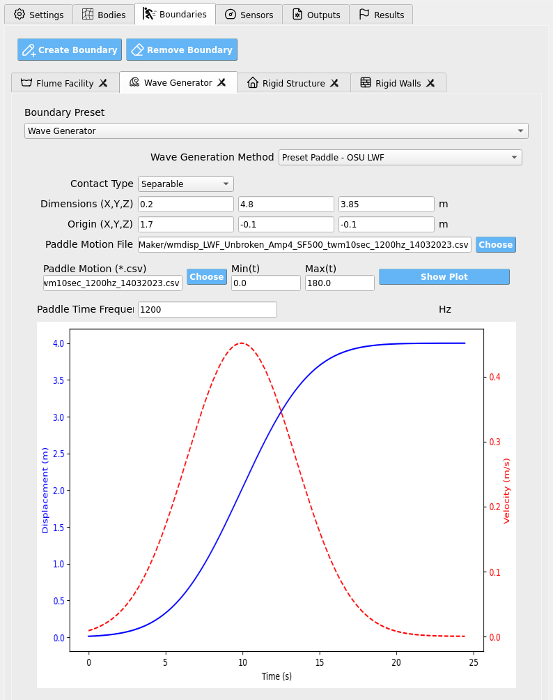
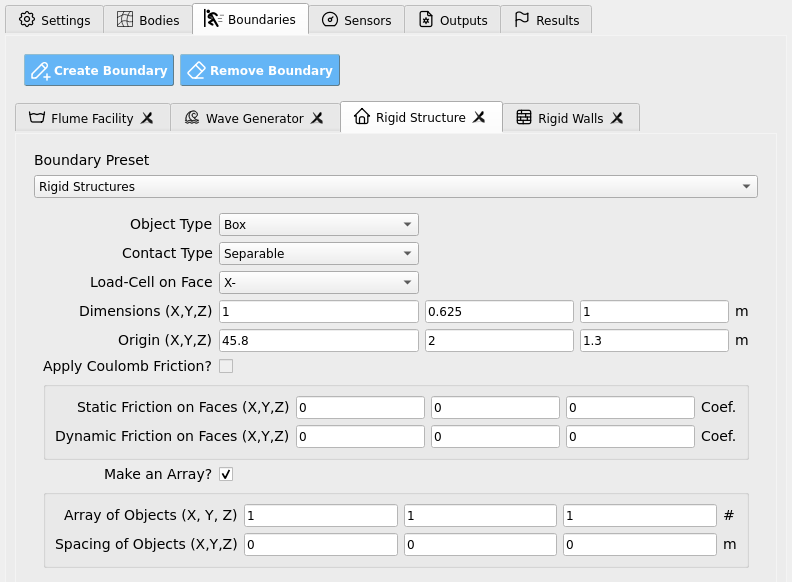
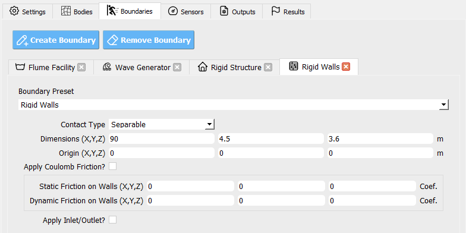

.. _lbl-BoundariesMPM:

========================
Boundaries
========================

Use the **Boundaries** tab to define the walls, structures, wave-makers, and other
facility elements that interact with the material points. Each boundary has a
**type**, **contact behavior**, **geometry**, **temporal activation window**, and optional
**motion**.

.. contents::
   :local:
   :depth: 2

---------------------------
Default Boundary Entities
---------------------------

The GUI provides four preconfigured entities to streamline setup:

- **Flume Facility**  
  Defines the overall flume geometry (e.g., optional bathymetry ramps,
  and surface friction). Presets are provided for supported physical facilities.

- **Wave Generator**  
  Configures the mechanism that produces waves (e.g., piston-style wave maker or
  a velocity boundary condition). Presets match each example facility.

- **Rigid Structure**  
  Adds an immovable body (commonly a rectangular prism) representing a test
  specimen. In the :ref:`Sensors <lbl-SensorsMPM>` tab you may attach load cells to
  map forces to structural models (e.g., OpenSees).

- **Rigid Walls**  
  Sets the computational domain's enclosing box (the “tank” or “room” the
  simulation runs in).

.. tip::
   Start from these defaults and refine parameters rather than building each
   boundary from scratch.

----------------
Boundary Types
----------------

Common types include **Walls**, **Box**, **Sphere**, **Cylinder**, and **Plane**, along with facility-specific
presets (e.g., **OSU_LWF_RAMP**, **OSU_LWF_PADDLE**, **USGS_RAMP**, **USGS_GATE**,
**OSU_TWB_RAMP**, **OSU_TWB_PADDLE**, **WASIRF_PUMP**, **TOKYO_HARBOR**, and a
**velocity boundary** type). Facility-prefixed types correspond to digital-twin
geometries and motions tailored to specific labs.

.. note::
   Some types expose **friction** fields, others intentionally hide them. If a
   parameter does not appear for a chosen type, it is not applicable.

----------------------
Contact & Friction
----------------------

**Contact** controls how material points interact with a boundary surface:

- **Sticky** — No slip at the interface (points adhere to the surface).
- **Slip** — Tangential slip allowed; normal penetration prevented.
- **Separable** — Interface can separate (no tension transfer), with optional
  tangential slip.

**Friction** (when available):

- **Static friction coefficient** — Onset threshold for sliding (≥ 0).
- **Dynamic friction coefficient** — Sliding resistance once motion begins (≥ 0).

.. important::
   Use **Slip** with low friction for hydraulically smooth walls, **Sticky** to
   anchor material to moving parts (e.g., a paddle), and **Separable** where
   loss of contact is physically expected (lift-off, cavitation zones, etc.).

.. warning::
   Excessively large friction can cause artificial sticking and nonphysical force
   spikes; start modestly and calibrate.

------------------------
Geometry & Extents
------------------------

Define where a boundary exists in space:

- **Domain Start** — The corner/point **nearest the origin**.
- **Domain End** — The opposite corner/point **farthest from the origin**.

These two vectors bound the region where the boundary acts (e.g., the size and
placement of a wall, paddle track, or structure).

.. tip::
   Ensure each component of **Domain End** is greater than the corresponding
   **Domain Start** component to produce a positive-size region.

-------------------------
Activation Window (Time)
-------------------------

Control when a boundary is active by specifying two times:

- **Start time** — When the boundary appears/enables.
- **End time** — When the boundary disappears/disables.

This is useful for staged motions (e.g., start the paddle after still-water
settling, or retract a gate at a given time).

----------------
Motion Options
----------------

Some boundaries can move or impose velocities.

- **Constant Velocity** — A vector speed applied continuously (e.g., a uniform
  inflow/outflow or translating plane).

- **Motion File** — A CSV time series driving a moving boundary (e.g., a piston wave maker). The file contains rows of:
  - **Time** (s)
  - **Velocity along the actuation axis** (m/s; typically **X** by default)
  - **Position along the actuation axis** (m; measured relative to the boundary's local origin between your Domain Start/End)

  Use **Sampling Frequency** to indicate the data rate (Hz). Intermediate samples are interpreted at fixed increments of the frequency's inverse.

.. note::
   The motion file's **position** should be consistent with the chosen **Domain**
   orientation. Keep your sign convention and axis alignment consistent across
   all boundaries.

-----------------------
Parameter Reference
-----------------------

.. list-table::
   :header-rows: 1
   :widths: 24 56 20

   * - Parameter
     - What it controls
     - Units / Notes
   * - **Type**
     - Boundary geometry/preset (e.g., Wall, Plane, Facility-specific paddle/ramp, velocity boundary).
     - Choose from the GUI list.
   * - **Contact**
     - Interface behavior: **Sticky**, **Slip**, or **Separable**.
     - Affects tangential slip and normal separation.
   * - **Static Friction**
     - Sliding onset threshold when contact is engaged.
     - ≥ 0; shown only for applicable types.
   * - **Dynamic Friction**
     - Resistance during sliding motion.
     - ≥ 0; shown only for applicable types.
   * - **Active Time (Start, End)**
     - Enables/disables the boundary between two times.
     - Seconds
   * - **Domain Start**
     - Lower/near corner of the boundary's extent.
     - Meters
   * - **Domain End**
     - Upper/far corner of the boundary's extent.
     - Meters (must exceed Start per component)
   * - **Constant Velocity**
     - Prescribed velocity vector (if supported).
     - m/s
   * - **Motion File**
     - CSV with time, velocity (axis), and position (axis).
     - Axis typically **X**; relative to local domain.
   * - **Sampling Frequency**
     - Data rate for interpreting motion file samples.
     - Hz

-----------------------
Best-Practice Workflow
-----------------------

1. **Pick a type** that matches the physical element (facility preset for flumes,
   **Plane**/**Wall** for simple boundaries, **velocity boundary** for inflow/outflow).
2. Set **Domain Start/End** to place and size it correctly.
3. Choose **Contact** consistent with physics; add **friction** only where
   supported/needed.
4. Define **Active Time** so motions begin after initial transients settle.
5. For moving boundaries, use a clean **Motion File** with proper sampling and
   axis alignment, or a **Constant Velocity** when appropriate.
6. Validate with quick, short runs (coarse grid, short duration) and inspect
   force/velocity responses before scaling up.

.. warning::
   Misaligned domains or inverted extents will yield missing or misapplied
   boundaries. If a boundary appears to have no effect, first verify **Domain**
   coordinates, **activation times**, and **contact** settings.
