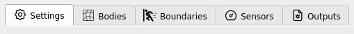

.. _lblEVT-MPM:

=====================
Material Point Method
=====================

The ``MPM`` event option is used to set the flow parameters related to the water-borne hazard event. This can either be a coupling between the shallow-water and MPM solver or using the ClaymoreUW MPM solver alone. The steps of the setup process for the event have been kept nearly similar to that often used in the Finite Element Method to make it easier for researchers from structural engineering background to easily use this application. This includes ``SettingsMPM`` >> ``BodiesMPM`` >> ``BoundariesMPM`` >> ``SensorsMPM`` >> ``OutputsMPM``. Figure :numref:`HydroSteps_MPM` shows the steps as selectable tab-pages in the GUI.

.. _EVTSettings_MPM:

   The steps involved in setup of the ``Hydro`` event

Each of the above steps in the setup process is documented in detail in respective sections below:

.. toctree::
   :maxdepth: 2
   

   SettingsMPM
   BodiesMPM
   BoundariesMPM
   SensorsMPM
   OutputsMPM
