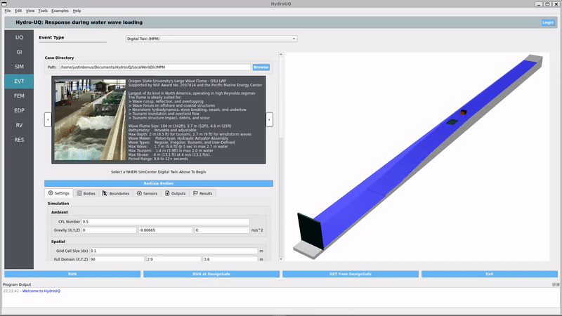

.. _lblEVT-MPM:

Material Point Method
---------------------

The ``MPM`` event option is used to set the parameters related to the water-borne hazard event using the ClaymoreUW Material Point Method solver. This module, in essence, serves the sole purpose of determining a loading time-series due to the hydrodynamic event. As a side-effect, it also produces information rich numerical simulation files for more advanced analysis extraneous to the minimum requirements of the SimCenter workflow. 

   The Hydro-UQ app user interface, with the EVT panel selected. The numerical solver shown is the MPM solver.

The steps of the setup process for the event have been kept similar to that often used in the Finite Element Method's many software iterations to make it easier for researchers from common engineering backgrounds to easily use this application. This includes the primary categories of ``Settings`` >> ``Bodies`` >> ``Boundaries`` >> ``Sensors`` >> ``Outputs``. Figure :numref:`HydroSteps_MPM` shows the steps as selectable tab-pages in the GUI.

.. _EVTSettings_MPM:

.. figure:: figures/HydroSteps_MPM.png
   :align: center
   :figclass: align-center

   The steps involved in setup of the ``Hydro`` event

Basic Documentation
~~~~~~~~~~~~~~~~~~~

Each of the above steps in the setup process is documented in basic detail in respective sections below:

.. toctree::
   :maxdepth: 1
   

   SettingsMPM
   BodiesMPM
   BoundariesMPM
   SensorsMPM
   OutputsMPM

Detailed Documentation
~~~~~~~~~~~~~~~~~~~~~~~

For a highly-detailed break-down of each parameter and the underlying concepts behind the ClaymoreUW schema / JSON file input configuration, please download the full ClaymoreUW documentation at: :download:`ClaymoreUW User-Guide <ClaymoreUW_UserGuide.pdf>`

You may also view the embedded documentation below on supporting browsers:

.. only:: html

   .. raw:: html

      <iframe
        src="ClaymoreUW_UserGuide.pdf#view=FitH"
        style="width:100%; height:700px; border:1px solid #ddd;"
        loading="lazy">
      </iframe>