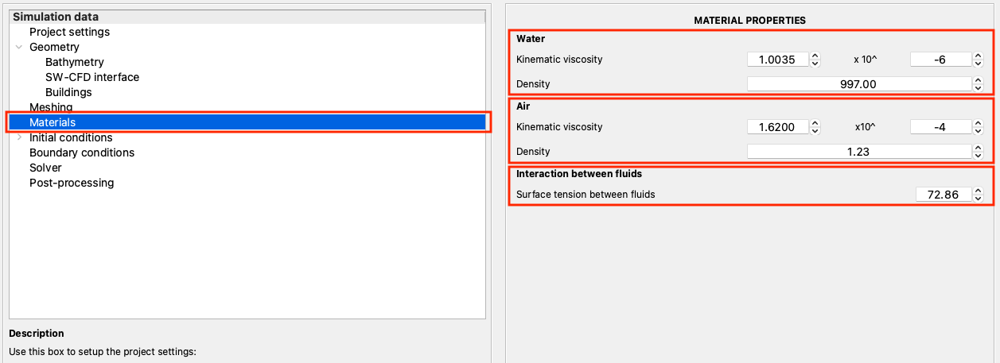

.. _lbl-materials:

***********************************************
Materials
***********************************************

The |app| is set up for multiphase flow simulations using the volume of fluid method. The materials window can be activated by selecting the option from the left panel as shown in :numref:`Material`.

.. _Material:

   Materials settings panel available in ``EVT``

The primary material inputs include:

#. Kinematic viscosity for the two fluids (here, water and air)
#. The density of the two fluids (here, water and air)
#. Surface tension between the two fluids (here, water and air)