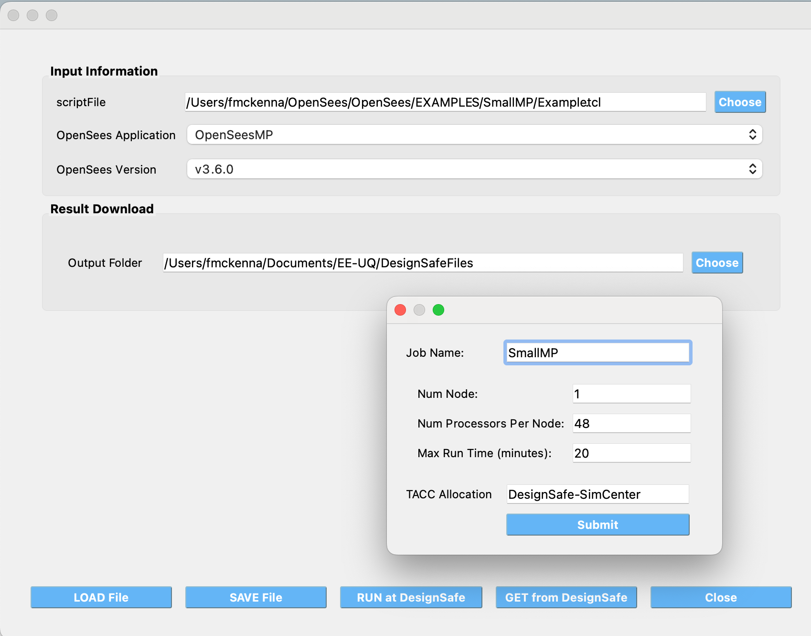

.. _OpenSeesTool:

OpenSees@DesignSafe Tool
------------------------

This tool allows users to submit **OpenSees**, **OpenSeesSP**, **OpenSeesMP**, and **OpenSeesPy** scripts to 
** `TACC <https://tacc.utexas.edu/>`_ ** to be run on some of the most powerful HPC computers in the
world. The only requirement for users is that they have a ** `DesignSafe <https://www.designsafe-ci.org/>`_ **
account and an allocation at TACC, which can be obtained by `submitting a ticket to 
DesignSafe <https://www.designsafe-ci.org/help/new-ticket/>`_ requesting HPC access
to ** `Frontera <https://tacc.utexas.edu/systems/frontera/>`_ ** and ** `Stampede3 <https://tacc.utexas.edu/systems/stampede3/>`_ **.

As shown in the figure below, the user provides a memorable job name, the input script to run, the application 
to use, and its version. When the user selects the **Run at DesignSafe** button, additional inputs are
requested, such as the number of nodes, the number of processors per node, the maximum runtime in minutes, and the allocation to use.

   OpenSees@DesignSafe Tool

After pressing the **Submit** button, the tool will zip the folder containing the script and, using Tapis,
create a folder in your DesignSafe DataDepot account. The zipped file will be sent to this folder, and a
**simcenter-opensees** job will be submitted to run with this folder and the selected application. Once the
job is complete, the contents of the folder, now containing output files, will be zipped again and stored in
DesignSafe for you.

To check the status of the submitted job and download the final folder, click the **Get from DesignSafe**
button. A table will appear, showing the status of all submitted jobs. By right-clicking on any job in the
table, a menu will appear with the option to **Retrieve Data**. If this option is selected, the zipped
folder will be retrieved, unzipped, and the contents will be placed in the currently specified
**Output Folder**.

.. caution::
   
   Gotcha's to running OpenSees scripts at DesignSafe
      Given how this application runs, or any DesignSafe OpenSees offering, the script you run can only reference files in it's current directory or directories below the current. Nor can the script save files outside of these locations. 

.. note::

   ** 1. Which version of OpenSeesPy is run? **
   
   The version run depends on your setup on the TACC HPC machine. All the tool does is run **python3** in your working environment. What is run as a consequence is the first python3 application found on your path.

   ** 2. Why run OpenSees Jobs utilzing this application at DesignSafe? **
   
      1. DesignSafe is providing access to some of the fastest HPC computers in the world, you can run for example OpenSeesMP jobs that utilize thousands of processors.
	 
      2. You can be running multiple jobs at the same time, though here is a limit to how many you can have runing at once!
	 
      3. The resulting folder containing your scripts is stored at DesignSafe. You can get that data. assuming you gave them a memorable job name, for jobs that ran today, yesterday, last week, last month, last year, ...
	 

   ** 3. Why this tool and not submit through DesignSafe Workspace OpenSees offerings? **
   
      It's simply the quickest way of getting the files to DesignSafe and submitting the job!

    

   
