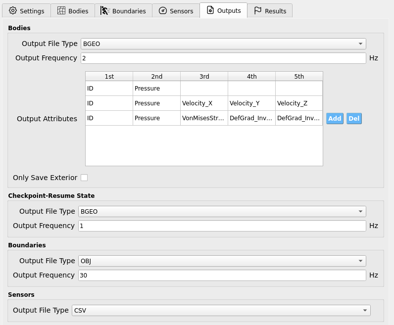

.. _lbl-OutputsMPM:

=====================
Outputs
=====================

The **Outputs** tab collects simulation results that are **not** controlled by
individual Sensors. Here you choose file formats, sampling rates, and (legacy)
checkpoint/resume behavior.

.. contents::
   :local:
   :depth: 2

-------
Bodies
-------

Controls per-frame output for material **bodies** defined in :ref:`lbl-BodiesMPM`.

.. list-table::
   :header-rows: 1
   :widths: 26 54 20

   * - Setting
     - What it does
     - Notes
   * - **Output File Type**
     - Select the geometry cache format for body snapshots.
     - **BGEO** or **GEO** (viewable in **SideFX Houdini**; Apprentice edition is free).
   * - **Output Frequency (Hz)**
     - How often body frames are written.
     - ``1 Hz`` → one frame per simulated second.
   * - **Only Save Exterior**
     - If checked, writes only particles near the body **surface**.
     - Reduces disk/I/O at the cost of **losing interior data**.

.. warning::
   **Only Save Exterior** removes interior state permanently from the saved frames.
   Leave **unchecked** unless you are certain you only need surface data.

Output Attributes (per body)
============================

This table appears inside the **Bodies** widget:

- Each **row** corresponds to a body from :ref:`lbl-BodiesMPM` **in exact order**.
- Each **cell** holds an attribute name to record **per particle** on that body
  (e.g., ``Pressure``, ``Velocity_X``, ``ID``, …).

.. tip::
   Keep the table synchronized with your body list. If you reorder or add/remove
   bodies, revisit **Output Attributes** to ensure rows still match the intended
   body.

-------------------------
Checkpoint-Resume State
-------------------------

**Deprecated (pending fixes).** Allows periodic snapshots for restart.

.. list-table::
   :header-rows: 1
   :widths: 28 52 20

   * - Setting
     - What it does
     - Notes
   * - **Output File Type**
     - Format for checkpoint files.
     - **BGEO** or **GEO**
   * - **Output Frequency (Hz)**
     - How often checkpoints are written.
     - Use a **low** rate to limit disk churn.

.. warning::
   This feature is currently **deprecated**. Parameters are exposed for forward
   compatibility, but checkpointing may be disabled or unstable in this version.

-----------
Boundaries
-----------

Controls export of **boundary** geometry defined in :ref:`lbl-BoundariesMPM`.

.. list-table::
   :header-rows: 1
   :widths: 28 52 20

   * - Setting
     - What it does
     - Notes
   * - **Output File Type**
     - File format for boundary exports.
     - **OBJ** (currently the only option)
   * - **Output Frequency (Hz)**
     - Sampling rate for boundary output.
     - Match to how often you need boundary motion snapshots.

--------
Sensors
--------

Controls the file format for **sensor** time series defined in :ref:`lbl-SensorsMPM`.

.. list-table::
   :header-rows: 1
   :widths: 28 52 20

   * - Setting
     - What it does
     - Notes
   * - **Output File Type**
     - Choose the tabular format for sensor outputs.
     - **CSV** or **TXT**

.. note::
   The **sampling rate** of sensor outputs is set in the **Sensors** tab per
   sensor group (e.g., wave-gauges, load-cells). The **file type here** only
   selects the on-disk format.

--------
Energies
--------

Exports global energy diagnostics.

.. list-table::
   :header-rows: 1
   :widths: 26 50 24

   * - Setting
     - What it does
     - Notes
   * - **Output File Type**
     - Select the tabular format.
     - **CSV** or **TXT**
   * - **Output Frequency (Hz)**
     - How often energy samples are written.
     - Choose based on how quickly energies vary.
   * - **Output Kinetic?**
     - Toggle export of **kinetic** energy.
     - On/Off
   * - **Output Gravity?**
     - Toggle export of **gravitational potential** energy.
     - Datum is **Y = 0** (vertical zero level).
   * - **Output Strain?**
     - Toggle export of **elastic strain** energy.
     - On/Off

----------------------
Best-Practice Guidance
----------------------

- Start with **Bodies Output = 1-5 Hz** for interactive review; increase only if
  motion details are being aliased, at which point **24-60 Hz** may be appropriate for typical animations.
- Prefer **BGEO** when using Houdini-based post-processing pipelines.
- Keep **sensor sampling** aligned with the **instrument rates** you're replicating;
  don't oversample unless you truly need the bandwidth.
- Use **Only Save Exterior** for very large free-surface runs where interior data
  is unnecessary, and monitor disk usage.
- For **Boundaries**, match output frequency to the **fastest motion** of interest
  (e.g., wave-maker strokes) to avoid temporal aliasing.