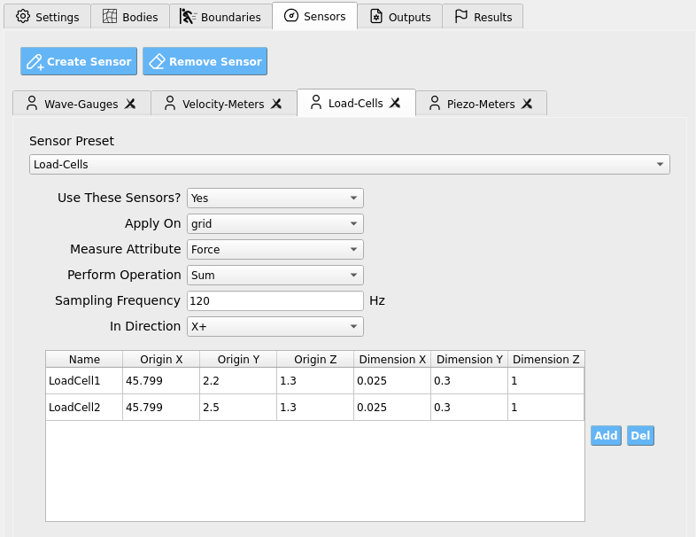

.. _lbl-SensorsMPM:

=====================
Sensors
=====================

**Sensors** measure physical quantities (force, pressure, position, velocity, etc.)
during a simulation. Conceptually, a sensor maps the evolving solver **state within
a specified spatial domain** to a **scalar** value. Sensors apply
a **reduction operation** (e.g., Max, Average, Sum) over all particles or grid-nodes
inside their domain.

The GUI provides four predefined sensor groups (you may add custom ones as needed):

- A **wave-gauge**: a slender vertical column that records particle **vertical position**
  and outputs the **Max** value → approximates free-surface elevation.
- A **velocimeter**: averages particle or grid-node **velocity** within its domain.
- A **load-cell**: sums **force** contributions on a rigid boundary in a chosen direction.
- A **piezometer**: averages particle **pressure** within its domain.

.. contents::
   :local:
   :depth: 2

-----------------------
Global Sensor Controls
-----------------------

These controls appear for each sensor group.

.. list-table::
   :header-rows: 1
   :widths: 24 56 20

   * - Setting
     - What it does
     - Notes
   * - **Use These Sensors?**
     - Enables/disables the entire sensor group.
     - Toggle **Yes/No**.
   * - **Apply On**
     - Chooses the numerical entity to sample.
     - **Particles** or **Grid-Nodes**. *(Load-cells typically use grid-nodes; gauges/piezometers often use particles.)*
   * - **Measure Attribute**
     - Selects the field to record from each entity.
     - e.g., ``Velocity_X``, ``Position_Y``, ``Pressure``, ``Force`` …
   * - **Perform Operation**
     - Reduction/aggregation over all sampled entities.
     - **Max**, **Min**, **Sum**, **Average**, **Count**.
   * - **Sampling Frequency**
     - How often to record (Hz).
     - ``1 Hz`` → one sample per simulated second.
   * - **In Direction**
     - For vector quantities, restrict/resolve to a direction.
     - e.g., **X+**, **X-**, **Y+**, **Y-**, **Z+**, **Z-**.

.. tip::
   Match **Sampling Frequency** to the physical device you are emulating (e.g.,
   wave-gauge or load-cell). Typical lab instrumentation ranges from a few Hz
   to hundreds of Hz.

.. warning::
   Extremely high sampling (e.g., ``100000 Hz``) can create **I/O bottlenecks**
   and slow the simulation substantially.

------------------------------
Sensor Geometry (Per-Row Table)
------------------------------

At the bottom of the tab, a table defines individual sensor volumes for the group.
Add or delete rows to create/remove sensors.

.. list-table::
   :header-rows: 1
   :widths: 20 13 13 13 13 13 13

   * - Column
     - Name
     - Origin X
     - Origin Y
     - Origin Z
     - Dimension X
     - Dimension Y
     - Dimension Z
   * - Meaning
     - Sensor name for organizational purposes
     - X of the sensor **origin**
     - Y of the sensor **origin**
     - Z of the sensor **origin**
     - Sensor box **size** in X
     - Sensor box **size** in Y
     - Sensor box **size** in Z

- **Origin** defines one corner of an axis-aligned box.
- **Dimensions** define the extent from that origin in each axis.

.. note::
   Create a **slender vertical box** for wave-gauges (small X/Z, tall Y). For
   velocimeters/piezometers, use a volume that represents the region of interest.
   For load-cells, align sensor boxes with the **face** of the rigid structure
   and use **In Direction** to select the face-normal.

.. important::
   For **Load-Cells**, ensure the number of rows (sensors) **matches the number of
   mappable OpenSees nodes** so the SimCenter workflow can correctly map force
   histories from ClaymoreUW to your structural model.

-----------------------
Recommended Setups
-----------------------

**Wave-Gauge (free surface proxy)**:
- Apply On: **Particles**
- Measure Attribute: **Position_Y**
- Perform Operation: **Max**
- Geometry: slender vertical column spanning expected water depth.

**Velocimeter**:
- Apply On: **Particles** *(or Grid-Nodes, depending on need)*
- Measure Attribute: **Velocity_[X|Y|Z]**
- Perform Operation: **Average**
- Geometry: small box centered where you want the velocity sample.

**Load-Cell (structure face)**:
- Apply On: **Grid-Nodes**
- Measure Attribute: **Force**
- Perform Operation: **Sum**
- In Direction: face normal (e.g., **X+** toward the structure)
- Geometry: thin box coincident with the structure’s wetted face.

**Piezometer**:
- Apply On: **Particles**
- Measure Attribute: **Pressure**
- Perform Operation: **Average**
- Geometry: vertical column or small volume near the point of interest.

----------------------
Best-Practice Guidance
----------------------

- **Axis alignment**: Align sensor boxes with expected flow/structure features to
  reduce ambiguity in direction selection.
- **Direction choice**: For vector fields (e.g., Force, Velocity), choose **In Direction**
  to isolate the physically relevant component (e.g., normal-to-face load).
- **Resolution vs. cost**: Many small sensors cost more to evaluate than a few well-placed
  ones at the same sampling rate; start minimal and refine.
- **Validation passes**: Begin with moderate sampling (e.g., 10-60 Hz) and adjust
  after inspecting spectra and peak capture.
- **Consistency with scaling**: If using similitude scaling elsewhere, remember
  sensor outputs report in the **current (scaled) unit system**.

.. warning::
   If a load-cell time history shows unexpected signs or magnitudes, verify:
   (1) the sensor box resides exactly on the **intended face**,  
   (2) **In Direction** matches the **face normal**, and  
   (3) structure/sensor alignment did not change during motion.