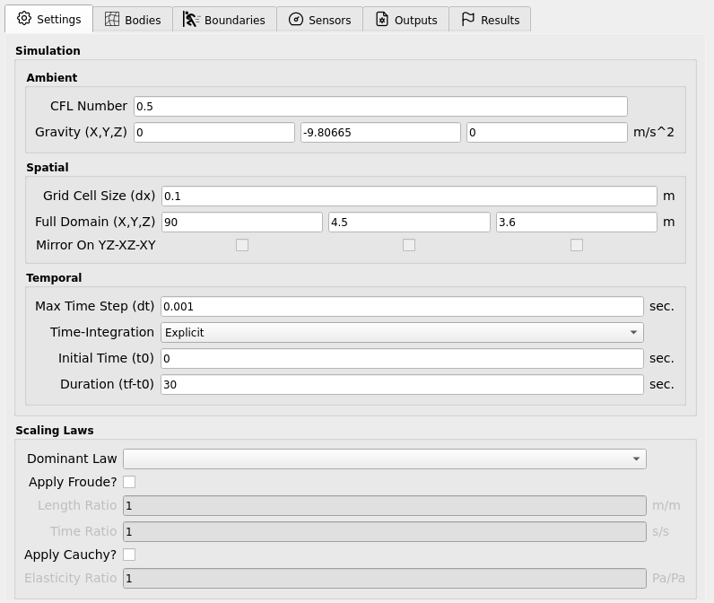

.. _lbl-SettingsMPM:

====================
Settings
====================

Global (solver-wide) settings for **ClaymoreUW** that are **not** specific to any
body, boundary, or sensor are collected here. They are grouped into:

- **Simulation Settings** (Ambient, Spatial, Temporal)
- **Scaling Settings**
- **Computer Settings (Deprecated)**

.. contents::
   :local:
   :depth: 2

-------------------
Simulation Settings
-------------------

General solver controls that govern stability, accuracy, and runtime.

Ambient
=======

Parameters that ambiently affect the entire simulation (not tied to space/time
discretization).

.. list-table::
   :header-rows: 1
   :widths: 24 60 16

   * - Parameter
     - Description
     - Typical / Notes
   * - **CFL Number**
     - Courant–Friedrichs–Lewy stability number used by the material models to
       compute a stable time step.
     - Keep in **0.3–0.5** for robust runs.
   * - **Gravity** (vector)
     - Uniform acceleration applied globally.
     - Example: ``[0, -9.80665, 0]`` (m/s²)

.. important::
   A lower CFL yields more conservative (smaller) time steps → **more stable** but
   **slower**. A higher CFL approaches the stability limit and risks divergence.

Spatial
=======

Parameters defining the computational grid and domain.

.. list-table::
   :header-rows: 1
   :widths: 24 60 16

   * - Parameter
     - Description
     - Typical / Notes
   * - **Grid-Cell Size (dx)**
     - MPM background grid spacing. Directly impacts accuracy and cost
       (smaller ``dx`` → more cells/steps).
     - Choose to adequately resolve features of interest.
   * - **Domain** (vector / bbox)
     - Bounding box of the computational domain (full extent).
     - Ensure all bodies and boundary motions remain inside for full duration.
   * - **Mirror** *(Deprecated)*
     - Legacy symmetry mirroring across coordinate planes for efficiency.
     - Avoid for new studies.

.. note::
   As you **refine** ``dx``, you must also reduce the stable time step due to the
   CFL condition. Expect runtime to increase superlinearly with refinement.

Temporal
========

Parameters controlling the simulation clock and integration.

.. list-table::
   :header-rows: 1
   :widths: 24 60 16

   * - Parameter
     - Description
     - Typical / Notes
   * - **Max Time Step (dt)**
     - Upper bound on the time step. The **effective step is computed**
       by the material models from the CFL and material stiffness; the solver
       uses the **minimum** of this value and the CFL-based step.
     - Acts as a safety cap; do **not** set above the stable CFL step.
   * - **Time-Integration**
     - Currently **explicit** scheme.
     - Implicit not yet available.
   * - **Initial Time (t0)**
     - Time datum (start time).
     - Usually ``0``.
   * - **Duration (tf - t0)**
     - Total simulated time to run.
     - Pick long enough to capture the full response.

.. tip::
   A practical rule of thumb is  
   ``Δt_effective ≤ CFL * dx / c_max``  
   where ``c_max`` is the problem’s max wave/signal speed (material dependent).
   Keep **CFL ≤ 0.5** for headroom.

----------------
Scaling Settings
----------------

Controls to enforce similitude when mapping between model-scale and prototype-scale.

.. list-table::
   :header-rows: 1
   :widths: 26 58 16

   * - Setting
     - Description
     - Notes
   * - **Dominant Law**
     - Choose **Froude** or **Cauchy** similitude as the governing scaling law.
     - Determines which primary ratios you specify.
   * - **Froude** inputs
     - Provide **Length Ratio** and **Time Ratio**; other quantities
       auto-scale for consistency (e.g., velocities, accelerations).
     - Useful for **gravity-dominated** free-surface flows.
   * - **Cauchy** inputs
     - Provide **Elasticity Ratio** (and Length Ratio as needed); elastic and
       inertial effects are scaled to maintain stress similitude.
     - Useful for **elastic/inertial** similarity (e.g., solid response).

.. warning::
   Ensure your **units are consistent** before and after scaling. Check that
   derived properties (e.g., densities, moduli, gravity) are scaled as intended
   by the selected law. Mismatched units or incompatible ratios can silently
   invalidate results.

.. note::
   This feature may expand in future versions. For now, only the listed inputs
   are user-editable; other parameters are adjusted automatically to maintain
   the chosen similitude.

-----------------------------
Computer Settings (Deprecated)
-----------------------------

Legacy controls tied to the host system.

.. list-table::
   :header-rows: 1
   :widths: 28 56 16

   * - Parameter
     - Description
     - Status
   * - **GPU Count**
     - Select number of GPUs to target.
     - Deprecated
   * - **Compile-Time Memory**
     - Static memory reservations used by older builds.
     - Deprecated

.. note::
   These settings are retained for backwards compatibility and may be removed in
   future releases. Prefer **runtime auto-configuration** and modern build presets.

-------------------
Best-Practice Hints
-------------------

- Start with **CFL = 0.4**, moderate ``dx``, then refine based on accuracy checks.
- Verify the **Domain** encloses all motion for the entire **Duration**.
- Use **Scaling Settings** to translate model-scale studies to prototype behavior,
  but validate with at least one unscaled baseline case.