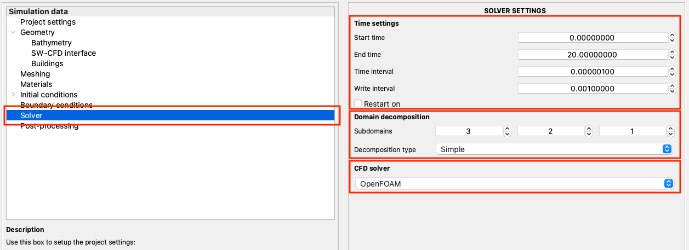

.. _lbl-solversett:

***********************************************
Solver
***********************************************

The solver window can be activated by selecting the option from the left panel as shown in :numref:`Solver`.

.. _Solver:

   Solver settings panel available in ``EVT``

There are three categories of inputs required from the user. 

#. **CFD solver:** The |app| is set up for multiphase flow simulations using OpenFOAM solver. At present, this is the only supported solver. However, alternatively, the user can bring in their own solver. Please refer to the researcher guide for more information in this direction.

#. **Domain decomposition:** This refers to the parallelization strategy of the solver. At present, a simple decomposition technique is employed to decompose the domain in the subdomains along the ``x`` , ``y`` , and ``z`` directions.

#. **Time settings:** This corresponds to when the CFD simulation start (``Start time``), end (``End time``)and time increment to be used (``Time interval``). It is important to note here that writing the results at every time step can lead to large file sizes. Thus, it is generally recommended to write once in 100 - 1000 steps. This is specified by the ``Write interval`` input.

    #. *Restart option:* HydroUQ also supports a restart option. If selected, the simulation will start from the latest time directory available. The user will be required to upload existing time directories from where the simulation can start.