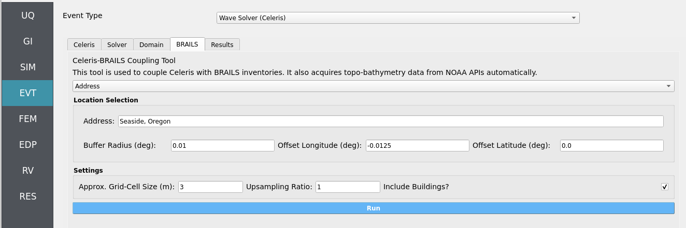

.. _lblEVT-Celeris_BRAILS:

===========
BRAILS
===========

The ``BRAILS`` tab provides an automated workflow for coupling **Celeris** with
**BRAILS building inventories** and **NOAA topo-bathymetry data**.  

It streamlines the preparation of simulation inputs by:

- Acquiring **topo-bathymetry** from NOAA APIs automatically.
- Generating and merging **BRAILS building inventories**.
- Performing **imputation** to fill missing building attributes.
- Combining building data with bathymetry-topography to form the input
  **bathymetry file** for the simulation.

.. important::
   This tool directly updates the input files in the ``Celeris`` tab.
   Once the workflow finishes, the **bathymetry visualization** will also refresh
   with the new inputs.

----------------------
Location Selection
----------------------

At the **top of the tab**, the **Location Selection** widget provides two methods
for defining the region of interest.

**Option 1: Address (Easy / Recommended)**

- Enter a **text address** (e.g., “Seattle, WA”).  
- The tool automatically **geocodes** this to latitude/longitude.
- Specify:
  
  - **Buffer Radius (degrees):** defines the square region size.  
  - **Offset Longitude / Latitude (degrees):** shifts the centroid if needed.  

.. note::
   This approach is easiest since it uses a human-readable address with optional
   adjustments.

**Option 2: Bounding Box (Precise)**

- Manually specify:

  - ``lon_LL`` and ``lat_LL`` = lower-left corner  
  - ``lon_UR`` and ``lat_UR`` = upper-right corner  

- Retrieves BRAILS inventories and NOAA bathymetry **within the bounding box**.

.. tip::
   Use the bounding box if you require **fine-grained control** of the study area.

----------------
Settings Widget
----------------

At the **bottom of the tab**, the **Settings** widget allows fine control of
bathymetry grid preparation:

- **Approx. Grid-Cell Size (m):**  
  NOAA API attempts to match this resolution, with slight warping due to
  global projections.

- **Upsampling Ratio:**  
  - ``1`` = no upsampling  
  - ``2`` = doubles the resolution  
  - Higher values increase detail, but also computational cost.

- **Include Buildings?:**  
  - **Checked** = merge BRAILS building inventory with topo-bathymetry.  
  - **Unchecked** = skip buildings for faster runs (minutes saved), but lose
    built-environment effects.

.. warning::
   Excluding buildings speeds up the workflow but removes their influence
   on hydrodynamics in your Celeris simulations.

-------------
Run Workflow
-------------

At the **bottom**, press the **Run** widget to execute the automated workflow.

Workflow sequence:

1. Acquire **topo-bathymetry** from NOAA APIs.  
2. Generate and **merge BRAILS inventories**.  
3. Perform **imputation** for missing attributes.  
4. Combine inventories with bathymetry to form simulation-ready input files.  
5. Update the **Celeris tab** automatically:
   - Input bathymetry file  
   - Visualization of bathymetry, sensors, and structures  

.. note::
   Always verify the updated inputs in the ``Celeris`` tab before launching
   full simulations.