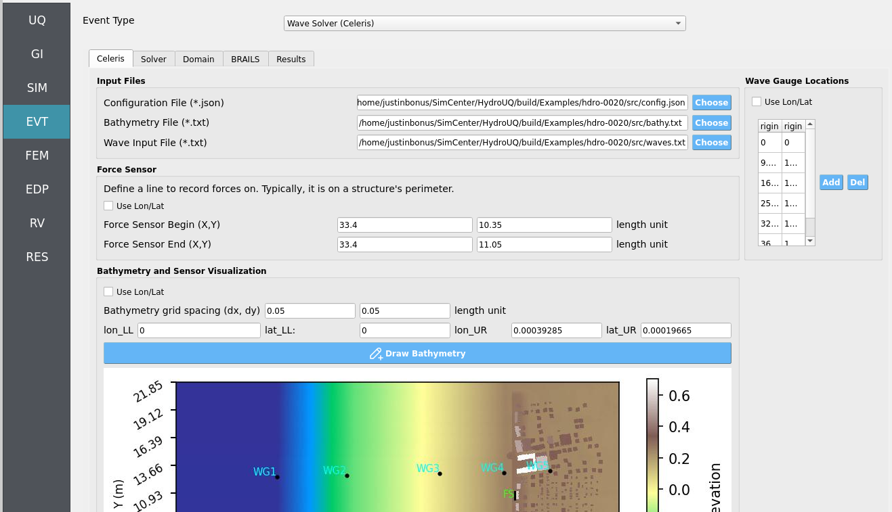

.. _lblEVT-Celeris-Celeris:

Celeris
===============================

This page allows you to configure the input files, define sensors, and visualize
the simulation setup for **Celeris**.

.. contents::
   :local:
   :depth: 2

-----------------
Input Files Panel
-----------------

On the **top-left**, the **Input File** widget provides options to select the three
essential files for a simulation:

- **Configuration File (JSON)** — specifies Celeris simulation parameters.
- **Bathymetry File (TXT)** — contains seafloor elevation data.
- **Waves File (TXT)** — defines incident wave conditions.

.. note::
   While these files are often selected manually, an alternate tab in the GUI
   labeled ``BRAILS`` will automatically update them after completing its workflow.

----------------
Force Sensor Panel
----------------

The **middle-left** panel, **Force Sensor**, allows you to define a line sensor
for recording hydrodynamic forces.

- Define **start** and **end points** of the line.
- The **ordering** of points matters:
  it affects the sensor's **normal vector** calculation.
- Can be defined in:
  - **Length units** (e.g., meters), or
  - **Geographic coordinates** (longitude / latitude).

.. important::
   To capture realistic forces, place the force sensor **flush with a structure’s perimeter**.

------------------------
Wave Gauge Locations Panel
------------------------

The **right-hand** panel, **Wave Gauge Locations**, defines a list of point sensors
to record the **free surface elevation** during the simulation.

- Each **row** corresponds to one gauge:
  - Column 1 = **X position**
  - Column 2 = **Y position**
- Gauges can be specified in either:
  - **Length units** (e.g., meters), or
  - **Longitude / latitude**.

.. tip::
   Use multiple wave gauges to compare simulated wave records at several locations.

-------------------------------------
Bathymetry and Sensor Visualization
-------------------------------------

The **bottom** panel, **Bathymetry and Sensor Visualization**, provides a simple
visualization interface.

- Displays the **bathymetry height map** using the file selected in *Input Files*.
- Overlays **force sensors** and **wave gauges**.
- Controlled via the **Draw Bathymetry** button.

.. note::
   The visualization axes can also be displayed in either **length units**
   or **longitude / latitude**.

.. warning::
   Ensure that the bathymetry file is formatted correctly.
   An invalid file will result in failed or misleading visualizations.