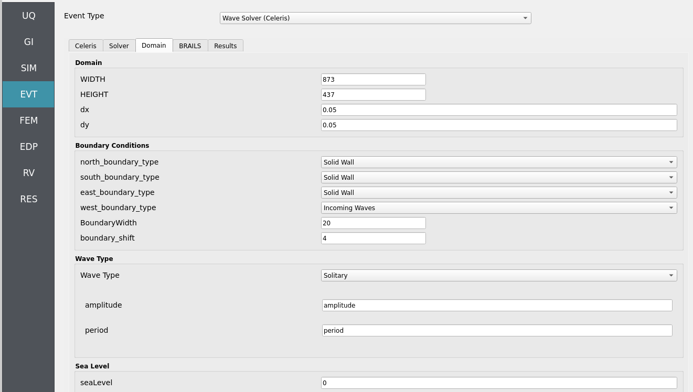

.. _lblEVT-Celeris-Domain:

Domain
======

Defines the numerical domain for the wave propagation solver in CelerisAi.

This class sets up the domain geometry (:math:`x_1`, :math:`x_2`, :math:`y_1`, :math:`y_2`) and resolution (:math:`N_x`, :math:`N_y`), 
handles bathymetric/topographic data (via an instance of a :class:`Topodata` class), 
configures boundary sea levels on each face (north, south, east, west), 
and stores critical parameters such as Courant number (``Courant``), friction, 
and base depth.

Two main configuration modes are supported:

1. **Celeris format**  
   Reads from a ``config.json`` file (if ``topodata.datatype == "celeris"``).

2. **Manual**  
   Uses arguments passed directly to the constructor.

This class also defines utility methods to:

- Create a meshgrid for the domain (``grid``).
- Load and interpolate topographic/bathymetric data (``topofield``, ``bottom``).
- Compute maximum depth (``maxdepth``) and highest topography (``maxtopo``).
- Compute the time step (``dt``) based on Courant criteria.
- Provide reflection indices for solid boundary conditions (``reflect_x``, ``reflect_y``).
- Create Taichi field templates for solver states (``states``, ``states_one``).

Attributes
----------

**precision** : ``ti.types.primitive_types``  
    Taichi precision (e.g., ``ti.f32``, ``ti.f64``).

**x1**, **x2**, **y1**, **y2** : float  
    Spatial domain boundaries.

**Nx**, **Ny** : int  
    Number of grid cells in x and y directions.

**topodata** : :class:`Topodata`  
    Instance that handles bathymetry/topography data.

**north_sl**, **south_sl**, **east_sl**, **west_sl** : float  
    Sea level values for each boundary face.

**Courant** : float  
    Courant number for numerical stability.

**isManning** : int  
    Flag to indicate if Manning friction is used.

**friction** : float  
    Friction value (e.g., Manning's n).

**base_depth_** : float or None  
    Reference depth for the domain. If None, it is inferred from topography.

**Boundary_shift** : int  
    Shift parameter used for boundary indexing or reflection.

**pixels** : ``ti.field``  
    2D Taichi field (shape = [Nx, Ny]) for visualization/debugging.

**g** : float  
    Gravitational constant (9.80665).

**configfile** : dict or None  
    Loaded JSON dictionary if using Celeris config format.

**seaLevel** : float  
    Reference sea level (default = 0.0).