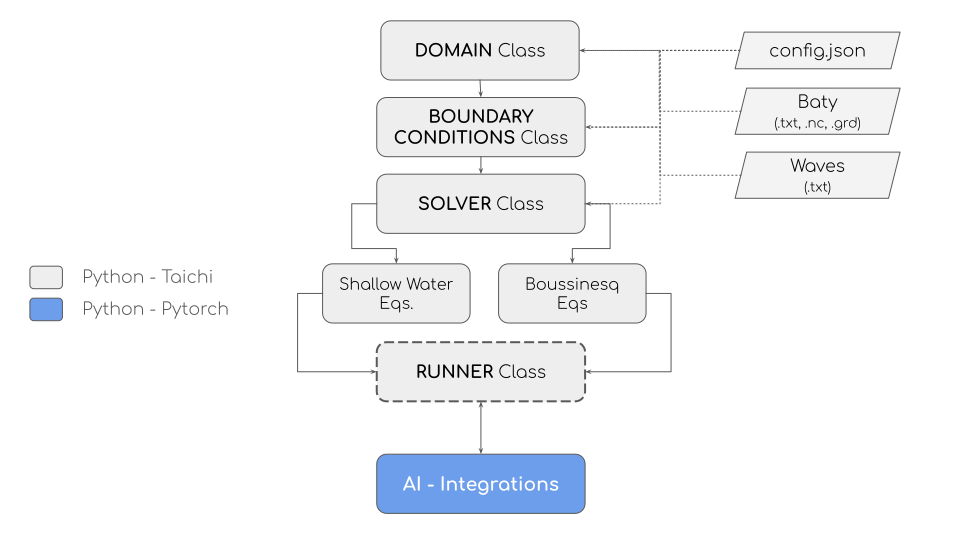
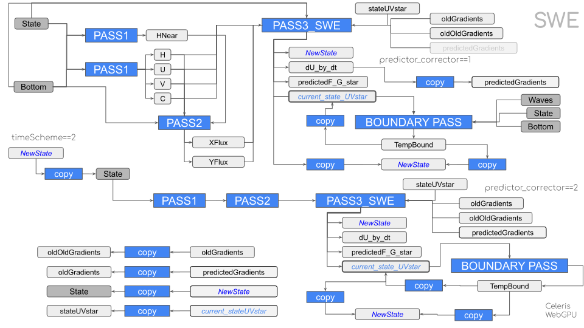
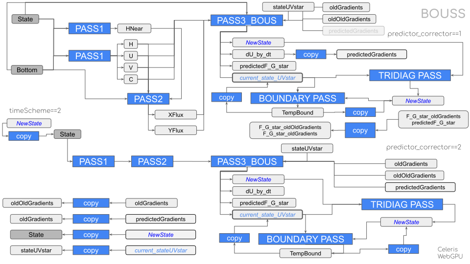

.. _lblEVT-Celeris-introduction:

Introduction
============

CelerisAi: A Nearshore Wave Modeling Framework for Integrated AI Applications
-----------------------------------------------------------------------------

CelerisAi [RenteriaLynett2025]_ is a Python and Taichi-based framework for nearshore wave modeling that seamlessly integrates with AI environments. It provides GPU and multi-CPU acceleration, flexible setup, and interactive visualization—enhancing coastal engineering applications such as depth inversion and complex nearshore simulations.

Methods
-------

CelerisAi is built upon Celeris Base [TavakkolLynett2020]_, which solves the extended Boussinesq equations derived by [MadseSorensen1992]_ to account for nonlinear and dispersive effects in nearshore wave transformation, and follows the architecture presented in the CelerisWebGPU version (`CelerisWebGPU <https://plynett.github.io/>`_).

Characteristics
---------------

The main characteristics of CelerisAi include:

- **Optimized Kernels:** Leverages custom Taichi-kernels for efficient computation.
- **OS Agnosticism:** Compatible across various operating systems.
- **High Performance:** Utilizes multiple CPUs, GPUs, or cloud services for accelerated simulations.
- **Modularity:** Structured around four main classes, facilitating easy expansion with additional physics or models.
- **AI Integration:** Incorporates PyTorch to send data directly from numerical models to neural networks without offloading from the GPU.
- **Visualization Options:** Supports both headless and interactive visualization.

Class Architecture and Workflow
-------------------------------

The simulation setup can be performed directly within a Python script or through JSON files by specifying the domain geometry, initial conditions, and boundary conditions.

   CelerisAi classes and setup.

CelerisAi can solve the shallow water equations or the extended Boussinesq equations. In both cases, the scalars and vectors are the same, but the methods used to solve the numerical scheme are different.

Workflow to solve the Shallow water equations
+++++++++++++++++++++++++++++++++++++++++++++

   SWE workflow
   
Workflow to solve the extended Boussinesq equations
+++++++++++++++++++++++++++++++++++++++++++++++++++

   Boussinesq workflow

Performance
-----------

Ongoing efforts focus on replicating benchmark cases to verify accuracy—such as the solitary wave run-up on a sloping beach. 

At run-time, simulation states can be transferred to PyTorch tensors, enabling data-driven updates or neural network–based parameter updating in real-time. This approach reduces the necessity of offline data generation, facilitating a new paradigm of concurrent modeling learning, and allows for advanced applications like nearshore bathymetry inversion.​

References
----------

.. [RenteriaLynett2025] Renteria, W., Lynett, P., Bonus, J., Mccann, M., & Ebrahimi, B. (2025). CelerisAi: A Nearshore Wave Modeling Framework for Integrated AI Applications. https://doi.org/10.22541/essoar.174129311.11936719/v1

.. [TavakkolLynett2020] Tavakkol, S., & Lynett, P. (2020). Celeris Base: An interactive and immersive Boussinesq-type nearshore wave simulation software. Computer Physics Communications, 248, 106966. https://doi.org/10.1016/j.cpc.2019.106966

.. [MadseSorensen1992] Madsen, P. A., & Sørensen, O. R. (1992). A new form of the Boussinesq equations with improved linear dispersion characteristics. Part 2. A slowly-varying bathymetry. Coastal Engineering, 18(3–4), 183–204. https://doi.org/10.1016/0378-3839(92)90019-Q

