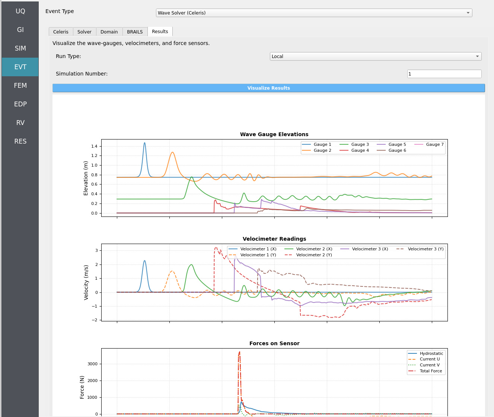

.. _lblEVT-Celeris-Results:

==========
Results
==========

Visualize the **wave gauges**, **velocimeters**, and **force-sensor** time series
from **Celeris** simulations produced by your most recent workflow execution.

.. contents::
   :local:
   :depth: 2

-----------
Overview
-----------

The **Results** tab loads simulation outputs and renders a Python-generated plot
containing:

- **Free-surface elevation** at wave gauges
- **Velocities** at velocimeter points
- **Forces** along the force sensor line (decomposed into **hydrostatic** and **hydrodynamic** components)

----------------------
Select a Run Type
----------------------

Use the **Run Type** selector to choose which execution to visualize.

.. list-table::
   :header-rows: 1
   :widths: 22 78

   * - Run Type
     - Requirements
   * - **Local**
     - No extra steps. Ensure your most recent local workflow was a **Celeris** run.
   * - **Remote**
     - You must first retrieve the remote job data from **DesignSafe** using the
       ``GET from DesignSafe`` button and **manually download and extract** the
       ``workdir.tar.gz`` file to your remote job directory, as described in :ref:`lbl-jobs`.

.. note::
   **Remote** visualization depends on the presence of the extracted output files
   from DesignSafe; without them, plots cannot be generated.

-------------------------
Choose a Simulation Number
-------------------------

Set **Simulation Number** to the desired sample index to visualize (``1`` to
the **maximum number of samples** you configured in the **UQ** tab).

.. tip::
   If you aren't sure which sample you want, start with ``1``, then step through
   sequentially to compare variability across samples.

--------------------
Visualize the Results
--------------------

Click **``Visualize Results``** to render a multi-series plot:

- **Wave Gauges** — free-surface elevation time histories
- **Velocimeters** — point velocity time histories
- **Force Sensor** — total force split into **hydrostatic** and **hydrodynamic**
  components along the defined sensor line

.. note::
   Plots are generated via an embedded Python script. If your Python path is not properly set in ``Files`` > ``Preferences``, the plot will not be created.

----------------
Quality & Caveats
----------------

.. warning::
   **Force-sensor accuracy** can degrade if:
   - The sensor line was **not flush with and in front of** a structure's perimeter.
   - **Overtopping** occurred (water flowing over the structure).
   - **Start/End points were inverted**, flipping the sensor's **normal vector**
     and causing forces to be reported with the wrong sign or magnitude.

.. important::
   If the force plot looks suspicious (e.g., sign-flipped loads), verify the
   sensor line **ordering** and **placement** in the *Celeris* setup and
   re-run the simulation.

-------------------
Troubleshooting Tips
-------------------

- **No data found (Local)**:
  Ensure your most recent local workflow was a **Celeris** run.
- **No data found (Remote)**:
  Confirm you ran ``GET from DesignSafe`` and **extracted** ``workdir.tar.gz``
  to the expected directory (see :ref:`lbl-jobs`).
- **Empty or partial plots**:
  Check that the **Simulation Number** exists (within ``1..N`` where **N** is the UQ sample count).
- **Force plot anomalies**:
  Re-check **sensor line order** (start/end), placement relative to the structure,
  and whether **overtopping** occurred.