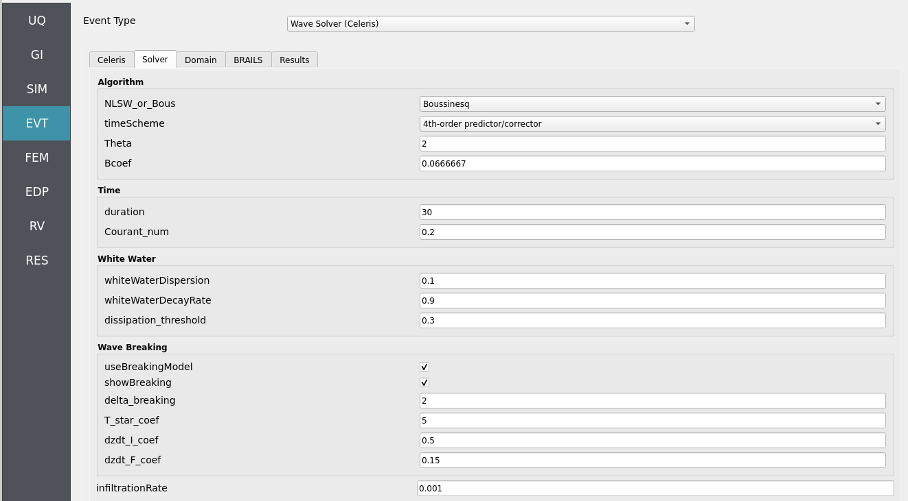

.. _lblEVT-Celeris-Solver:

Solver
======

Main numerical solver class for the CelerisAi model.

This class manages the entire simulation process, including:

- Initializing solution states and bottom fields from the :class:`Domain` class.
- Controlling boundary conditions from the :class:`BoundaryConditions` class.
- Executing the time-stepping scheme (Euler, Adams-Bashforth variants) and 
  1D/2D flow updates (SWE or Boussinesq).
- Incorporating breaking models, sediment transport, and the 
  kernels for reconstruction (Pass1), flux computations (Pass2), 
  and final updates (Pass3).

Attributes
----------

**domain** : :class:`Domain`  
    Instance of the Domain class containing grid info and topography.

**bc** : :class:`BoundaryConditions`  
    Instance managing boundary condition types and wave settings.

**dissipation_threshold** : float  
    Used for visualization (mark cells above certain foam/dissipation).

**theta** : float  
    Midmod limiter parameter (1.0 more dissipative, 2.0 less dissipative).

**timeScheme** : int  
    Time integration scheme:
    
    - 0 = Euler  
    - 1 = 3rd-order predictor  
    - 2 = 4th-order predictor/corrector

**pred_or_corrector** : int  
    Indicates stage in solver loop (1 = predictor, 2 = corrector).

**Bcoef** : float  
    Dispersion parameter for Boussinesq model; default 1/15.

**model** : str  
    Type of model, 'SWE' or 'Bouss'.

**useBreakingModel** : bool  
    True if wave-breaking model is included.

**whiteWaterDecayRate** : float  
    Turbulence decay rate for foam (visualization).

**whiteWaterDispersion** : float  
    Turbulence dispersion factor.

**useSedTransModel** : bool  
    True if sediment transport is included.

**sediment** : object  
    Default or custom sediment parameters.

**infiltrationRate** : float  
    For modeling infiltration on dry beaches.

**clearCon** : int  
    If 1, concentration channel is cleared for visualization.

**showBreaking** : int  
    If greater than 0, shows wave breaking foam areas.

**delta_breaking** : float  
    Eddy viscosity coefficient in breaking zones.

**T_star_coef** : float  
    Timescale factor for fully developed breaking.

**dzdt_I_coef** : float  
    Start-breaking parameter threshold.

**dzdt_F_coef** : float  
    End-breaking parameter threshold.

Notes
-----

The class initializes a large set of Taichi vector fields (state vectors, flux arrays, 
intermediate arrays for Boussinesq tridiagonal solves, sediment transport arrays, etc.)
to manage the numerical solution.