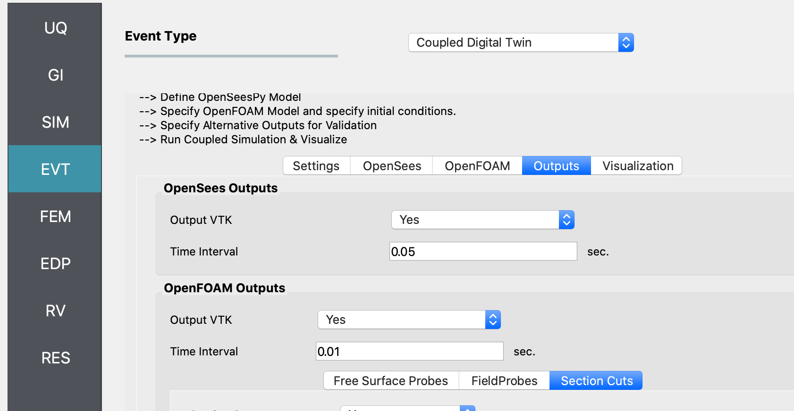
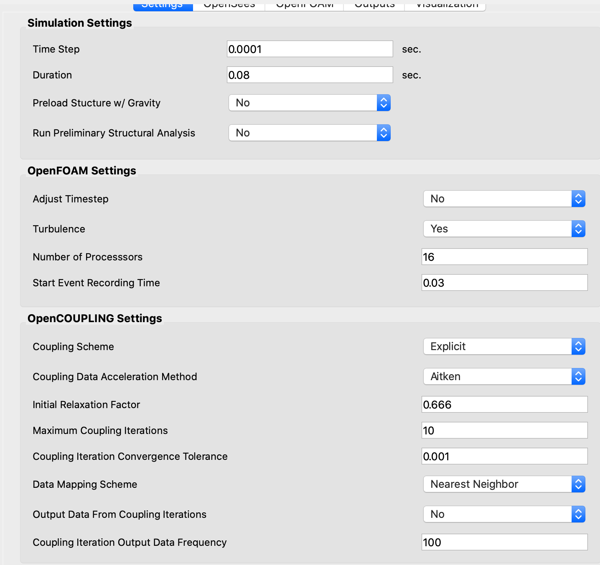
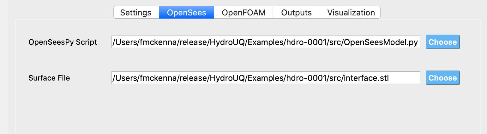
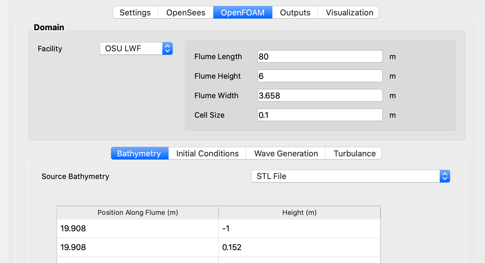
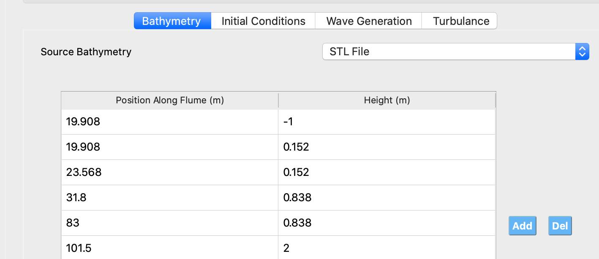
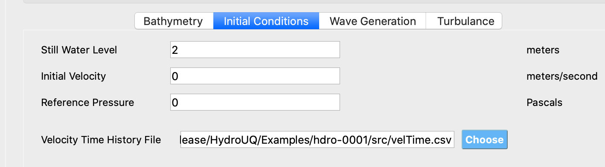
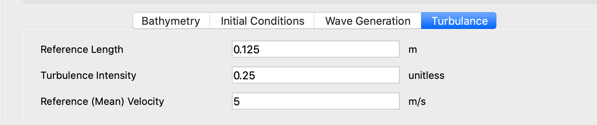
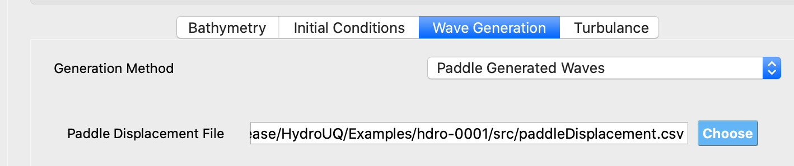

====================
Coupled Digital Twin
====================

This panel allows users to utilize a coupled OpenFOAM CFD simulation and OpenSeesPy finite element simulation to obtain loads and pressures on the building for subsequent UQ analysis. A screenshot of the GUI is shown below in :numref:`EVT-Coupled`

.. _EVT-Coupled:

   Coupled Event Panel

 
For a coupled event the user is presented with a workflow they must progress through:

.. contents:: Table of Contents
   :depth: 1
   :local:
   :backlinks: none

Coupled Simulation Settings
---------------------------

**Simulation Settings**

The user is presented with a variety of settings to specify the coupled simulation. The GUI is shown in Figure  :numref:`EVT-CoupledSettings` and individual input parameters are as follows:

``Time Step``: The coupling timestep for the solution. This value should be selected such that the CFD model CFL criterion is satisfied, as well as the required minimum timestep for finite element analysis model stability.

``Duration``: Coupled simulation duration.

``Preload Structure w/ Gravity``: Utilize the nodal masses to create a gravity loading in the -Z direction of the OpenSees model. (optional, this could be handled manually within the OpenSees script itself)

``Run Preliminary Structural Analysis``: Utilize the end state of the OpenSees analysis (if defined in the OpenSees script) as the initial state of the structure during the coupled analysis.

.. _EVT-CoupledSettings:

    Settings

**OpenFOAM Settings**

``Adjust Timestep``: [Default, No] This setting allows the OpenFOAM analysis to reduce its timestep to a value below that of the coupling timestep. NOT RECOMMENDEDFOR CASES WITH STRUCTURAL DEFORMATION. Subcycling of the CFD model between coupling iterations can result in erroneous force spikes. It is suggested that a constant timestep size is utilized for coupled analyses.

``Turbulence``: Allow for calculation of turbulence within the CFD model.

``Number of Processors``: The number of processors the OpenFOAM CFD solution will be calculated with.

``Start Event Recording Time``: What time the user would like the coupled model to output post-processing data.

**OpenCOUPLING Settings**

``Coupling Scheme``: Implicit/Explicit. Implicit is recommended.

``Coupling Data Acceleration Method``: IQN-ILS is recommended.

``Initial Relaxation Factor``: The relaxation factor for FSI coupling iterations.

``Maximum Coupling Iterations``: Default, 100. Keep at a large value, and should converge before reaching maximum iterations.

``Coupling Iteration Convergence Tolerance``: This is a relative convergence measure of the coupling data passed between participants within each coupling timestep. This value should be below 5e-3, but not too small. This is a measure of how much the coupling residuals change from coupling iteration to coupling iteration. Once the values have nearly approached their desired values from the interface acceleration techniques, the coupling convergence tolerance is satisfied.

``Data Mapping Scheme``: Nearest Neighbor is recommended. Radial-basis-function mapping is available but is less stable and slower than the nearest neighbor.

``Output Data from Coupling Iterations``: Not recommended. Intended for debugging of coupling iterations for models which are not converging.

``Coupling Iteration Output Data Frequency``: A large value is recommended.

Specify OpenSees Structural Model and an External Surface File
----------------------------------------------------------------

**OpenSees Model**

``OpenSees File``: Must be an OpenSeesPy script

``External surface file``: Must be an STL file, this is the boundary that will represent the structure within a three-dimensional CFD simulation, which will be coupled to the FEA model)

   OpenSees

Specify OpenFOAM CFD Model and Initial Conditions
---------------------------------------------------

**OpenFOAM Model**

Select the NHERI flume facility or specify the flume geometry within the text field boxes provided.
                                                                                                                                                                           
Specify a flume cell size (this is the approximate edge length size of the volumes within the CFD domain for the largest cells). The minimum flume cell size could tentatively be 8 times smaller than this value, due to mesh castellation during automatic meshing routines. Use caution when specifying this value. CFD mesh resolution is increased in the structural near field.

   OpenFOAM

**Specify the flume bathymetry (STL file, or point list of x position, elevation of flume floor at x position).**

If there is no bathymetry, please provide points within the point list that are outside of the boundary of the flume, or specify the bottom of the flume as a two-point list with your start x location and end x location as the start and end of the flume and the flume elevation at both points as 0.

   Bathymetry

**Specify the initial conditions of the OpenFOAM model, including the still water level, the initial fluid velocity, and the fluid reference pressure [default, 0 Pa]. If a velocity time history is desired as an inlet boundary condition, upload a CSV file containing the times and velocities desired at the inlet at those times.**

    
   Initial Conditions

**Specify the turbulence initial conditions. The reference length, turbulence intensity, and the reference velocity of the turbulence.**

     
   Turbulence 

**Specify the wave generation techniques for the CFD model, if waves are desired.**

``Paddle Generated Waves``: Upload a CSV of times, displacements of the paddle at the inlet. This will create a paddle-generated wave through the motion of the CFD boundary at the minimum X boundary of the model.
                                                                                                                                                                            
``Periodic Waves``: Specify the wave properties to apply a periodic wave inlet boundary condition to the CFD model.
                
``No Waves``: Steady state flow or flows without waves.

   Wave Generation 

Specify Outputs       
---------------
                                                                                                                                                                                                                                                                                                                                             
A variety of outputs from the coupled model can be obtained through the specification of the output settings.
 
- Output VTK - Output a VTK file of the OpenSees and OpenFOAM models at the specified time interval.

  .. figure:: coupled/Outputs.png
     :align: center
     :figclass: align-center
     
     Outputs
   
- Free surface probes - function as wave gauges within the CFD model

  .. figure:: coupled/OutputSuraceProbes.png 
     :align: center
     :figclass: align-center
     
     Surface Probes

- Field Probes - sample various fields from the CFD model for postprocessing (pressure, velocity, phase fraction)
  
  .. figure:: coupled/OutputFieldProbes.png
     :align: center
     :figclass: align-center
     
     Field Probes
  
- Section cuts - sample various fields as a section cut of the CFD model - specify origin point and normal of the section cut, as well as the fields of interest

  .. figure:: coupled/OutputCuts.png
     :align: center
     :figclass: align-center
    
     Section Cuts

Postprocessing       
--------------

Data from the coupled analysis will be available in the DesignSafe Data Depot under your ``My Data/Hydro-UQ/`` folder. Each analysis will have a temporary directory associated with it. Within this directory, there is a results.zip file which contains the OpenFOAM postProcessing folder, as well as VTK output from OpenSees. This zip folder can be extracted and results can be viewed with ParaView.  

