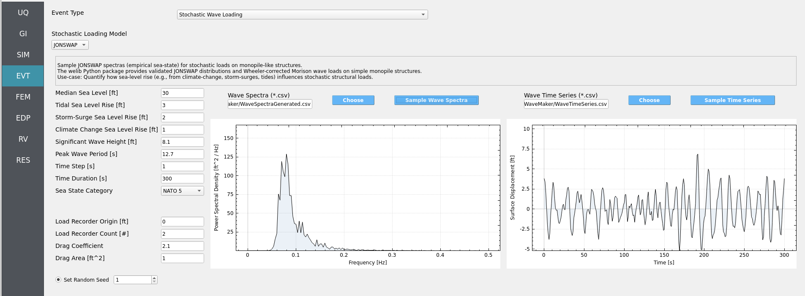

.. _lbl-stochasticWave:

=========================
Stochastic Wave Loading
=========================

Sample **JONSWAP** sea states and compute **Wheeler-corrected Morison** loads on
an assumed monopile-like structure. The module builds a wave **power spectral
density (PSD)** from your inputs (e.g., significant wave height, peak period),
samples a **wave elevation time series** at the structure site, and then evaluates
vertical stacks of **load recorders** along the monopile. These loads are later
mapped onto full structural models (e.g., in OpenSees) in the SimCenter workflow
to determine structural response.

.. warning::
   The **JONSWAP spectrum** was derived from North Sea field data and is
   conditionally applicable. It can be reasonable for North Atlantic offshore
   conditions (e.g., Maine/Norway) under appropriate sea states, but it is a
   **placeholder** that advanced users may replace with a more site-specific spectrum.

The implementation uses a validated Python backend (``welib``) for JONSWAP and
Wheeler-corrected Morison loading and is designed to run quickly (tens-hundreds
of samples typically complete in minutes).

.. contents::
   :local:
   :depth: 2

----------------
GUI at a Glance
----------------

- **Left column** — All input **parameters**.
- **Center plot** — **Wave Spectra (PSD vs Frequency)**. Click ``Sample Wave Spectra`` to
  build the JONSWAP spectrum from the current parameters.
- **Right plot** — **Wave Time Series (Surface Displacement vs Time)**. Click
  ``Sample Time Series`` to synthesize a realization of the free-surface elevation.

   *Stochastic Wave Loading GUI in HydroUQ v4.2.0*

-----------
Parameters
-----------

.. note::
   Any parameter can be turned into a **Random Variable** by entering an alphabetic
   name instead of a number. Then define its distribution in the **Random Variables (RV)**
   sidebar to propagate **hydrodynamic uncertainty** through your workflow.

**Water Level (ft)**

.. list-table::
   :header-rows: 1
   :widths: 36 64

   * - Parameter
     - Description
   * - **Median Sea Level**
     - Reference water level about which fluctuations occur.
   * - **Tidal Sea Level Rise**
     - Tidal offset relative to the median level.
   * - **Storm-Surge Sea Level Rise**
     - Event-based surge offset.
   * - **Climate Change Sea Level Rise**
     - Long-term mean sea-level shift.

**Sea State**

.. list-table::
   :header-rows: 1
   :widths: 36 64

   * - Parameter
     - Description
   * - **Significant Wave Height (ft)**
     - JONSWAP input height (``H_s``).
   * - **Peak Wave Period (s)**
     - JONSWAP peak period (``T_p``).
   * - **Sea State Category [NATO 1–5]**
     - *Deprecated*. Shown for legacy compatibility; prefer explicit ``H_s`` and ``T_p``.

.. deprecated::  The **Sea State Category** control is legacy-only and may be removed in a future release.

**Time Discretization**

.. list-table::
   :header-rows: 1
   :widths: 36 64

   * - Parameter
     - Description
   * - **Time Step (s)**
     - Sampling interval for the synthesized time series (e.g., ``1.0`` s).
   * - **Time Duration (s)**
     - Total simulated duration (e.g., ``300`` - ``3600`` s).

.. warning::
   Using an extremely small **Time Step** (e.g., ``0.001 s``) or very long
   **Time Duration** (e.g., ``100000 s``) will cause **unnecessary runtimes** and
   heavy I/O. Typical choices: ``Δt = 1 s`` and duration **5-60 minutes**.

**Load Recorders**

.. list-table::
   :header-rows: 1
   :widths: 36 64

   * - Parameter
     - Description
   * - **Load Recorder Origin (ft)**
     - Horizontal location for the recorder stack.
   * - **Load Recorder Count (#)**
     - Number of vertically distributed recorders.

.. important::
   The **Load Recorder Count** here must equal the number of **mapping nodes**
   defined for the OpenSees structure in your structural module to ensure **1:1**
   load mapping.

**Hydrodynamics**

.. list-table::
   :header-rows: 1
   :widths: 36 64

   * - Parameter
     - Description
   * - **Drag Coefficient**
     - Morison drag coefficient (``C_d``). (e.g., ``2.1``)
   * - **Drag Area (ft^2)**
     - Projected area used with drag calculations for the monopile segment.

**Stochastic Controls**

.. list-table::
   :header-rows: 1
   :widths: 36 64

   * - Parameter
     - Description
   * - **Random Seed (optional)**
     - Set for reproducibility; leave blank to draw a new random realization.

----------------
Typical Workflow
----------------

1. Enter water-level, sea-state, time, recorder, and hydrodynamic parameters.
2. Click **``Sample Wave Spectra``** to generate the JONSWAP PSD from inputs.
3. Click **``Sample Time Series``** to synthesize a surface elevation realization.
4. The module computes **Wheeler-corrected Morison loads** at each recorder along
   the monopile for the sampled elevation.
5. Review the spectra and time-series plots; repeat with new **Random Seed(s)** or
   RV-defined parameter sets to study variability.

-------------------------
Best-Practice Guidelines
-------------------------

- **Time resolution:** Aim for at least **10–20 samples per peak period**
  (``Δt ≤ T_p/10`` to ``T_p/20``). Oversampling beyond that rarely improves loads.
- **Frequency resolution:** Duration controls frequency bin size
  (``Δf = 1/T``). Choose **20–60 min** to resolve the peak and energetic tail.
- **Multiple realizations:** Use distinct **Random Seeds** (or RVs) to bracket
  variability of extreme and RMS loads.
- **Hydrodynamic consistency:** Ensure **Drag Area** and **C_d** reflect the
  monopile segment being represented and use consistent **units**.
- **Mapping parity:** Keep **Load Recorder Count** synchronized with structural
  mapping nodes to prevent mismatches downstream.

----------------
Example Use-Cases
----------------

- **Assess resilience of a North Sea offshore structure** under uncertain sea
  states by sampling distributions for ``H_s`` and ``T_p`` and comparing load
  envelopes across realizations.

- **Design load sensitivity study:** Evaluate how changes in **Drag Coefficient**
  (e.g., due to marine growth or surface roughness) alter peak and fatigue-relevant
  load statistics for a given sea state.

- **Quantify the effect of sea-level rise** (tidal, surge, climate) on stochastic
  **monopile base shear** and overturning moments by varying the water-level
  components while holding sea state fixed.

- **Operational forecasting scenario:** For a planned maintenance window, sample
  short-duration sea states around the latest forecasted ``H_s``/``T_p`` to estimate
  likely ranges of monopile loads during operations.

----------------
Troubleshooting
----------------

- **Flat spectra or zero loads:** Check that ``H_s > 0`` and **Drag Area**/**C_d**
  are nonzero; confirm **Duration** is reasonable.
- **Aliased time series:** Decrease **Time Step** or ensure ``Δt ≤ T_p/10``.
- **Non-reproducible results:** Set **Random Seed** to a fixed value.
- **Mapping errors downstream:** Verify **Load Recorder Count** equals the
  number of structural mapping nodes.