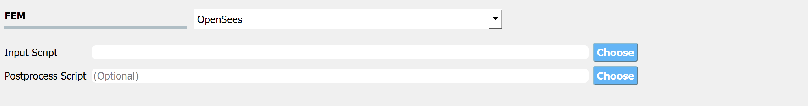
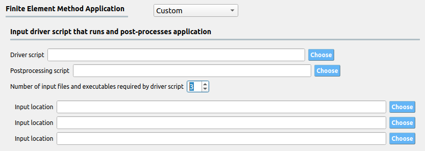
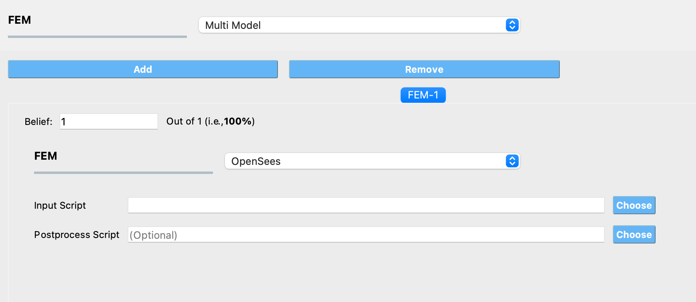
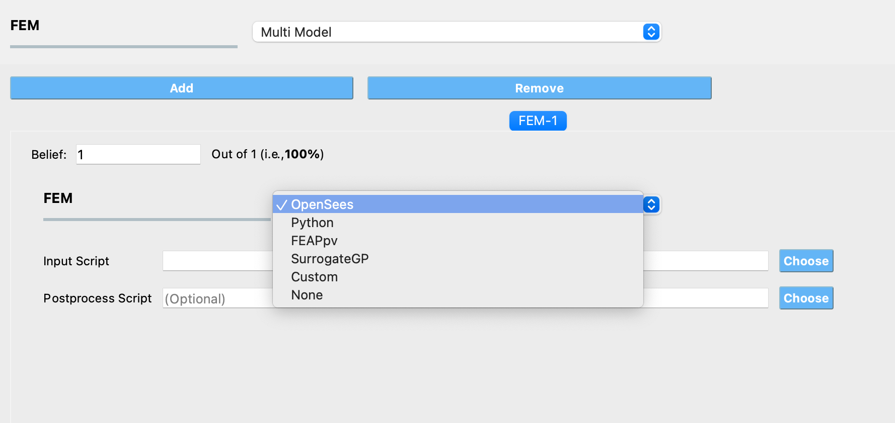

.. _lblFEM:

FEM: Finite Element Method
==========================

The **FEM** tab will present users with a selection of FEM
applications. Currently, there are six options: OpenSees, Python, FEAPpv, SurrogateGP (using a surrogate model trained in quoFEM in place of a numerical simulation model), Custom (user-specified application), Multi Model (using more than one model in an analysis), along with the option of specifying no simulation model.

.. _figFEM:

	Input for the **FEM** tab.

.. note::
   Because the UQ engines treat the FEM applications as a black box, when the UQ engine runs each deterministic simulation it expects the FEM application to output a single file. This file must be named ``results.out`` and be placed in the same directory as the main input file. The ``results.out`` file must contain a single line. That line must contain as many QoI values as the sum of the length of all the EDPs defined by the user in the **QoI** panel. Each value must be separated by a space. An example ``results.out`` file for a problem specifying four response QoI values is as shown:

   .. literalinclude:: results.out

OpenSees
^^^^^^^^

When the choice of FEM application is OpenSees (the default application), the user is presented with the input panel shown in figure above and there are two entry fields for filenames:

1. **Input Script**: The user must specify a main input script. When entered the application will parse this file looking for variables set with the ``pset`` option (a unique set command to the OpenSees interpreter that is used to identify parameter values). For each variable whose value is set with ``pset``, the program will auto populate the variable in the **RV** tab.

.. literalinclude:: TrussModel.tcl
   :language: tcl

2. **Postprocess Script** (optional): This is an optional entry where the user has the option of specifying either a tcl script or a Python script that will be used to postprocess the results and create a ``results.out`` file after the main script runs. See for instance, :ref:`example 1<qfem-0001>`.

.. note::
   The postprocess file can be either a tcl script or a Python script and the file extensions must be either ``.py`` or ``.tcl``.

.. warning::
   If a tcl script file and the user is reading results from files created with OpenSees recorder commands, the user must ensure there is a ``wipe recorders`` command at the end of the main script or at the start of the postprocessing script.

Python
^^^^^^^

The user provides a main script and has the option to provide 2 other scripts: 

.. figure:: figures/openseespyFEM.png
  :align: center
  :figclass: align-center
  :width: 1200

1. **Postprocess Script** (Optional): This must be a Python script which is provided the QoI variable names when started. This entry can be left blank if the main script creates a ``results.out`` file with a single line as described for the OpenSees application.

2. **Parameters File**: This file allows for the automatic population of the **RV** tab with any variables found in the file. For example if the file contained the following:

  .. literalinclude:: TrussParams.py
     :language: py

  The **RV** tab would be populated with the ``E``, ``P``, ``Ao``, and ``Au`` random variables. See :ref:`example 2<qfem-0002>` for more. For the Windows users, see the below important warning.

.. Caution::

    **Python on Windows.** On Windows, quoFEM is bundled with its own ``python.exe``, with the essential packages (including numpy, scipy, openseespy) already installed. By default, this ``python.exe`` is used to (1) run SimCenter workflow; and (2) run the user-provided python model. Therefore, please make sure to test your model using the "correct" ``python.exe`` before running in quoFEM. 

    .. figure:: figures/step1_preference_default.svg
        :align: center
        :figclass: align-center
        :width: 500

        Windows Default Python Path found in ``File``-``Preference``

    * **"Pip install" Python packages**

      If your model requires additional python packages, use the following command to install them.

      .. code-block:: bash

           {$PythonExePath} -m pip install {$PackageName}

      where ``{$PythonExePath}`` is the (default) python path shown in the preference window and ``{$PackageName}`` is the name of the python package. 

    * **Use custom Python**

      
      .. figure:: figures/step1_preference_custom.svg
         :align: center
         :figclass: align-center
         :width: 500

         Custom Python Path

      If you would like to use other version of python in quoFEM, use the custom option in ``File``-``Preference``. Then you will need to **manually install** the packages required to run SimCenter workflow using.

      .. code-block:: bash

           {$NewPythonExePath} -m pip install nheri_simcenter --upgrade

      where ``{$NewPythonExePath}`` is the new python path specified in the preference window. 

FEAPpv
^^^^^^

|FEAPpv| is another FEM engine used by the |app| that is publicly available from the |FEAPpvDownload| page. FEAPpv is a general purpose finite element analysis program which is designed for research and educational use. To install |FEAPpv| you must download the source code and follow the build instructions on the **Source Code Download and Compile Instructions** section of the |FEAPpvDownload| page.

Similar to the OpenSees application, when the user selects FEAPpv the user is requested to provide two files.

.. figure:: figures/feapFEM.png
  :align: center
  :figclass: align-center
  :width: 1200

1. **Input File**: The user must specify a main input file.  A part of this file may contain variables set in the ``PARA`` section. The variables in this section will be read by the UI when the file is entered and will be autopopulated in the **RV** tab. For example if a file containing the following code was specified:

.. literalinclude:: TrussTemplate.txt

  then the parameters ``E``, ``P``, ``Ao``, ``Au`` would be read by the application and placed in the **RV** tab.

2. **Postprocess Script**: The user must provide the name of the Python script that will run when FEAPpv has finished executing. This Python script must load the output file from FEAPpv and create the ``results.out`` file. Currently the user has no control over the name of the output file created by FEAPpv, ``SimCenterOut.txt``. It is this file the post-process script must open and use to create the ``results.out`` file.

Custom
^^^^^^
This option allows users to specify custom simulation applications which do not
necessarily need to be limited to only Finite Element Method software. With this
option all users need to do is provide a driver script that takes the input file
generated by the UQ engine, parses and passes the inputs to the custom analysis
engine, and processes the results to meet the format requirements specified for
``results.out``. The inputs generated by the UQ engine will be provided in a
file named ``params.in`` and will always follow the format shown in the example
``params.in`` file :ref:`below <paramsInExample>`. The first line specifies the
number of random variables while the subsequent lines first contain the name of
the random variable and the value of the current realization separated by a
space.

.. _paramsInExample:
.. literalinclude:: params.in

For the custom simulation application, the user provides at least two inputs:

* The script that drives the simulations which must be named
  ``driver.bat`` on Windows and ``driver`` on MacOS and Linux
 
* The script that post-processes the simulation results and writes them to
  ``results.out`` in the required format

Additionally, users can specify as many additional files and binaries as
required by the application by increasing the number of input slots, as shown in
:numref:`CustomFEM`. By specifying these files here, they will be copied to the
correct location for quoFEM to access them during analyses. Users also have the
option to simply place all the required files in the same location as the
provided workflow driver script -- quoFEM will automatically copy any files in this
directory. This is particularly helpful if several different applications with
numerous inputs are all being called by the workflow driver script and avoids
the need to explicitly input each one of these files.

.. _customFEM:

  Input for Custom Analysis Application

SurrogateGP
^^^^^^^^^^^^
In place of the physical simulation models, the Gaussian process surrogate model trained in quoFEM can be imported for UQ/Optimization analyses. 

.. _surrogateFEM1:

.. figure:: figures/SurrogateFEM1.png
  :align: center
  :figclass: align-center
  :width: 1200

  Input for Surrogate model FEM Application

When users select the SurrogateGP option, they are requested to provide the following files:

.. Note:: 

  All the required input files described below can be generated from the quoFEM. See :ref:`lblSimSurrogate`.

1. **Surrogate info file (.json)**: This file contains the meta-information about the surrogate model. Users can open it with a text editor to see the contents.

2. **Surrogate model file (.pkl)**: Surrogate model is saved in a binary format. GPy python package is required to view or use this model outside of quoFEM.

Additionally, if users want to allow alternation between the exact simulation model and surrogate model depending on the predicted error rate, an additional folder that contains the simulation information is required (See **Run Exact FEM Simulation** option below). Note that this folder is not explicitly specified in the input panel, but it needs to be located in the specific directory under the specific name (``templatedir_SIM``).  

3. **Simulation template folder (templatedir_SIM)**: This folder contains the simulator scripts (workflow driver) and required files to run the original simulation model. **Note that the folder should be located in the same directory as the Surrogate info file**. If the folder is not presented in the right directory, the analysis can fail. The name of the folder should not be modified.

Once the files are loaded, users may choose the tolerance level of the predictive variance.

* **Maximum Allowable Normalized Variance**: Prediction variance divided by the variance level of the training dataset. If more than one QoIs is introduced, only the highest normalized variance value will be considered.

.. Warning:: 
   * It is important to understand that the predictive variance does not necessarily imply the error level of the model.
   * The provided percentage ratio of the out-of-tolerance samples is only a rough guideline since it assumed that the samples are uniformly populated throughout the range user provided during the training session. Therefore, if user selects other distribution types and ranges, the percentage estimation will not be correct anymore. 

Users may either stop the analysis, continue, or run exact FEM simulations whenever the tolerance limit is exceeded.

* **Stop Analysis**: The analysis is immediately terminated. quoFEM will show the error (eg. dakota engine gives "No dakotaTab.out file" error)

* **Continue**: The tolerance level is ignored and the analysis is continued. This option is not recommended.

* **Run Exact FEM Simulation**: The program will run the exact FEM simulation user provided in the training session. In case the surrogate model is constructed purely based on the data and without any model information (case 3 in section 2.1.2.2), this option will be disabled.

Additionally, **GP output** can be set as either the *median prediction* or a *random sample* generated from the normal distribution (or lognormal distribution if the user used log-transform when training) with the predictive median and variance. **NOTE:** the random generator does not account for the Gaussian process correlation, and each realization of QoI given RVs is independent of each other. Only users familiar with GP modeling and who understand the limitation are recommended to use the *random sample* option.

If the user wants to inspect the simulation status or check error/warning messages related to the surrogate model, they can refer to the messages written at: ``{Local Jobs Directory}/tmp.SimCenter/surrogateLog.err``. (Note: ``{Local Jobs Directory}`` is specified from the file-preference in the menu bar.)

.. _surrogateFEM2:

.. figure:: figures/SurrogateFEM2.png
  :align: center
  :figclass: align-center
  :width: 800

  Example of surrogateLog.err file

.. Note:: 

  Once the surrogate model is imported, RV and QoI tab will be auto-populated. Users are allowed to remove some of the QoIs if not interested but may not add new QoIs or modify the names of existing QoIs.

Multi Model
^^^^^^^^^^^
By selecting this option, users can define multiple numerical simulation models for use in their UQ analysis. The Add and Remove buttons allow users to control the number of models they want to use in the analysis. 

  Input for Multi Model FEM Application

By adding a model, a new tab is created in the FEM panel where users can choose one of the FEM applications described in the sections above and provide the inputs necessary to define the model. Users also need to specify their belief about the credibility of the model in the tab corresponding to that model. The beliefs are expressed as non-negative numerical values. The belief value for each model is defined relative to the other models, and the beliefs do not need to sum to 1.

  Selecting a FEM application within a model tab

.. Note:: 

  If a Multi Model application is selected, at least 2 models must be defined.

