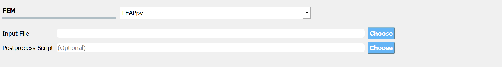
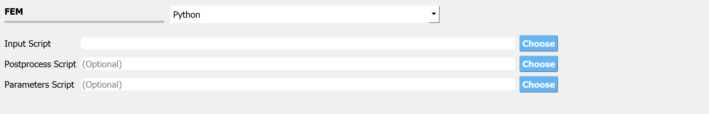

.. _lblFEM:

FEM: Finite Element Method
==========================

The **FEM** tab will present users with a selection of FEM applications. Currently, there are three applications available: OpenSees, FEAPpv and OpenSeesPy. More FE platforms will be added in future versions to allow users to provide their own simulation application.

.. _figFEM:

.. figure:: figures/fem.png
	:align: center
	:figclass: align-center

	Input for the **FEM** tab.

.. note::
   Because the UQ engines treat the FEM applications as a black box, when the UQ engine runs each deterministic simulation it expects the FEM application to output a single file. This file must be named ``results.out`` and be placed in the same directory as the main input file. The ``results.out`` file must contain a single line. That line must contain as many QoI values as the user will enter in the **QoI** panel. Each value must be separated by a space. An example ``results.out`` file for a problem specifying four response QoI values is as shown:

   .. literalinclude:: results.out

OpenSees
^^^^^^^^

When the choice of FEM application is OpenSees (the default application), the user is presented with the input panel shown in figure above and their are two entry fields for filenames:

1. **Input Script**: The user must specify a main input script. When entered the application will parse this file looking for variables set with the ``pset`` option (a unique set command to the OpenSees interpreter that is used to identify parameter values). For each variable whose value is set with ``pset``, the program will auto populate the variable in the **RV** tab.

.. literalinclude:: TrussTemplate.tcl
   :language: tcl

2. **Postprocess Script**: This is an optional entry where the user has the option of specifying either a tcl script or a Python script that will be used to postprocess the results and create a ``results.out`` file after the main script runs. 

.. note::
   The postprocess file can be either a tcl script or a Python script and the file extensions must be either ``.py`` or ``.tcl``.

.. warning::
   If a tcl script file and the user is reading results from files created with OpenSees recorder commands, the user must ensure there is a ``wipe recorders`` command at the end of the main script or at the start of the postprocessing script.

FEAPpv
^^^^^^

Similar to the OpenSees application, when the user selects FEAPpv the user is requested to provide two files.

1. **Input File**: The user must specify a main input file.  A part of this file may contain variables set in the ``PARA`` section. The variables in this section will be read by the UI when the file is entered and will be autopopulated in the **RV** tab. For example if a file containing the following code was specified:

.. literalinclude:: TrussTemplate.txt

then the parameters ``E``, ``P``, ``Ao``, ``Au`` would be read by the application and placed in the **RV** tab.

2. **Postprocess Script**: The user must provide the name of the Python script that will run when FEAPpv has finished executing. This Python script must load the output file from FEAPpv and create the ``results.out`` file. Currently the user has no control over the name of the output file created by FEAPpv, ``SimCenterOut.txt``. It is this file the postprocess script must open and use to create the ``results.out`` file.

OpenSeesPy
^^^^^^^^^^

For the OpenSeesPy application, the user provides a main script and has the option to provide 2 other scripts: 

1. **Postprocess Script**. This must be a Python script which is provided the QoI variable names when started. This entry can be left blank if the main script creates a ``results.out`` file with a single line as described for the OpenSees application.

2. **Parameters File** (Optional). This file allows for the automatic population of the **RV** tab with any variables found in the file. For example if the file contained the following:

.. literalinclude:: parameters.py
   :language: py

The **RV** tab would be populated with the ``E``, ``P``, ``Ao``, and ``Au`` random variables.

.. note:
   
   If a **Parameters File** is not supplied, the Python script must specify the random variables in the main script in the following form

