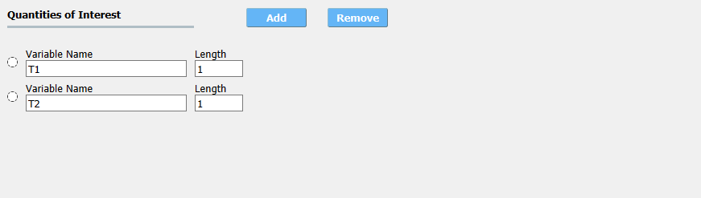

.. _lblQUO_QOI:

QoI: Quantities of Interest
===========================

The **QoI** tab is where the user specifies the variable names associated with the FEM results. For each result quantity that the users application generates and places in the ``results.out`` file, the user must provide a variable name. A new response quantity is added by the user selecting the **Add** button. Quantities can be removed by selecting it, this is done by clicking in the circle before the variable name, and then selecting the **remove** button.

.. _figQoI:

	Input for the **QoI** tab.

In figure shown the user has added two response quantities, ``Node_2_Disp_2`` and ``Node_4_Disp_1``. The postprocessing script, if one has been provided, will be passed these two values as arguments.

.. warning::

   1. There can be no spaces in variable names, underscores are permitted.
   2. Names cannot begin with a numeral, i.e. 0,1,2,3,4,5,6,7,8,9.
   3. Names cannot be duplicated.
