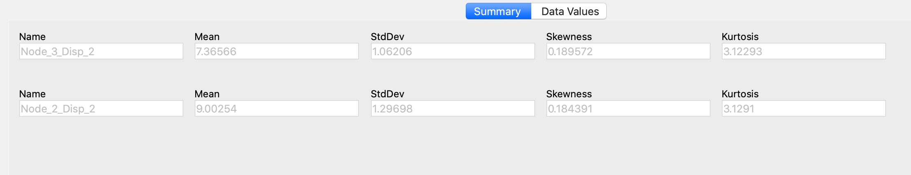
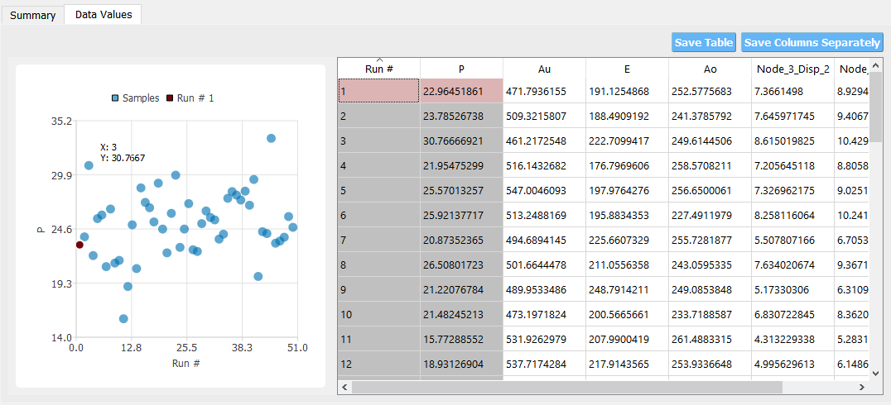

.. _lblQUO_RES:

RES: Results
------------

After the user hits the **Run** or the **Run at DesignSafe** button, the |app| performs the simulations required as part of the uncertainty analysis defined by the user in the four other input panels. If the analysis is completed successfully, the |app| brings up the **RES** panel to present the results. A successful run or download of a job that ran successfully will typically result in two tabbed widgets being displayed in this panel. The tabs in the **RES** panel depend on the uncertainty analysis that was conducted, and specific results tabs for analyses that differ from the typical two tabs will be described later.

The first tab :numref:`figResultsSummaryquoFEM` shows summary statistics: mean, standard deviation, skewness, and kurtosis of the outputs of interest in the problem.

.. _figResultsSummaryquoFEM:

	Summary tab of the **RES** panel.

The second tab consists of a visualization area in the top portion and a spreadsheet at the bottom portion. The spreadsheet presents results for each realization in tabular format. By clicking inside various columns in the spreadsheet area with the left and right mouse buttons, the information in the visualization area is updated :numref:`figResultsData_quoFEM`. The plot displayed in the visualization area is controlled as follows:

    #. Selection with the left mouse button identifies the variable on the Y-axis.
    #. Selection with the right mouse button identifies the variable on the X-axis.
    #. If the same column is selected with both mouse buttons, then the distribution of the selected Decision Variable is plotted. A left click on the column triggers a cumulative distribution function plot, while a right click triggers a probability density function plot.

.. _figResultsData_quoFEM:

	Data values tab of the **RES** panel.

The columns in the table are labeled by the variable names defined in the **QoI** panel, with a suffix showing the component number for non-scalar quantities of interest.

Users can also save the data to CSV files by clicking on the buttons between the visualization area and the spreadsheet area.

