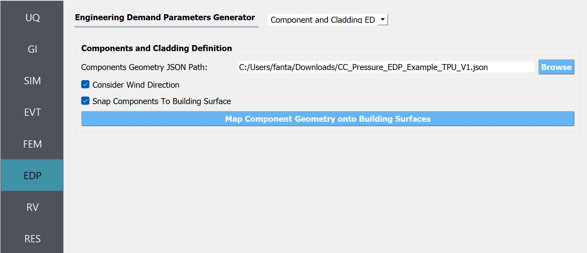

.. _lblEDP:

EDP: Demand Parameters
======================

This panel is where the user selects which outputs will be displayed when the simulation runs. There are a number of options available in the pull-down:

#. Standard
#. User-Defined
#. Component and Cladding EDP
#. None

Standard
--------

When the user selects this option, there are no additional inputs required. The standard EDP generator will ensure the max absolute value of the following is obtained:

#. Relative Floor displacements:
#. Absolute Floor Accelerations
#. Interstory Drifts

The results will contain results for these in abbreviated form:

#. PFD peak relative floor displacement Event#-PFD-FLOOR-DIR
#. PFA peak floor acceleration Event#-PFA-FLOOR-DIR
#. PID peak inter-story drift: Event#-PID-STORY-DIR

.. note::   

   FLOOR is numbered starting at floor 0, and STORY is numbered starting at story 1. DIR is either 1 or 2

User Defined
------------
As shown in the figure, this panel allows the user to determine their own output and process it. When using this option the user provides additional data:

.. figure:: figures/userDefinedEDP.png
	:align: center
	:figclass: align-center

	User-Defined EDP panel.

1. Additional Input: These are additional commands that are invoked by the analysis application before the transient analysis is performed. For example, for OpenSees this would be a script
   containing a series of recorder commands. A recorder file passed to OpenSees might look like the following:

  .. code:: tcl

     # recorder EnvelopeNode -file $filename -node $nodeTag1 ... $nodeTagN -dof $DOF1 $DOF2 disp
     recorder EnvelopeNode -file node.out -node 1 2 3 4 -dof 1 disp
     # recorder EnvelopeElement -file $filename -ele $eleTag1 ... $eleTagN forces
     recorder EnvelopeElement -file ele.out -ele 1 2 3 forces

2. Postprocess Script: This is a python or tcl script that will be invoked after the finite element application has run. It must be provided by the user. Its purpose is to process the output files and create a single file, results.out. This file must contain a single line with as many entries as EDP's specified. For example, a python postprocessing file that would take the outputs from the recorder commands of the previous code block to create the results file needed by the applications is illustrated as the example python file below along with the tcl script for creating recorders in OpenSees.

	.. collapse:: Example post-processing python file

		.. code-block:: python

			#!/usr/bin/python
			# written: fmk, adamzs 01/18
			# import functions for Python 2.X support
			from __future__ import division, print_function
			import sys
			if sys.version.startswith('2'): 
				range=xrange
				string_types = basestring
			else:
				string_types = str
			import sys
			def process_results(inputArgs):
				#
				# process output file "node.out" for nodal displacements
				#
				with open ('node.out', 'rt') as inFile:
					line = inFile.readline()
					line = inFile.readline()
					line = inFile.readline()
					displ = line.split()
					numNode = len(displ)
				inFile.close

				# now process the input args and write the results file
				outFile = open('results.out','w')

				# note for now assuming no ERROR in user data
				for i in inputArgs:
					theList=i.split('_')
					if (len(theList) == 4):
						dof = int(theList[3])
					else:
						dof = 1
					if (theList[0] == "Node"):
						nodeTag = int(theList[1])
						if (nodeTag > 0 and nodeTag <= numNode):
							if (theList[2] == "Disp"):
								nodeDisp = abs(float(displ[((nodeTag-1)*2)+dof-1]))
								outFile.write(str(nodeDisp))
								outFile.write(' ')
							else:
								outFile.write('0. ')
						else:
							outFile.write('0. ')
					else:
						outFile.write('0. ')

				outFile.close

			if __name__ == "__main__":
				n = len(sys.argv)
				responses = []
				for i in range(1,n):
					responses.append(sys.argv[i])

				process_results(responses)

	.. collapse:: Example post-processing tcl file

		.. code-block:: tcl
			
			set nodeIn [open node.out r]
			while { [gets $nodeIn data] >= 0 } {
				set maxDisplacement $data
			}
			puts $maxDisplacement

			# create file handler to write results to output & list into which we will put results
			set resultFile [open results.out w]
			set results []

			# for each quanity in list of QoI passed
			#  - get nodeTag
			#  - get nodal displacement if valid node, output 0.0 if not
			#  - for valid node output displacement, note if dof not provided output 1'st dof
			
			foreach edp $listQoI {
				set splitEDP [split $edp "_"]	
				set nodeTag [lindex $splitEDP 1]
					if {[llength $splitEDP] == 3} {
						set dof 1
				} else {
						set dof [lindex $splitEDP 3]
				} 
				set nodeDisp [lindex $maxDisplacement [expr (($nodeTag-1)*2)+$dof-1]]
				lappend results $nodeDisp
			}
	  
|
.. warning::

   The name of the output file used in the post-processing script must be **results.out**.
       
3.  Response Parameters. This is an area in which the user associates a variable name with the column of the results output file. If the process script has an array of strings named named EDP's the script, the Response Parameters will be initially set with these values from the script.

Component and Cladding EDP
---------------------------
This option provides EDP capabilities for evaluating wind loads, including forces and pressure, on building components and cladding. Unlike the standard wind EDP option, it does not perform structural analysis. Instead, it can be used to compute pressure or forces directly from CFD model or experimental measurement. In the current release this option only works with the CFD-based workflows. The following figure illustrates the inputs required for this option:

	Inputs for Component and Cladding EDP.

1. **Component Geometry JSON Path**: The path to JSON file that holds the definition of component geometry. Each component is defined as a planer element. Currently, this option supports three types of shapes: rectangle, circle, polygon and composite. The following figure demonstrates how this component geometries can be defined: 

	.. figure:: figures/componentCladdingDefinition.jpg
		:align: center
		:width: 50%

		Defining the geometry of component and cladding elements.

	.. collapse:: Sample json file for defining components

		.. code-block:: json

			{
				"snapToBuilding":true,
				"considerWindDirection":true,
				"sampleTimeInterval":10,
				"components": 
				[
					{
						"componentId":0,
						"componentName":"zone1",
						"componentType": "roof",        
						"loadType": "pressure",
						"loadValue": "peak", 
						"samplingDensity": 10, 
						"geometries": 
						[
							{
								"geometryId": 0,
								"geometryName": "zone1_1",
								"shape": "rectangle",
								"width": 20.8,
								"height": 6.89294,
								"origin": [0.0, -4.8, 9.27991],
								"normal": [0.0, -0.371367, 0.928485]
							},
						]
					},
					{
						"componentId":1,
						"componentName":"w101",
						"componentType": "window",        
						"loadType": "pressure",
						"loadValue": "peak", 
						"samplingDensity": 15, 
						"geometries": 
						[
							{
								"geometryId": 0,
								"shape": "circle",
								"radius": 10.0,
								"origin": [-12.0, 6.4, 2.5],
								"normal": [-1.0, 0.0, 0.0]
							}
						]
					},
					{
						"componentId":2,
						"componentName":"zone2",
						"componentType": "wall",        
						"loadType": "pressure",
						"loadValue": "peak", 
						"samplingDensity": 5, 
						"geometries": 
						[
							{
								"geometryId": 0,
								"shape": "polygon",
								"points": 
								[
									[-12.0, 8.0, 0.0],
									[-12.0, 6.4, 0.0],
									[-12.0, 6.4, 8.64], 
									[-12.0, 8.0, 8.0]
								]
							},            
							{
								"geometryId": 1,
								"shape": "rectangle",
								"width": 1.6,
								"height": 8.0,
								"origin": [-11.2, -8.0, 4.0],
								"normal": [0.0, 1.0, 0.0]
							}
						]
					}
				]
			}

2. **Consider Wind Direction**: If this option is checked the workflow will transform(rotate) the coordinates specified in the JSON file to alight with the wind direction specified in the EVT panel. For the CFD-based events it's recommended to turn this check on.  

3. **Snap Components to Building Surface**: If checked, geometries of each component will be snapped to the building facade.  

4. **Map Component Geometry onto Building Surfaces**: By clicking this button, the user can generate the elements and visualize them with the building geometry. When the button is clicked and new dialog window will show up as seen in the figure bellow. Also, the points that will be used to sample pressure measurements are displayed. These measurement points and the corresponding tributary areas will be used for performing area integration for the wind load calculation in the final analysis. 

	.. figure:: figures/component_cladding_mapping.jpg
		:align: center
		:width: 100%

		Mapping component geometries to the building surface.

None
-----------

This option is used only when the user specifies a surrogate model in the SIM tab. Because a surrogate model can evaluate only the EDPs that are pre-trained, we automatically display those quantities and do not allow users to modify the list. 

.. Note::   
   This option is not for training a surrogate model but for using a pre-trained surrogate model.