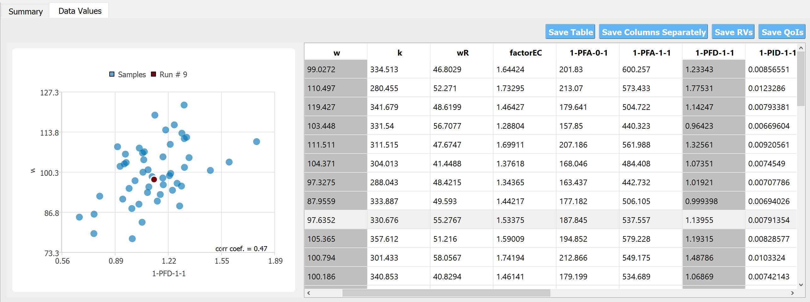

.. _lblGI:

RES: Results
============

A successful run or download of a job that ran successfully at |DesignSafe| will result in 2 tabbed widgets being displayed in the results panel.  The first tab, as shown in :numRef:`figResultsSummary` shows the summary statistics, e.g. **mean** and **stdDev**. 

.. _figResultsSummary:

.. figure:: figures/resultsSummary.png
	:align: center
	:figclass: align-center

	Results summary.

The second panel, shown in :numref:`figResultsData` presents the results both
graphically and in tabular form. By selecting different
columns with left and right mouse buttons in the table below the
graphic, the information in the graph is changed. Selecting the left
mouse button changes the Y axis, the right mouse changes the X
axis. If the same column is selected using both left and right keys,
either the cumulative density function (CDF) and probability density function (PDF) is displayed. If the last mouse press was with the left
button, the PDF will be displayed; if the last mouse press was the right one, the CDF
will be displayed.
 
.. note:: Regarding the columns in the table below the figure: You will see a column for each random variable the workflow came across and then the columns for the response quantities. There may be more random variables than you specified. This is because certain applications the user selected may introduce additional random variables for the UQ engine to consider. 

.. _figResultsData:

	Results presented both graphically and in tabular form.

