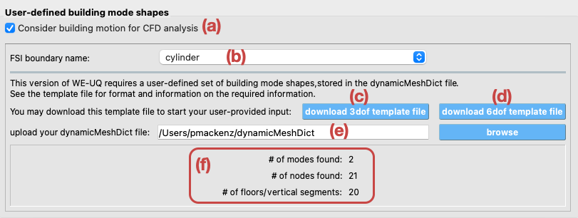

CFD Expert Template
-------------------

This option allows users to obtain wind forces utilizing an existing OpenFoam model that was uploaded to Design-Safe data depot. This is done by coupling the OpenFOAM model and the building model in a weak form, where the CFD analysis is executed first, then building forces are extracted and applied to the building model. This initial version is limited in scope due to the following assumptions:

#. The OpenFOAM model has a patch with the name *building* that represents the building envelope.

#. Only horizontal forces are applied to the building model, the vertical force and moments are not considered.

#. The building forces are extracted using the binning feature in OpenFOAM force module and thus, it is assumed that all the floors are of equal heights.

#. OpenFOAM solvers supported thus far are
   
   * *pisoFOAM*

   * *picoFOAM*

   * *pimpleFOAM*

#. Meshing is performed using the *blockMesh* tool.

#. No uncertainty is considered in the CFD analysis.

It is important to note that this type of event is only supported when running the simulation at DesignSafe and does not run on the local computer. The backend applications used in WE-UQ create a copy of the OpenFOAM case directory provided by the user, then modify the post-processing stage in the case to output the forces acting on the building, for each floor level. :numref:`fig-cfd-expert` shows input parameters required for using the CFD expert event. It is important to note that this event requires the user to have an OpenFOAM case uploaded to DesignSafe data depot. For that reason, the widget is disabled when the user is not logged into DesignSafe. Once the user signs in, the widget is enabled and the input parameters can be changed. 

.. _fig-cfd-expert:
.. figure:: figures/cfd_expert.png
	:align: center
	:figclass: align-center

	CFD expert event.

There are at least 6 input parameters and two advanced option switches that needs to be provided by the user and can be summarized as follows:

#. **Case:** The remote path of the OpenFOAM case that was uploaded in advance to DesignSafe data depot. By default, this is set to an example case that is provided by the SimCenter in the community directory.

#. **Solver:** The OpenFOAM solver that is used in the simulation.

#. **Force Calculation:** The method used to calculate the forces acting on the building in the CFD analysis.

#. **Meshing:** The meshing tool used for the provided OpenFOAM case. 

#. **Start time:** The time in the CFD simulation to start extracting the forces on the buildings. Force values before that time are not used.

#. **Coupling building vibration and CFD:** Choose whether or not you want the deformation/vibration of the building to be coupled with the CFD analysis.  This feature will significantly slow down your simulation for the CFD mesh will be updated frequently during the simulation.

#. **Inflow Conditions:** Whether or not the inflow conditions will be specified for the CFD simulation.  

.. warning::

   This is an advanced option and needs to be treated with special caution.  The tool does not
   provide a universal set of input parameters but rather expects the user to be familiar with
   turbulence modeling and to select sensible parameters.  

   Calibration runs agains experimental data or reference simulations are highly recommended.

If the user selects to specify the inflow conditions, the parameters for the inflow condition shown in :numref:`fig-cfd-expert-inflow` will need to be specified. This requires the application to download some of the case files and modify them before the simulation is started, which is done automatically by the tool.

.. note::
   
   This is the first version of WE-UQ that supports this kind of coupling.  Eventually, the coupling will
   become a fully outomated process, but for this first release, the user needs to provide an initial set of
   mode shapes to initialize the procedure.

   Mode shapes need to be prepared as a text file following this 
   File format for user-provided input of building vibration modes.

.. _fig-cfd-expert-inflow:
.. figure:: figures/cfd_expert_inflow.png
	:align: center
	:figclass: align-center

	Inflow condition parameters.

#. **Consider building motion for CFD analysis (FSI):** This enables fluid-structure interaction between
air and a deformable building.

This feature is new in version 2.1 and remains under development to provide additional support to
the user.

.. warning::

   This is an advanced option and needs to be treated with special caution.  The tool does not
   provide a universal set of input parameters but rather expects the user to be familiar with
   turbulence modeling and to select sensible parameters.  

   Calibration runs agains experimental data or reference simulations are highly recommended.

If the user selects to use the fluid-structure-interaction (FSI) through this tool ( box :numref:`fig-cfd-expert-FSI` (a) ), the following items need to be provided:

* An OpenFOAM model that includes a named boundary along which the interaction with the structure
  will be implemented.  That name boundary must be selected in
  box :numref:`fig-cfd-expert-FSI` (b) such that necessary adjustments to configuration files can
  be made by the tool before uploading the workflow. 

* FSI is implemented in the frequency domain.  As such, the provided OpenFOAM extension requires
  the user to provide representative mode shapes for the building, as well as specify respective
  surface patches for force extraction.  The tool provides two templates for the user's
  convenience:

  1. For building models using only displacement degrees of freedom per node (3dof template: box
  :numref:`fig-cfd-expert-FSI` (c) ), or

  2.  For building models using displacements and rotational degrees of freedom per node (6dof template: box
  :numref:`fig-cfd-expert-FSI` d) )

  The user has to update those templates and upload the file through the tool ( box
  :numref:`fig-cfd-expert-FSI` (e) ).
  The tool will do a basic data check on the uploaded file and provide a summary in box
  :numref:`fig-cfd-expert-FSI` (f).

.. _fig-cfd-expert-FSI:

	Inflow condition parameters.
	
.. note::

    The FSI module require the *pimpleFOAM* solver and the FSI solver provided by SimCenter.

