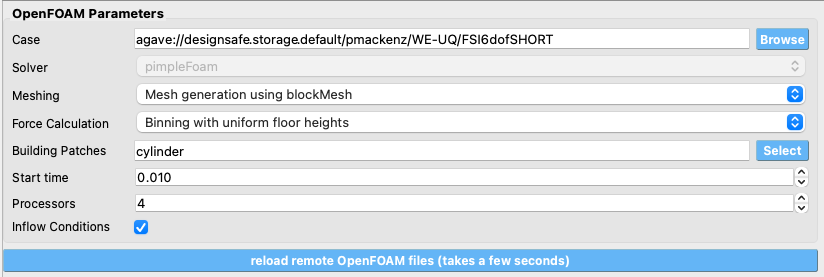
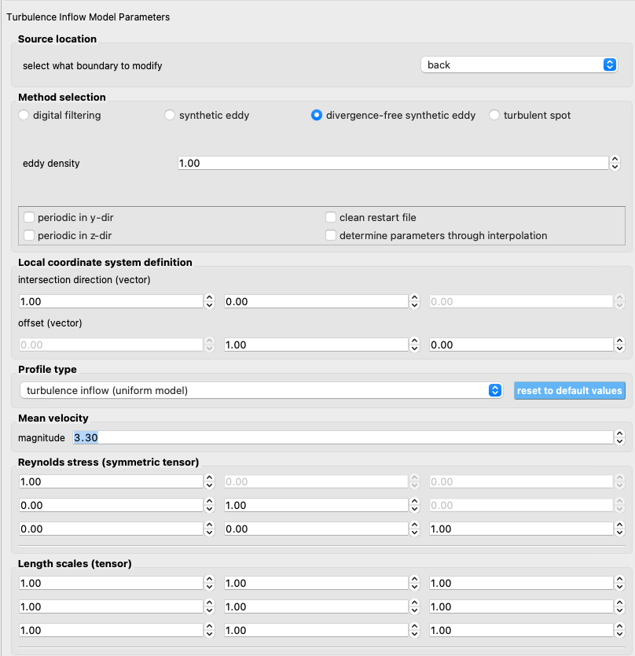

CFD Expert Template
-------------------

This option allows users to obtain wind forces utilizing an existing OpenFoam model that was uploaded to Design-Safe data depot. This is done by coupling the OpenFOAM model and the building model in a weak form, where the CFD analysis is executed first, then building forces are extracted and applied to the building model. This initial version is limited in scope due to the following assumptions:

#. The OpenFOAM model has a patch with the name \textit{building} that represents the building envelope.

#. Only horizontal forces are applied to the building model, the vertical force and moments are not considered.

#. The building forces are extracted using the binning feature in OpenFOAM force module and thus, it is assumed that all the floors are of equal heights.

#. OpenFOAM solvers supported are limited to \textit{pisoFOAM}.

#. Meshing is performed using the \textit{blockMesh} tool.

#. No uncertainty is considered in the CFD analysis.

It is important to note that this type of event is only supported when running the simulation at DesignSafe and does not run on the local computer. The backend applications used in WE-UQ create a copy of the OpenFOAM case directory provided by the user, then modify the post-processing stage in the case to output the forces acting on the building, for each floor level. :numref:`fig-cfd-expert` shows input parameters required for using the CFD expert event. It is important to note that this event requires the user to have an OpenFOAM case uploaded to DesignSafe data depot. For that reason, the widget is disabled when the user is not logged into DesignSafe. Once the user signs in, the widget is enabled and the input parameters can be changed. 

.. _fig-cfd-expert:

	CFD Expert Event

There are at least 6 input parameters that needs to be provided by the user and can be summarized as follows:

#. **Case:** The remote path of the OpenFOAM case that was uploaded in advance to DesignSafe data depot. By default, this is set to an example case that is provided by the SimCebnter in the community directory.

#. **Solver:** The OpenFOAM solver that is used in the simulation.

#. **Force Calculation:** The method used to calculate the forces acting on the building in the CFD analysis.

#. **Meshing:** The meshing tool used for the provided OpenFOAM case. 

#. **Start time:** The time in the CFD simulation to start extracting the forces on the buildings. Force values before that time are not used.

#. **Inflow Conditions:** Whether or not the inflow conditions will be specified for the CFD simulation.  

If the user selects to specify the inflow conditions, the parameters for the inflow condition shown in :numref:`fig-cfd-expert-inflow` will need to be specified. This requires the application to download some of the case files and modify them before the simulation is started, which is done automatically by the tool.

.. _fig-cfd-expert-inflow:

	Inflow Condition Parameters