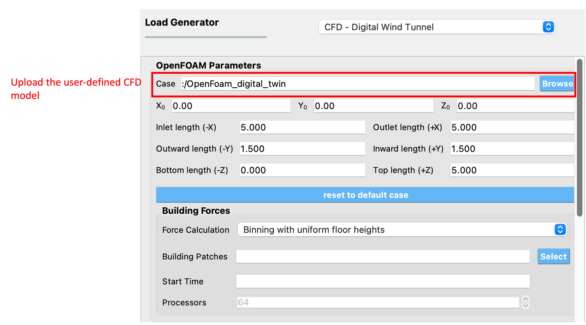
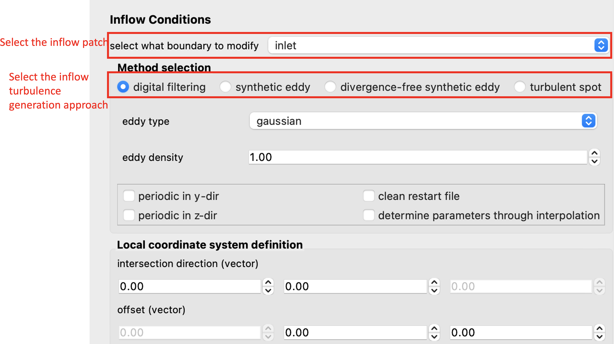
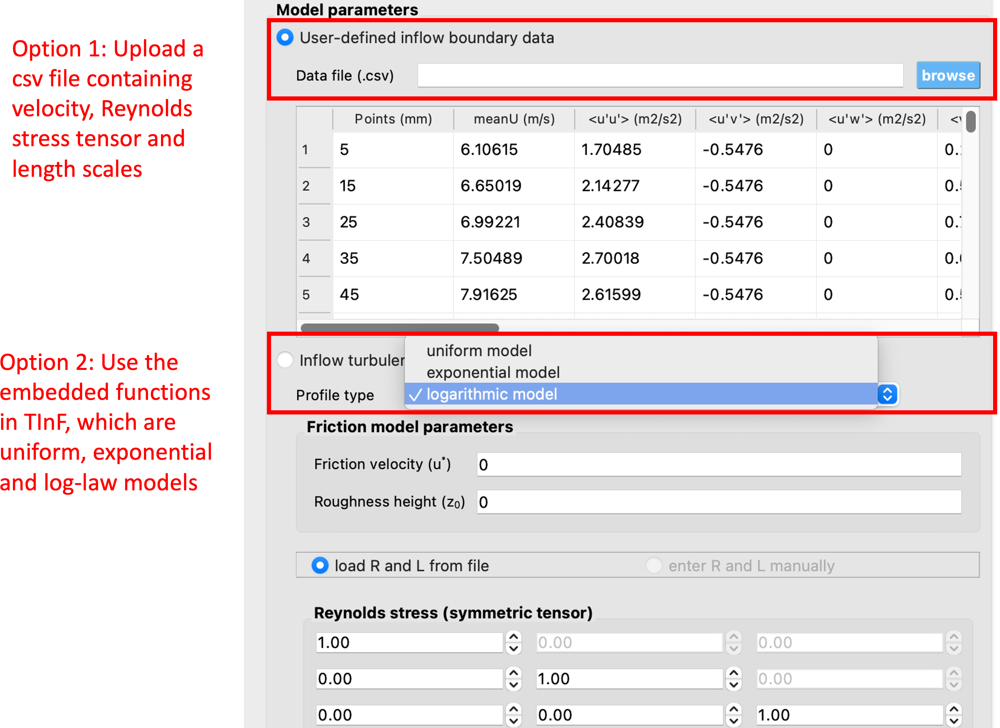

Digital Wind Tunnel
-------------------

The Digital Wind Tunnel provides great flexibility in testing different designs and wind scenarios. This feature allows users to run CFD simulations with user-defined atmospheric boundary layer inflow conditions and with user-defined OpenFOAM models. It can be implemented with the empty domain for validation purposes, or users can provide their own building model for analysis. This initial version is limited in scope due to the following assumptions:

#. Meshing is performed using the *snappyHexMesh* tool.

#. OpenFOAM solvers supported are limited to *pisoFOAM*.

#. Only horizontal forces are applied to the building model, the vertical force and moments are not considered.

#. The building forces are extracted using the binning feature in OpenFOAM force module and thus, it is assumed that all the floors are of equal heights.

#. No uncertainty is considered in the CFD analysis.

It is important to note that this type of event is only supported when running the simulation at DesignSafe and does not run on the local computer. For that reason, users need to create a DesignSafe account in order to use this feature. 

The user needs to input certain parameters, which are summarized as follows:

#. **Case:** The user-defined OpenFOAM case can be uploaded by pressing the "Browse" button as shown in :numref:`fig-dwt-upload-case`. By default, this is set to a benchmark case that is provided by the SimCenter in the community directory.

#. **Inflow Conditions:** Select the patch where the inflow conditions will be specified for the CFD simulation as shown in :numref:`fig-dwt-inflow-method`. 

#. **Method selection:** Select the inflow turbulence generation approach as shown in :numref:`fig-dwt-inflow-method`. The Digital Wind Tunnel incorporates the Turbulence Inflow Tool (TInF) developed by NHERI SimCenter, which features four inflow turbulence generation approaches. The basic parameter settings can be referred to `Turbulence Inflow Tool (TInF) documentation <https://nheri-simcenter.github.io/TinF-Documentation/>`_.

.. _fig-dwt-upload-case:

	Uploading a user-defined CFD model. 

.. _fig-dwt-inflow-method:

	Selecting the inflow patch and turbulence generation approach.

After selecting a particular approach for inflow turbulence generation, the statistical information of the inflow turbulence is required by the selected approach. The Digital Wind Tunnel offers two input options for users as shown in :numref:`fig-dwt-inflow-option2`:

#. **User-defined inflow boundary data:** This option allows users to specify the inflow turbulence properties obtained from wind tunnel measurements, such as mean velocity, Reynolds stress, and length scales at the inflow boundary for a CFD simulation. By pressing the "Browse" button, the **csv** file format can be uploaded and displayed in the user interface.

#. **Inflow turbulence parameters:** Users can also specify the inflow conditions through the embedded functions in the Digital Wind Tunnel. There are three functions to characterize the atmospheric inflow profiles: uniform function, exponential function and logarithmic function. The uniform function assumes a constant wind velocity over the entire simulation domain, but may not accurately represent the complex nature of atmospheric boundary layer flows. The exponential function is often used to represent the vertical profile of wind velocity in the atmospheric boundary layer. The logarithmic function is another commonly used function that also represents the vertical profile of wind speed in the atmospheric boundary layer, based on the assumption of a logarithmic variation of wind velocity with height. Detailed information about the parameter settings can be referred to `Turbulence Inflow Tool (TInF) documentation <https://nheri-simcenter.github.io/TinF-Documentation/>`_.

.. _fig-dwt-inflow-option2:

	Two options to configure inflow conditions.

After the CFD model with the appropriate inflow conditions is set up, the next step is to run the simulation. Press the **RUN at DesignSafe** button to submit the job to TACC Frontera HPC resources. Once the simulation is completed, download the data from **GET from DesignSafe** for post-processing.
