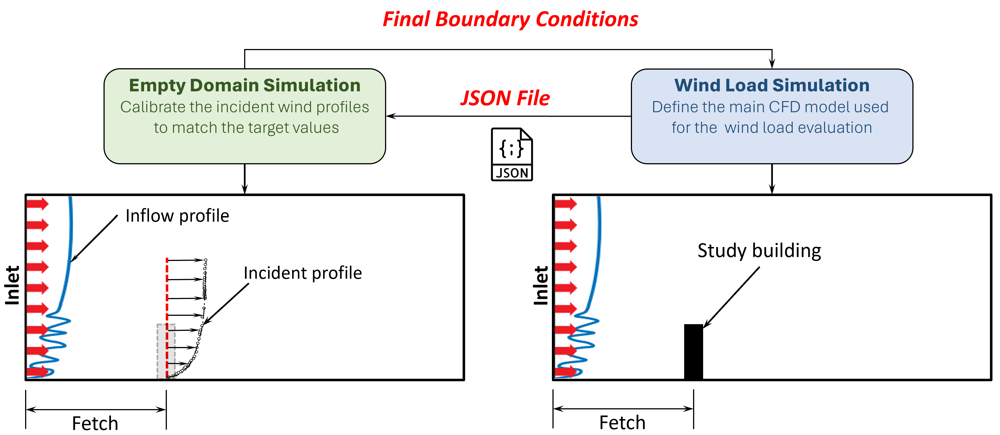
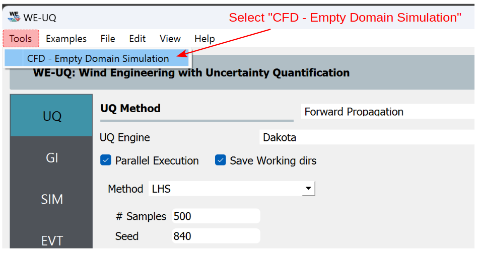
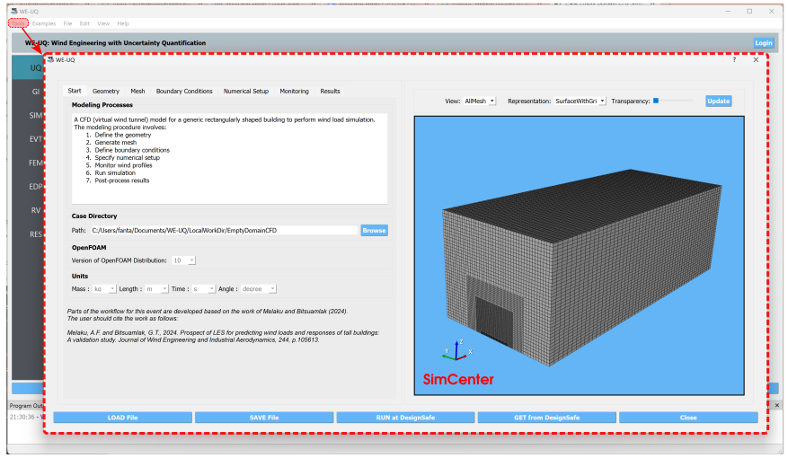
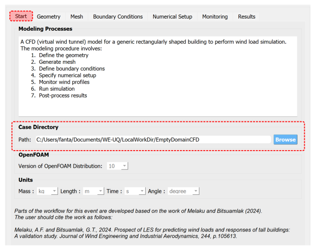
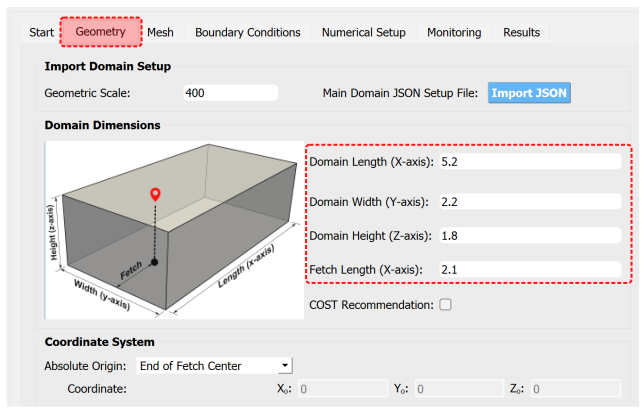
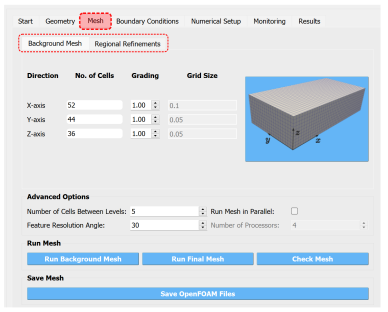
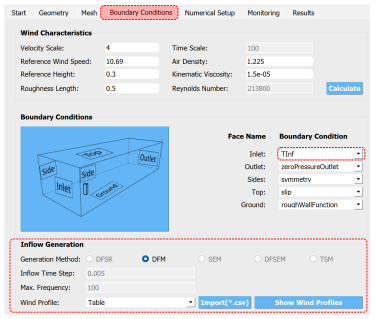
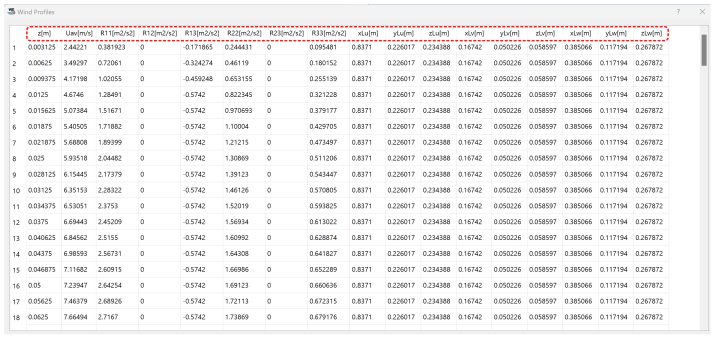
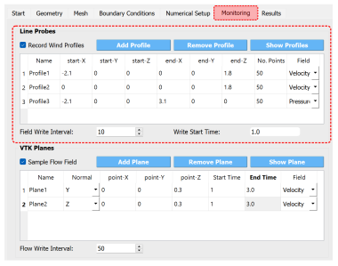
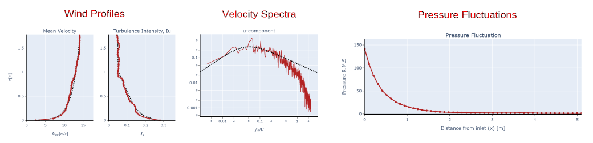

.. _lblEmptyDomainCFD:

Empty Domain CFD Simulation
============================

When performing wind load evaluation on buildings using CFD, it is often necessary to calibrate the characteristics of the approaching Atmospheric Boundary Layer(ABL) flow. This is particularly important for transient simulations (i.e., LES) as the flow characteristics change downstream of the inlet. Thus, it is customary to run an empty domain simulation and evaluate the statistics of the flow at the incident location (i.e. where the building/structure will be placed). If the statistics of flow do not match the target wind profiles, the boundary conditions need to be rescaled. This process is often an iterative procedure that requires running an empty domain simulation multiple times. Once the target profiles are matched, the final boundary conditions can be used in the main wind load simulation. :numref:`fig-emp-cfd-workflow` describes this procedure schematically. The inputs of the empty domain simulation can be imported from the main simulation in the form of ``JSON`` file.     

.. _fig-emp-cfd-workflow:

   
   The procedure of calibrating wind profiles using empty domain simulation. 

To define CFD model for the empty domain simulation, the user needs to follow the following key steps:           

#. Define the size of the computational domain
#. Generate the mesh with refinement regions
#. Define boundary conditions
#. Specify numerical setups
#. Setup the wind profiles to be monitored
#. Submit the simulation to run remotely 
#. Post-process and verify the results 

Considering the high computational cost of the simulation, the CFD models can only be run remotely using High-Performance Computing (HPC) resources at DesignSafe-CI. Thus, the user is required to have DesignSafe account to run the simulations. Also, the generated CFD model is saved locally as a typical OpenFOAM case. This will allow the user to copy this directory and run the simulation elsewhere. 

To set up empty domain simulation in WE-UQ, from the *Menu Bar* click **Tools** and select *CFD - Empty Domain Simulation* as shown in :numref:`fig-tools-menu-bar`. This will open up a new dialog window for defining the CFD model (see :numref:`fig-emp-dmn-window`). The workflow for this feature is similar to :ref:`Isolated Building CFD Model <lblIsolatedBuildingCFD>` and the user need to refer to this manual for the details instruction. Here a brief step-by-step procedure is given. 

.. _fig-tools-menu-bar:

   
   Open dialog window for setting up empty domain simulation. 

.. _fig-emp-dmn-window:

   
   Empty domain simulation setup window. 

Start
""""""
:numref:`fig-emp-dmn-start` shows the *Start* tab of the simulation window. Here the user needs to define the location of the OpenFOAM case directory in **Path**. This location could be anywhere on the user's machine. However, it is recommended to put it in the user's ``Documents`` folder under ``WE-UQ/LocalWorkDir`` subfolder. The version of the OpenFOAM pre-processors for this tool is ``Version 10`` and all the units are metrics.    

.. _fig-emp-dmn-start:

   
   Specifying the working directory in *Start* tab of the workflow. 

Computational Domain 
""""""""""""""""""""""
In *Geometry* tab specify details related to the size of the computation domain, geometric scale and coordinate system as seen in :numref:`fig-emp-dmn-geometry`.  The model for empty domain CFD simulation can be recreated from a ``JSON`` setup file exported from the main wind load simulation as demonstrated in :numref:`fig-emp-cfd-workflow`.

.. _fig-emp-dmn-geometry:

   
   Define the dimensions of the computational domain in *Geometry* tab of the workflow 

#. **Geometric Scale**: The ratio of the full-scale dimensions to the model scale dimensions. If a simulation is run at full scale, this value should be set to 1.0.

#. **Main Domain JSON Setup File**: Used to import ``JSON`` file from the main wind load simulation by clicking the button **Import JSON**. This will automatically populate fields matching the dimension and boundary conditions from the wind load simulation domain. 

#. **Domain Length (X-axis)**: Dimension of the domain in the streamwise direction (x-axis).  

#. **Domain Width (Y-axis)**: Dimension of the domain in the lateral direction (y-axis). 

#. **Domain Height (Z-axis)**: Height of the domain in in vertical direction (z-axis). 

#. **Fetch Length (X-axis)**: The distance between the inlet of the computational domain and the anticipated location of the structure. This is the location where the incident wind profiles will be monitored.  
 

Mesh Generation 
"""""""""""""""""
The mesh generation follows the same procedure described in :ref:`Isolated Building CFD Model <lblIsolatedBuildingCFD>`. For the empty domain simulation, only a background mesh with regional refinements is needed as shown in :numref:`fig-emp-dmn-mesh`. Once the user defines meshing parameters in *Background Mesh* and *Regional Refinements* subtabs, the final grid can be generated by clicking **Run Final Mesh** button shown in :numref:`fig-emp-dmn-mesh`. 

.. _fig-emp-dmn-mesh:

   Define mesh parameters and generate the computational grid in *Mesh* tab of the workflow 

Boundary Conditions 
"""""""""""""""""""""
Before defining boundary conditions, for ABL flows, the user needs to set the characteristics of the approaching wind. This is done by defining parameters such as exposure conditions, and reference wind speed and physical properties flows as seen in :numref:`fig-emp-dmn-bc`. The most important boundary condition for ABL flows is the inlet boundary. This boundary condition can be set as a turbulent inflow by using *TInf* option at the **Inlet**. Then, details about the inflow turbulence generation can be specified under **Inflow Generation**  part (see :numref:`fig-emp-dmn-bc`). Here are the inputs needed for setting up turbulent inflow: 

#. **Generation Method**: Specifies the type of inflow turbulence generation method. By default, it is set to the Digital Filtering Method (DFM). Similarly, techniques based on the spectral representation method such as Divergence-free Spectral Representation (DFSR) method, can be used here.   

#. **Wind Profile**: Define the target profile of the approaching wind. The target profiles can be imported from a ``*.csv`` file by using **Import (.csv)** button. Once the file is imported, it can be displayed in tabular format by clicking **Show Wind Profiles** as seen in :numref:`fig-emp-dmn-prof-tbl`. The target profiles are defined by prescribing the variation of mean velocity, Reynold's stress, and integral lenght scale profile along the height of the domain (z-direction).  

.. _fig-emp-dmn-bc:

   Specify the inflow boundary conditions using the *TInf* option in the *Boundary Conditions* tab.  

.. _fig-emp-dmn-prof-tbl:

   Display the target wind profiles by clicking **Show Wind Profiles** button.  

Numerical Setup 
"""""""""""""""""
For specifying parameters related to the turbulence model, solver and numerical methods used, please refer to the description in :ref:`Isolated Building CFD Model <lblIsolatedBuildingCFD>`.  

Result Monitoring 
""""""""""""""""""
The main result often studied in empty domain simulation is the downstream evolution of the wind profiles. The workflow provides options to monitor wind profiles along a line probe. Also, the 2D snapshot of the flow field can be recorded by defining VTK planes. Details about the input fields in :numref:`fig-emp-dmn-res-mon` are provided below. 

.. _fig-emp-dmn-res-mon:

   Define line probes to monitor wind profiles and VTK planes for the flow field in *Monitoring* tab of the workflow. 

**Line Probes**

The line probes monitor velocity or pressure field along a line. To define a line the user needs to specify the **Name**, start and end coordinates of the line, **No. Points** on the line, **Field** as shown in :numref:`fig-emp-dmn-res-mon`.  

#. **Record Wind Profiles**: If this option is checked wind profiles will be recorded while the simulation is running. 

#. **Add Profile**: Adds a new line probe in the table. 

#. **Remove Profile**: Removes a selected line probe from the table. 

#. **Field Write Interval**: The interval (as a multiple of the time step) at which to record the wind profiles. 

#. **Write Start Time**: A allows the user to specify a time from which to start monitoring results. For unsteady CFD simulations, it is common for the first few time steps to experience very transient fluctuations and it's recommended to avoid this part from the analysis.  

**VTK Planes**

The flow field on a section of the domain can be monitored by defining 2D planes. The resulting flow field will be saved in ``*.vtk`` format. A VTK plane can be defined by specifying its **Name**, **Normal** axis, **X**, **Y**, **Z** coordinates of a point on the plane, **Start Time**, **End Time** and **Field** in a tabular format as shown in :numref:`fig-emp-dmn-res-mon`.

#. **Sample Flow Field**: If this option is checked the flow field on a VTK plane will be saved while the simulation is running. 

#. **Add Plane**: Adds a new VTK  plane in the table. 

#. **Remove Plane**: Removes a selected VTK plane from the table. 

#. **Flow Write Interval**: The interval (as a multiple of the time step) at which to record the VTK plane. 

CFD Result 
"""""""""""
After the simulation is completed, the results can be displayed in the *Results* tab. The results are calculated based on the monitoring options the user supplied in the previous tab. The workflow post-processes the characteristics of the approaching flow including wind profiles, velocity spectra as well as pressure fluctuations. :numref:`fig-emp-dmn-res-dsp` shows the *Results* tab with all paoting options.  

	.. note:: 
		To display the results in this tab, first, the user needs to make sure the CFD simulation is completed successfully and the results are retrieved from *DesignSafe* by clicking **GET From DesignSafe** button. 
	

.. _fig-emp-dmn-res-dsp:

.. figure:: figures/EmptyDomainCFD/empty_domain_result_display.svg
   :align: center
   :width: 75%

   Plot the wind profiles, velocity spectra and pressure fluctuations in the *Results* tab of the workflow. 

#. **Wind Profiles**: After selecting the line probe from the combo box under **Name of the Profile**, the user can plot the comparison of the wind profiles from the simulation with the target values by clicking **Plot Profile** button. 

#. **Velocity Spectra**: After selecting the name of the line probe and height above the ground (**Location**), the user can plot the comparison of the velocity spectra from the simulation with the target spectra by clicking **Plot Spectra** button. The spectra are computed at 4 locations along the height i.e., :math:`[0.25 H_{ref}, 0.5 H_{ref}, H_{ref}, 2H_{ref}]`, where :math:`H_ref` the reference height defined in the *Boundary Conditions* tab.  

#. **Pressure Fluctuations**: Similarly, by selecting **Name of the Profile**, the distribution of pressure fluctuations (standard deviation) can be displayed.  

Sample plots for wind profiles, velocity spectra and pressure fluctuations are shown in :numref:`fig-emp-dmn-res-spl`.

.. _fig-emp-dmn-res-spl:

   Sample plots of the results from the empty domain simulation. 

.. [Greenshields2015] Greenshields, C.J. (2015). OpenFOAM Programmer's Guide. OpenFOAM Foundation Ltd.
.. [Franke2007] Franke, J., Hellsten, A., Schlünzen, K.H. and Carissimo, B., 2007. COST Action 732: Best practice guideline for the CFD simulation of flows in the urban environment.
.. [Greenshields2022] Greenshields, C.J. (2022). https://doc.cfd.direct/openfoam/user-guide-v10/snappyhexmesh

.. [Melaku2021] Melaku, A.F. and Bitsuamlak, G.T., 2021. A divergence-free inflow turbulence generator using spectral representation method for large-eddy simulation of ABL flows. Journal of Wind Engineering and Industrial Aerodynamics, 212, p.104580.

.. [Klein2003] Klein, M., Sadiki, A. and Janicka, J., 2003. A digital filter based generation of inflow data for spatially developing direct numerical or large eddy simulations. Journal of Computational Physics, 186(2), pp.652-665.

.. [Xie2008] Xie, Z.T. and Castro, I.P., 2008. Efficient generation of inflow conditions for large eddy simulation of street-scale flows. Flow, turbulence and combustion, 81, pp.449-470.

.. [Jarrin2006] Jarrin, N., Benhamadouche, S., Laurence, D. and Prosser, R., 2006. A synthetic-eddy-method for generating inflow conditions for large-eddy simulations. International Journal of Heat and Fluid Flow, 27(4), pp.585-593.

.. [Poletto2013] Poletto, R., Craft, T. and Revell, A., 2013. A new divergence free synthetic eddy method for the reproduction of inlet flow conditions for LES. Flow, turbulence and combustion, 91, pp.519-539.

.. [Kröger2018] Kröger, H. and Kornev, N., 2018. Generation of divergence free synthetic inflow turbulence with arbitrary anisotropy. Computers & Fluids, 165, pp.78-88.
