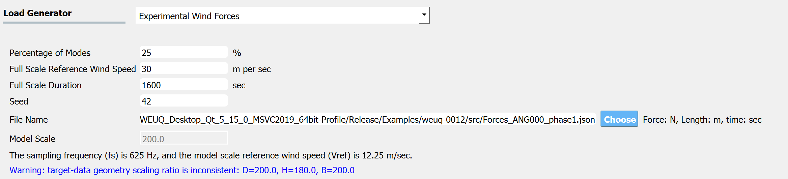

.. _lblExperimentalWindForce:

Experimental Wind Force
------------------------

This application takes the wind force time series data obtained from a wind tunnel experiment and allows us to generate multiple stochastic (full-scale) wind time histories that preserve the spectral properties. The wind load is assumed to follow a Gaussian stochastic process. This algorithm follows the implementation details in [Duarte2023]_.

.. _fig-ExperimentalWind0:

	Generating full-scale wind force history from a model-scale wind force time history obtained from wind tunnel experiments.

.. [Duarte2023] Duarte, T. G. A., Arunachalam, S., Subgranon, A., & Spence, S. M. (2023). Uncertainty Quantification of a Wind Tunnel-Informed Stochastic Wind Load Model for Wind Engineering Applications. arXiv preprint arXiv:2305.06253.

User Inputs
^^^^^^^^^^^^^^^^^^^^^^^^^^

.. _fig-ExperimentalWind1:

	Option to import experimental wind force time history

* **Percentage of Modes**: The truncation criteria for the proper orthogonal decomposition.
* **Full Scale Reference Wind Speed**: The wind speed at the reference point of the building (e.g. top of the building). The reference point location should match that of the model.
* **Full Scale Duration**: The duration of wind force time series that will be generated by this engine.
* **Seed**: The seed for the random number generator.
* **File Name**: "Wind Force Time History File" that contains model geometry and wind tunnel experiment details. The data can be provided either in a matlab binary file (.mat) or a json (.json) file. Please see the next section for the details of the variables (keys) needed in the file.
* **Model Scale**: This is the model scaling ratio. This value is automatically estimated after reading the "Wind Force Time History File", as a ratio between the full-scale and model-scale building dimensions. Only if the file is imported in a json format, the model scale ratio will be displayed. 
* The units can be modified at GI tab. 

Additional parameters for estimating cross-power spectrum density function can be specified, i.e. **Window Size** and **Overlap Percentage**. Note that the engine implemented in WE-UQ uses ``scipy.signal.csd`` function, and the detailed parameter information can be found in the `scipy user manual <https://docs.scipy.org/doc/scipy/reference/generated/scipy.signal.csd.html>`_.

.. _fig-ExperimentalWind2:

	Option to import experimental wind force time history

The **Full Scale Building Geometry** and the **Units** are specified in the GI tab. The correct **number of stories** should also be provided. 

.. _fig-ExperimentalWind5:

.. figure:: figures/weuqExperimentalWindForces5.png
	:align: center
	:figclass: align-center
	:width: 500

	GI tab (Only the variables in the red box are relevant to the current module.)

.. warning::
		This algorithm assumes that **the building is uniformly scaled in all dimensions**, meaning if model height is scaled by 1/200 for the experiment, width (breath) and depth is also scaled by 1/200. Therefore the ratio of model-scale dimensions (B,H,D) provided in the "Wind Force Time History File" should match that of the full-scale dimensions (Height, Width, Depth) specified in the GI tab. Otherwise, WE-UQ will give a warning message in blue font color as shown in the screen capture above.

Wind Force Time History File
^^^^^^^^^^^^^^^^^^^^^^^^^

.. _fig-ExperimentalWind6:

.. figure:: figures/weuqExperimentalWindForces6.png
	:align: center
	:figclass: align-center
	:width: 700

	Schematic representation of the building and the loads, and the coordinate system ([Duarte2023]_ )

The details of experimental wind force data should be provided either in a matlab binary (.mat) or json (.json) file. The following variables (or keys) need to be included (``ntimestep``: number of time steps, ``nfloor``: number of floors of the building)

* **B**: Scalar. Breath (Width) of the building model used in the experiment (Length unit defined in GI tab)
* **D**: Scalar. Depth of the building model used in the experiment (Length unit defined in GI tab)
* **H**: Scalar. Height of the building model used in the experiment (Length unit defined in GI tab)
* **fs**: Scalar. Sampling frequency (Hz)
* **Fx**: 2D array with size [``ntimestep`` x ``nfloor``]. The x-directional wind force time history measured at each story (Force unit defined in GI tab)
* **Fy**: 2D array with size [``ntimestep`` x ``nfloor``]. The y-directional wind force time history measured at each story (Force unit defined in GI tab)
* **Tz**: 2D array with size [``ntimestep`` x ``nfloor``]. The z-directional wind force moment time history measured at each (Force unit defined in GI tab)
* **t**: 1D array with size [1 x ``ntimestep``]. The time series data for the wind force time histories Fx, Fy, Tz (sec).
* **Vref**: Scalar. Model Scale Reference Wind Speed at the reference point of the building. The reference point of the model should match that of the full-scale building (Velocity with length unit defined in GI tab and sec).
 
.. _fig-ExperimentalWind3:

	Example of information inside a matlab binary file (.mat) (``nfloor`` = 25, ``ntimesteps`` = 20,000, units: meter, Newton, second)

.. _fig-ExperimentalWind4:

	Example of information inside a Json file (.json) (``nfloor`` = 25, ``ntimesteps`` = 20,000, units: meter, Newton, second)

The example Json file shown in the image can be found at :weuq-0012:`/src`, named ``Forces_ANG000_phase1.json``
