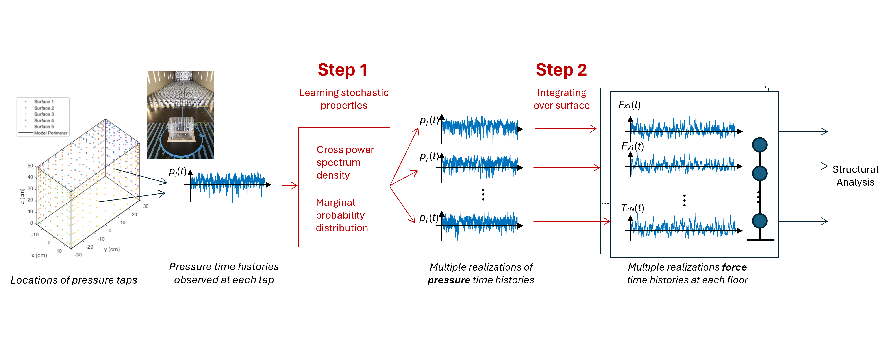
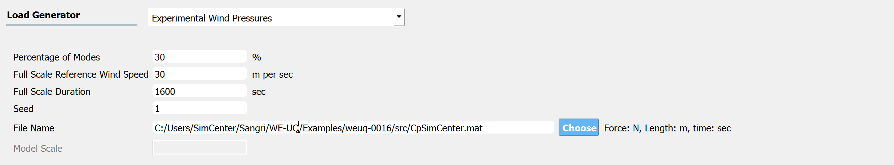
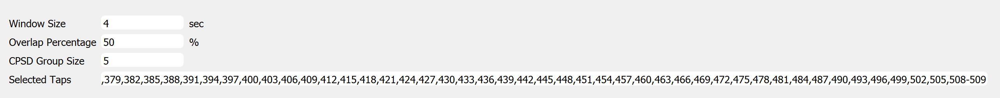
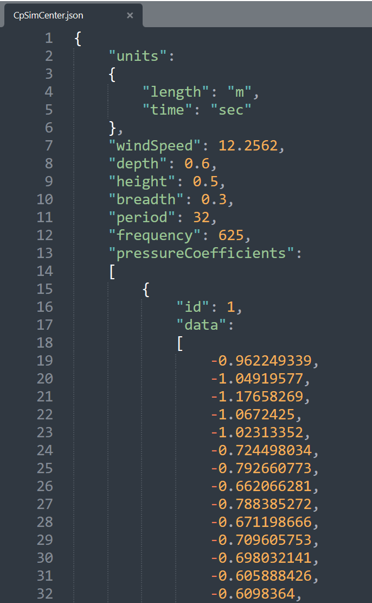

.. _lblExperimentalWindPressure:

Experimental Wind Pressure
----------------------------

:bdg-link-primary:`Source code (Python) <https://github.com/NHERI-SimCenter/SimCenterBackendApplications/blob/master/modules/createEVENT/experimentalWindPressures/experimentalWindPressures.py>`

This application takes a set of stationary wind pressure time series data from a wind tunnel experiment and generates multiple realizations of wind pressure time series that preserve certain stochastic properties (i.e., marginal (non-Gaussian) distribution at each pressure tap location and cross power spectrum density (CPSD) functions) [Duarte2023]_. Then the pressure time history is translated into full-scale force time history applied at each floor, of which the integration is approximated by uniformly dividing the building surface into meshes and assuming each mesh is subjected to the pressure load at the nearest pressure tap. 

.. _fig-ExperimentalWindP0:

	Generation of wind force history from the time histories of wind pressure coefficients obtained from a wind tunnel experiment. [Duarte2023]_

.. [Duarte2023] Duarte, T.G., Arunachalam, S., Subgranon, A. and Spence, S.M., (2023). Uncertainty Quantification and Simulation of Wind-Tunnel-Informed Stochastic Wind Loads. Wind, 3(3), pp.375-393.

User Inputs
^^^^^^^^^^^^^^^^^^^^^^^^^^

.. _fig-ExperimentalWindP1:

	Option to import experimental wind pressure time history

The input parameters for the application interface are provided below. 

* **Percentage of Modes**: Percentage of modes (dominant modes) that will be included to obtain the pressure time history. If 100% of modes are included, the simulated process is exact up to the second order, but additional computation cost is expected. It is recommended to include at least 25% of modes to have negligible errors in the simulation at a reasonable computational cost [Duarte2023]_
* **Full Scale Reference Wind Speed**: The full-scale wind speed at the reference point of the building (e.g., top of the building). The reference point location should match that of the model used in the wind tunnel testing.
* **Full Scale Duration**: The duration of the wind force time series that will be generated by this engine.
* **Seed**: The seed for the random number generator.
* **File Name**: “Wind Pressure Time History File” that contains model geometry and wind tunnel experiment details. The data can be provided either as a MATLAB binary file (.mat) or a json (.json) file. Please see the next section for the details of the variables (keys) needed in the file.
* **Model Scale**: This is the geometric length scale. This value is automatically estimated after reading the “Wind Pressure Time History File”, as a ratio between the full-scale and model-scale building dimensions. Only if the file is imported in a json format, the model scale ratio will be displayed.
* The units can be modified at the GI tab. 

Additional input parameters for estimating cross-power spectral density function can be specified.

* **Window Size**: length of the Hanning window function given in seconds. Its values can range from [0, L], where L is the record duration used as input. A window size of 4 s is suggested for wind tunnel records lasting about 30 s – 60 s, but the user has the flexibility to define this variable according to specific case study requirements. 
* **Overlap Percentage**: The extent of overlap between segments of the signal. A value of 50% overlap is suggested. Note that the engine implemented in WE-UQ uses ``scipy.signal.csd`` function, and the detailed parameter information can be found in the `scipy user manual <https://docs.scipy.org/doc/scipy/reference/generated/scipy.signal.csd.html>`_.
* **Cross Power Spectrum Density (CPSD) group size** (:math:`gg`): a variable that subdivides the CPSD matrix into :math:`gg\times gg` "groups" in order to avoid running out of memory this value can be increased to speed up the analysis, however, it may lead to run out of memory. Choose according to the specifications of the user's machine.
* **Selected Taps**: (Optional) A subset of taps used for simulation. All taps are included if the field is empty.

.. _fig-ExperimentalWindP2:

	Option to import experimental wind pressure time history

The **Full Scale Building Geometry** and the **Units** are specified in the GI tab. The correct **number of stories** should also be provided. 

.. _fig-ExperimentalWindP5:

.. figure:: figures/weuqExperimentalWindForces5.png
	:align: center
	:figclass: align-center
	:width: 500

	GI tab (Only the variables in the red box are relevant to the current module.)

.. warning::
		This algorithm assumes that **the building is uniformly scaled in all dimensions**, meaning if model height is scaled by 1/200 for the experiment, width (breath) and depth are also scaled by 1/200. Therefore the ratio of model-scale dimensions (B,H,D) provided in the "Wind Pressure Time History File" should match that of the full-scale dimensions (Height, Width, Depth) specified in the GI tab. Otherwise, WE-UQ will give a warning message in blue font color as shown in the screen capture above.

Wind Pressure Time History File
^^^^^^^^^^^^^^^^^^^^^^^^^

.. _fig-ExperimentalWindP6:

.. figure:: figures/weuqExperimentalWindPressures6.png
	:align: center
	:figclass: align-center
	:width: 100%

	The coordinate system

The details of experimental wind pressure data should be provided either in a MATLAB binary (.mat) or json (.json) file. The following variables (or keys) need to be included (``ntimestep``: number of time steps, ``ntap``: number of taps). Note the variable names follow the camel case rule as below.

* **units**: `Structure <https://www.mathworks.com/help/matlab/ref/struct.html>`_ (or a dictionary). It has two fields, length and time.

	* **length**: String. e.g., *m, meter, meters, cm, centimeter, centimeters, mm, millimeter, millimeters, in, inch, inches, ft, foot, feet*.
	* **time**: String. e.g., *s, sec, second, seconds, min, minute, minutes, hr, hour, hours*

* **breadth**: Scalar. Breath (Width) of the building model used in the experiment (e.g., m)
* **depth**: Scalar. Depth of the building model used in the experiment (e.g., m)
* **height**: Scalar. Height of the building model used in the experiment (e.g., m)
* **frequency**: Scalar. Sampling frequency (e.g., Hz)
* **period**: Scalar. Duration of recording (e.g., sec)
* **windSpeed**: Scalar. Model Scale Reference Wind Speed at the reference point of the building. The reference point of the model should match that of the full-scale building (e.g., m/sec).

* **pressureCoefficients**: `Array of structures <https://www.mathworks.com/help/matlab/matlab_prog/create-a-structure-array.html>`_ (or dictionaries) with size [``1`` x ``ntap``].  Each element has two fields id and data. 

	* **id**: Scalar integer. The index of pressure taps. It is mapped with *id* in *tabLocations* variable (described below) and also used in *Selected Tabs* field. 
	* **data**: 2D array with size [``ntimestep`` x ``1``]. The time history of pressure coefficients. The ``ntimestep`` should correspond to ``period`` x ``frequency``.

* **tabLocations**: `Array of structures <https://www.mathworks.com/help/matlab/matlab_prog/create-a-structure-array.html>`_  (or dictionaries) with size [``1`` x ``ntap``].  Each element has four fields id, face, xLoc, and yLoc.

	* **id**: Scalar integer. The index of pressure taps.
	* **face, xLoc, yLoc**: Scalar. The face id (1,2,3,4, or 5) and horizontal and vertical coordinates (e.g., m) of each pressure tap as indicated in :numref:`fig-ExperimentalWindP3`. Input the model scale value.

.. _fig-ExperimentalWindP3:

.. figure:: figures/weuqExperimentalWindPressures3.png
	:align: center
	:figclass: align-center
	:width: 30%

	Example of information inside a matlab binary file (.mat) (``ntap`` = 509, ``ntimesteps`` = ``frequency`` x ``period`` =20,000, units: meter, Newton, second)

.. _fig-ExperimentalWindP4:

	Example of information inside a Json file (.json)  (``ntap`` = 509, ``ntimesteps`` = ``frequency`` x ``period`` =20,000, units: meter, Newton, second)

The example Matlab file shown in the image can be found at `WE-UQ/Examples/weuq-0016 <https://github.com/NHERI-SimCenter/WE-UQ/tree/master/Examples//weuq-0016//>`_, named ``CpSimCenter.mat``
