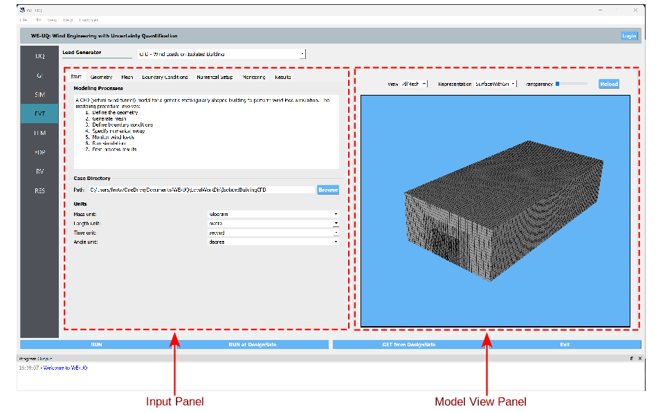

Isolated Building CFD Model
-------------------

The Isolated Building CFD Model is a Computational Fluid Dynamics (CFD) based wind load generator that provides greater flexibility in modeling the approaching wind and the flow around the building. This event allows the user to seamlessly define CFD model for isolated building with rectangularly shaped cross-section. The modeling process is automated with different pre-/post-processing functionalities. The user needs to provide information related to geometry, mesh generation, boundary conditions, turbulence modeling, solver selection, etc. One of the most salient feature include automatic meshing with user interactive interface. At the backend, the CFD simulations are conducted by executing an open-source CFD code, OpenFOAM. The user need to follow the following procedure to model wind loading using this event.           

#. Define the geometry of the building and the computational domain
#. Generate the mesh using global and refinement options
#. Define boundary conditions with the characteristics of the approaching wind
#. Specify turbulence model, solver type, and other numerical setup 
#. Define the outputs to be monitored from the CFD simulation
#. Submit the simulation to run remotely and follow-up the progress 
#. Post-process and verify the results from the simulation 

Considering the high computational cost of the simulation, the CFD models can only be run remotely using High Performance Computing (HPC) resources at DesignSafe-CI. Thus, the user is required to have DesignSafe account to run the simulations. Also, the generated CFD model is saved locally as a standard OpenFOAM case. This will permit the user to copy this directory and run the simulation using their own OpenFOAM installation elsewhere. 

.. note::
	It is important to note that, no uncertainty is considered in the CFD simulation. At this stage of the development, the CFD results informs the workflow in a rather deterministic manner. 

Overall, the GUI of the CFD-even has two region, the *Input Panel* where the user can specify details of the CFD model, and the *Model View Panel* for visualizing the geometry and generated mesh (see :numref:`fig-iso-gui-overview`). The *Input Panel* contains tabbed interface for defining different components of the CFD workflow. Whereas, the *Model View Panel* holds the VTK representation of computational domain and a tool bar for manipulating the view of the model. Individual components in each part of the GUI are described in the following subsections.           

.. _fig-iso-gui-overview:

	Parts of the GUI for the CFD-based wind load event. 

*Start* Tab
~~~~~~~~~~~~
This tab outlines the steps in the CFD modeling process, shows path for the working directory and options for unit system. 

#. **Path:** The path where the created OpenFOAM case will be saved. "Browse" button as shown in :numref:`fig-iso-gui-overview` can be used to change the location to any user specified path. By default, this is path points to SimCenter's working directory.

#. **Units:** Select units for mass, length, time and angle. The units for each property can be selected from the corresponding combo boxes as shown in :numref:`fig-iso-gui-overview`. 

	.. note::
		Note that for defining the CFD models, units different from those specified in *GI* Tab of the workflow can be used. However, throughout the CFD modeling process the physical properties need to have a consistent units.

*Geometry* Tab
~~~~~~~~~~~~
#. **Method selection:** Select the inflow turbulence generation approach as shown in :numref:`fig-dwt-inflow-method`. The Digital Wind Tunnel incorporates the Turbulence Inflow Tool (TInF) developed by NHERI SimCenter, which features four inflow turbulence generation approaches. The basic parameter settings can be referred to `Turbulence Inflow Tool (TInF) documentation <https://nheri-simcenter.github.io/TinF-Documentation/>`_.

.. _fig-dwt-upload-case:
.. figure:: figures/DWTcase.png
	:align: center
	:figclass: align-center

	Uploading a user-defined CFD model. 

.. _fig-dwt-inflow-method:
.. figure:: figures/DWTmethod.png
	:align: center
	:figclass: align-center

	Selecting the inflow patch and turbulence generation approach.

After selecting a particular approach for inflow turbulence generation, the statistical information of the inflow turbulence is required by the selected approach. The Digital Wind Tunnel offers two input options for users as shown in :numref:`fig-dwt-inflow-option2`:

#. **User-defined inflow boundary data:** This option allows users to specify the inflow turbulence properties obtained from wind tunnel measurements, such as mean velocity, Reynolds stress, and length scales at the inflow boundary for a CFD simulation. By pressing the "Browse" button, the **csv** file format can be uploaded and displayed in the user interface.

#. **Inflow turbulence parameters:** Users can also specify the inflow conditions through the embedded functions in the Digital Wind Tunnel. There are three functions to characterize the atmospheric inflow profiles: uniform function, exponential function and logarithmic function. The uniform function assumes a constant wind velocity over the entire simulation domain, but may not accurately represent the complex nature of atmospheric boundary layer flows. The exponential function is often used to represent the vertical profile of wind velocity in the atmospheric boundary layer. The logarithmic function is another commonly used function that also represents the vertical profile of wind speed in the atmospheric boundary layer, based on the assumption of a logarithmic variation of wind velocity with height. Detailed information about the parameter settings can be referred to `Turbulence Inflow Tool (TInF) documentation <https://nheri-simcenter.github.io/TinF-Documentation/>`_.

.. _fig-dwt-inflow-option2:
.. figure:: figures/DWTvelocity.png
	:align: center
	:figclass: align-center

	Two options to configure inflow conditions.

After the CFD model with the appropriate inflow conditions is set up, the next step is to run the simulation. Press the **RUN at DesignSafe** button to submit the job to TACC Frontera HPC resources. Once the simulation is completed, download the data from **GET from DesignSafe** for post-processing.
