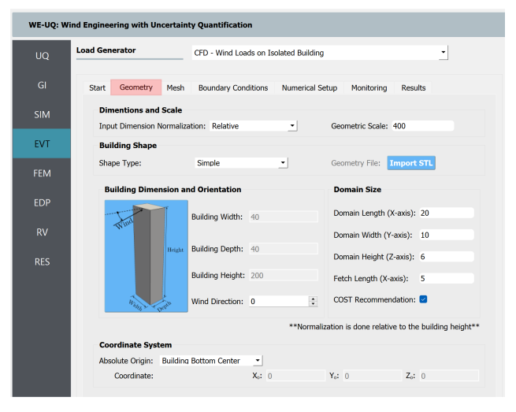

****************************
Isolated Building CFD Model
****************************
The Isolated Building CFD Model is a Computational Fluid Dynamics (CFD) based wind load generator for an isolated building with a rectangularly shaped plan area. It provides greater flexibility in modeling the approaching wind and the wind induced loads on the building. This event allows the user to seamlessly define the computational model with interactive GUI support. The modeling process is automated with different pre-/post-processing functionalities. The user needs to provide information related to geometry, mesh generation, boundary conditions, turbulence modeling, solver selection, etc. One of the most salient features includes automatic meshing with a user-interactive interface. At the backend, the CFD simulations are conducted by executing an open-source CFD solvers from OpenFOAM [Greenshields2015]_. The user needs to follow the following procedure to model wind loading using this event.           

#. Define the geometry of the building and the computational domain
#. Generate the mesh using different global and local refinement options
#. Define boundary conditions with the characteristics of the approaching wind
#. Specify turbulence model, solver type, and other numerical setups 
#. Define the outputs to be monitored from the CFD simulation
#. Submit the simulation to run remotely and follow up on the progress 
#. Post-process and verify the results from the simulation 

Considering the high computational cost of the simulation, the CFD models can only be run remotely using High-Performance Computing (HPC) resources at DesignSafe-CI. Thus, the user is required to have DesignSafe account to run the simulations. Also, the generated CFD model is saved locally as a standard OpenFOAM case. This will permit the user to copy this directory and run the simulation using their own OpenFOAM installation elsewhere. 

.. note::
	It is important to note that, no uncertainty is considered in the CFD simulation. At this stage of development, the CFD results inform the workflow in a rather deterministic manner. 

Overall, the GUI of the CFD-even has two regions, the *Input Panel* where the user can specify details of the CFD model, and the *Model View Panel* for visualizing the geometry and generated mesh (see :numref:`fig-iso-gui-overview`). The *Input Panel* contains a tabbed interface for defining different components of the CFD workflow. Whereas, the *Model View Panel* holds the VTK representation of the computational domain and a toolbar for manipulating the view of the model. Individual components in each part of the GUI are described in the following subsections.           

.. _fig-iso-gui-overview:
.. figure:: figures/IsolatedBuildingCFD/input_and_model_view_panel.svg
	:align: center
	:figclass: align-center

	Parts of the GUI for the CFD-based wind load event. 

Start
---------------
This tab outlines the main steps in the CFD modeling process. It provides the path to the working directory and options for the unit system. 

#. **Path:** The path where the created OpenFOAM case will be saved. The "Browse" button in :numref:`fig-iso-gui-overview` can be used to change the location to any user-specified directory. By default, this path points to SimCenter's working directory in *Documents*.

#. **Units:** Select units for mass, length, time and angle. The units for each property can be specified at the bottom of the *Start* tab as shown in :numref:`fig-iso-gui-overview`. 

	.. note::
		To define the CFD models, units specified under this event are used (not those defined in the *GI* tab of the main workflow). Throughout the CFD modeling process, the physical properties need to be specified using the units provided here consistently. Currently, the CFD-even is defined using the metric system. 

Geometry
----------------
Here the geometry and dimensions of the building and computational domain are defined. It is common to conduct CFD simulations as a replica of actual wind tunnel testing facilities. For this type of application, the user must specify the dimensions of the tunnel and the geometric scale used to construct the building model in the experiment. In :numref:`fig-iso-geometry-tab`, all the inputs are related to the geometry of the building and the computational domain.     

.. _fig-iso-geometry-tab:

	**Geometry** tab for editing dimensions/configurations of the building and computational domain.

#. **Input Dimension Normalization**: This option specifies whether to use normalized dimensions for specifying the domain dimensions. The normalization is done relative to the building height. The user must specify whether to use *Relative* or *Absolute* dimensions.    

#. **Geometric Scale**: If the CFD simulation is conducted at a reduced scale, the geometric scale (the ratio of full-scale to model-scale dimensions) must be specified here.

#. **Building Width**, **Building Depth** and **Building Height** are the dimensions of the building in full-scale. The dimensions of the building are defined in the *GI* tab and cannot be changed here. 
      
#. **Wind Direction**: The angle of incidence of the approaching wind measured from the x-axis in a counter clock-wise direction. The wind direction is accounted for indirectly by rotating the building configuration relative to the rest of the computational domain. 

#. **Domain Length**: Represents the length of the domain in the stream-wise direction (x-direction). If the *Relative* dimensions are specified, the input should be normalized by the building height.  

#. **Domain Width**: The lateral dimension of the domain in the y-direction. 

#. **Domain Height**: The vertical extension of the domain in the z-direction. 

#. **Fetch Length**: Distance between the inlet of the domain and the building center.   

#. **COST Recommendation**: This option specified whether to use the COST([Franke2007]_) recommendations to determine the extent of the computational domain.  

	.. note::
		If the CFD simulation is run for a validation purpose i.e., to compare with an experimental measurement, it is recommended to make the extent of the domain the same as the test section of the wind tunnel. This typically requires the width and height of the domain to be the same as the experimental facility. However, the length of the domain can be reduced by applying synthetically generated inflow turbulence at the inlet that satisfies important statistics of a fully developed wind flow. Details about inflow turbulence generations can be found in (Ref TInf). 

#. **Location of Absolute Origin**: This option specified the location of the absolute origin for the coordinate system where :math:`(x = 0, y = 0, z = 0)`. There are three options: *Building Bottom Center*, *Domain Bottom Left Corner*, and *Custom*. By default, the origin is the *Building Bottom Center*. The origin also can be changed to any user-specified point by using the *Custom* option and editing the coordinates (see the bottom of :numref:`fig-iso-geometry-tab`).  

Meshing
----------------
The mesh (computational grid) is generated employing OpenFOAM’s *snappyHexMesh* tool. The procedure involves first defining a regularly spaced background mesh for the whole domain. Then, further refinements are made progressively as we get close to the surface of the building. The building geometry is created as a Stereolithography (STL) surface from its width, depth and height. Finally, the meshing is performed locally on the user's machine. Thus, the user can interactively visualize the mesh using the model view window on the right. The step-by-step procedure to define the mesh for this event involves: 

* **Step 1**: Define a background structured mesh.     
* **Step 2**: Specify the volumetric refinement regions.
* **Step 3**: Specify refinement on the building surface.
* **Step 4**: Apply further refinements to the edges of the building.   
* **Step 5**: Add prism layers on the building surface in the wall-normal direction.    

.. _fig-iso-mesh-tab:

	**Mesh** tab for generating the computational grid using *snappyHexMesh* tool.
The following subsections describe the GUI for each step. Further details of the *snappyHexMesh* meshing tool used can be found in [Greenshields2022]_. 

Background Mesh
""""""""""""""""
The background mesh is the grid used in the far field away from the area the building is located. The user needs to define a background mesh before running *snappyHexMesh*. The ideal grid for the background mesh is hexahedral (hex) cells. Thus, the background mesh is generated using OpenFOAM's *blockMesh* utility as a structured grid. To start, the user needs to specify the number of cells in the three-orthogonal directions as shown in :numref:`fig-iso-mesh-tab`. Once the information in the *Background Mesh* tab (see :numref:`fig-iso-mesh-tab`) is filled, the user can press the *Run blockMesh* button to generate and visualizing the background mesh. The mesh is automatically updated on the model view panel as seen in :numref:`fig-iso-gui-overview`. Descriptions of the fields used to define the background mesh are given below.     

#. **Direction**: The axis along which the number of cells will be specified. The mesh information must be provided in :math:`(x, y, z)` directions separately.  

#. **No. Cells**: Number of cells in each direction. 

#. **Grading**: This field provides expansion ratios to generated graded mesh in any direction. These values specify the ratio of the width of the first cell to the last cell along the direction considered. Specially, will be useful if one wants to provide stretched cells near the ground surface.

#. **Grid Size**: The width of cells in a specified direction.  This field is automatically calculated as the user edits **No. Cells** field.

	.. warning:: 
		It is recommended to use nearly cubical cells for the background mesh. This can be achieved by changing the **No. Cells** in each direction until the corresponding **Grid Size** felids are approximately equal. Specially close to the building location, the use of nearly cubical cells is important for the *snappyHexMesh* to operate properly.

	.. note:: 
		If the **Input Dimension Normalization** in the *Geometry* tab of this event is set to *Relative*, all the dimensions used for defining meshing e.g. **Grid Size**, are expressed relative to the building height. 
	
Refinement Regions
""""""""""""""""""""
Once the background mesh is generated, further mesh refinements can be added using refinement regions (boxes). To achieve this, the user can specify multiple refinement regions. The refinement regions are boxes defining the extent of the region, and the corresponding refinement level. :numref:`fig-iso-mesh-tab-regional` shows a sample input with four refinement boxes. It is recommended to have both global and local refinement regions. Here global refinement refers to a box that extends from the inlet of the domain up to the wake of the study building. Whereas, local refinements cover the region in the vicinity of the building. For example, Box1 and Box2 in :numref:`fig-iso-mesh-tab-regional` are of global type, whereas Box3 and Box4 are local refinements. In the current version of the tool, the refinement regions can only be box-shaped. Here descriptions of each field are provided.  

.. _fig-iso-mesh-tab-regional:
.. figure:: figures/IsolatedBuildingCFD/mesh_tab_regional_refinment.svg	
	:align: center
	:figclass: align-center

	Specification of the refinement regions.

#. **Name**: Name of the refinement box, any unique identifier text can be used here. 
#. **Level**: Specifies the level of refinement for each region. Can start at 1 for the outermost refinement region and goes up to the highest level used close to the building. To reduce abrupt changes in grid size, the refinement level should be incremented by 1 as one goes from lower to higher refinement levels.   

#. **X-min**, **Y-min** and **Z-min** are the coordinates of the minimum point for the bounding box encompassing the refinement region.

#. **X-max**, **Y-max** and **Z-max** are the coordinates of the maximum point for the bounding box encompassing the refinement region. 

To add a new refinement region the user can use **Add Region** button shown in :numref:`fig-iso-mesh-tab-regional`. In a similar way, to remove an existing region, first, the user needs to select a row from the table and press the **Remove Region** button. 

	.. note:: 
		All the refinements are done by progressively splitting the cells from the previous level. Thus, the mesh size is reduced by half when we go one refinement level higher. 
		
		..
			Whereas, the cell count increases by about :math:`(2^3 = 8)` folds.
	
Surface Refinements
""""""""""""""""""""""""""
Near solid walls, surface refinements can be added to resolve important flow features. Especially on the building surface, additional refinements are often necessary to capture the wind loads (e.g., surface pressure fluctuations) more accurately. Surface refinement is defined by specifying the name of the target surface, the required refinement level, and the refinement distance as shown in :numref:`fig-iso-mesh-tab-surface`.

.. _fig-iso-mesh-tab-surface:
.. figure:: figures/IsolatedBuildingCFD/mesh_tab_surface_refinment.svg	
	:align: center
	:figclass: align-center

	Specification of the surface refinements.

#. **Add Surface Refinement**: If this option is checked, the surface refinement will be added to the building surface. If the user wants not to use any surface refinement this option needs to be unchecked. 

#. **Surface Name**: Name of the surface where the refinement will be applied. Currently, it supports only the building surface and this field cannot be edited.

#. **Refinement Level**: Specifies the level of refinement as it continues from the regional refinement. Needs to be bigger (at least by 1 level) than the highest refinement level used in the *Regional Refinement* tab earlier.  

#.  **Refinement Distance**: Represents a wall-normal distance the refinement will extend in the computational domain. This distance is always measured from the target (building) surface. For example, if 0.5 is used, the near-surface refinement will encompass a region with a distance of 0.5 units away from the surface in all directions. 

Edge Refinement
""""""""""""""""

Prism Layers
""""""""""""""""

Boundary Conditions
----------------

Numerical Setup
----------------

Monitoring
----------------

Results
----------------

.. [Greenshields2015] Greenshields, C.J. (2015). OpenFOAM Programmer's Guide. OpenFOAM Foundation Ltd.
.. [Franke2007] Franke, J., Hellsten, A., Schlünzen, K.H. and Carissimo, B., 2007. COST Action 732: Best practice guideline for the CFD simulation of flows in the urban environment.
.. [Greenshields2022] Greenshields, C.J. (2022). https://doc.cfd.direct/openfoam/user-guide-v10/snappyhexmesh

