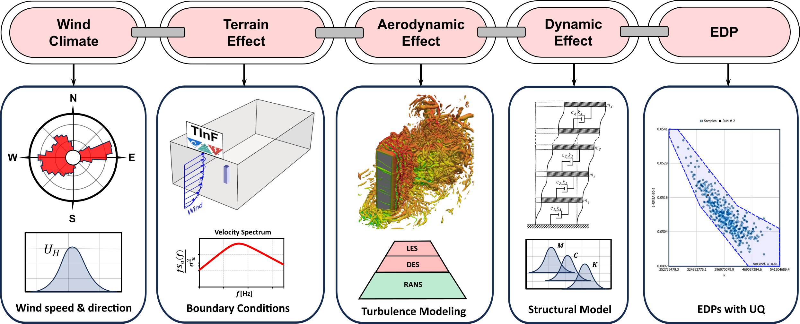
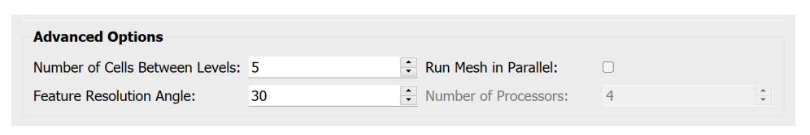
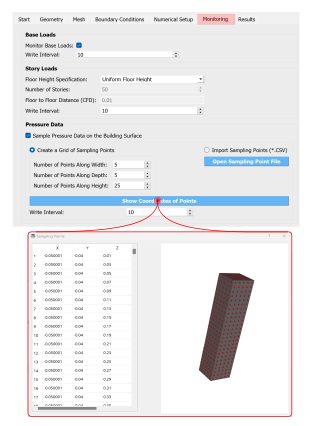

.. _lblIsolatedBuildingCFD:

Isolated Building CFD Model
============================

The Isolated Building CFD Model is a Computational Fluid Dynamics (CFD) based wind load generator for an isolated building with a rectangularly shaped plan area. It provides greater flexibility in modeling the approaching wind and the wind-induced loads on the building. This event allows the user to seamlessly define the computational model with interactive GUI support. :numref:`fig-iso-cfd-workflow` shows the overall CFD-based workflow as within the framework of WE-UQ. The modeling process is automated with different pre-/post-processing functionalities. The user needs to provide information related to geometry, mesh generation, boundary conditions, turbulence modeling, solver selection, etc. One of the most salient features includes automatic meshing with a user-interactive interface. At the backend, the CFD simulations are conducted by executing open-source CFD solvers from OpenFOAM [Greenshields2015]_. The user needs to follow the following procedure to model wind loading using this event.           

.. _fig-iso-cfd-workflow:

	The high-level CFD-based workflow with uncertainty quantification. 

#. Define the geometry of the building and the computational domain
#. Generate the mesh using global and local refinement options
#. Define boundary conditions with the characteristics of the approaching wind
#. Specify turbulence model, solver type, and other numerical setups 
#. Define the outputs to be monitored from the CFD simulation
#. Submit the simulation to run remotely and follow up on the progress 
#. Post-process and verify the results from the simulation 

Considering the high computational cost of the simulation, the CFD models can only be run remotely using High-Performance Computing (HPC) resources at DesignSafe-CI. Thus, the user is required to have DesignSafe account to run the simulations. Also, the generated CFD model is saved locally as a standard OpenFOAM case. This will permit the user to copy this directory and run the simulation using their own OpenFOAM installation elsewhere. 

.. note::
	It is important to note that, no uncertainty is considered in the CFD simulation. At this stage of development, the CFD results inform the workflow in a rather deterministic manner. 

Overall, the GUI of the CFD-even has two regions, the *Input Panel* where the user can specify details of the CFD model, and the *Model View Panel* for visualizing the geometry and generated mesh (see :numref:`fig-iso-gui-overview`). The *Input Panel* contains a tabbed interface for defining different components of the CFD workflow. Whereas, the *Model View Panel* holds the VTK representation of the computational domain and a toolbar for manipulating the view of the model. Individual components in each part of the GUI are described in the following subsections.           

.. _fig-iso-gui-overview:

	Parts of the GUI for the CFD-based wind load event. 

Start
----------
This tab outlines the main steps in the CFD modeling process. It provides the path to the working directory and options for the unit system. 

#. **Path:** The path where the created OpenFOAM case will be saved. The "Browse" button in :numref:`fig-iso-gui-overview` can be used to change the location to any user-specified directory. By default, this path points to SimCenter's working directory in *Documents*.

#. **Units:** Select units for mass, length, time and angle. The units for each property can be specified at the bottom of the *Start* tab as shown in :numref:`fig-iso-gui-overview`. 

	.. note::
		To define the CFD models, units specified under this event are used (not those defined in the *GI* tab of the main workflow). Throughout the CFD modeling process, the physical properties need to be specified using the units provided here consistently. Currently, the CFD-even is defined using the metric system. 

Geometry
-----------
Here the geometry and dimensions of the building and computational domain are defined. It is common to conduct CFD simulations as a replica of actual wind tunnel testing facilities. For this type of application, the user must specify the dimensions of the tunnel and the geometric scale used to construct the building model in the experiment. In :numref:`fig-iso-geometry-tab`, all the inputs are related to the geometry of the building and the computational domain.     

.. _fig-iso-geometry-tab:
.. figure:: figures/IsolatedBuildingCFD/geometry_tab.svg
	:align: center
	:figclass: align-center

	**Geometry** tab for editing dimensions/configurations of the building and computational domain.

#. **Input Dimension Normalization**: This option specifies whether to use normalized dimensions for specifying the domain dimensions. The normalization is done relative to the building height. The user must specify whether to use *Relative* or *Absolute* dimensions.    

#. **Geometric Scale**: If the CFD simulation is conducted at a reduced scale, the geometric scale (the ratio of full-scale to model-scale dimensions) must be specified here.

#. **Building Width**, **Building Depth** and **Building Height** are the dimensions of the building in full-scale. The dimensions of the building are defined in the *GI* tab and cannot be changed here. 
      
#. **Wind Direction**: The angle of incidence of the approaching wind measured from the x-axis in a counterclockwise direction. The wind direction is accounted for indirectly by rotating the building configuration relative to the rest of the computational domain. 

#. **Domain Length**: Represents the length of the domain in the stream-wise direction (x-direction). If the *Relative* dimensions are specified, the input should be normalized by the building height.  

#. **Domain Width**: The lateral dimension of the domain in the y-direction. 

#. **Domain Height**: The vertical extension of the domain in the z-direction. 

#. **Fetch Length**: Distance between the inlet of the domain and the building center.   

#. **COST Recommendation**: This option specifies whether to use the COST([Franke2007]_) recommendations to determine the extent of the computational domain.  

	.. note::
		If the CFD simulation is run for a validation purpose i.e., to compare with an experimental measurement, it is recommended to make the extent of the domain the same as the test section of the wind tunnel. This typically requires the width and height of the domain to be the same as the experimental facility. However, the length of the domain can be reduced by applying synthetically generated inflow turbulence at the inlet that satisfies important statistics of a fully developed wind flow. Details about inflow turbulence generations can be found in (Ref TInf). 

#. **Location of Absolute Origin**: This option specifies the location of the absolute origin for the coordinate system where :math:`(x = 0, y = 0, z = 0)`. There are three options: *Building Bottom Center*, *Domain Bottom Left Corner*, and *Custom*. By default, the origin is the *Building Bottom Center*. The origin also can be changed to any user-specified point by using the *Custom* option and editing the coordinates (see the bottom of :numref:`fig-iso-geometry-tab`).  

Meshing
-----------
The mesh (computational grid) is generated employing OpenFOAM’s *snappyHexMesh* tool. The procedure involves first defining a regularly spaced background mesh for the whole domain. Then, further refinements are made progressively as we get close to the surface of the building. The building geometry is created as a Stereolithography (STL) surface from its width, depth and height. Finally, the meshing is performed locally on the user's machine. Thus, the user can interactively visualize the mesh using the model view window on the right. The step-by-step procedure to define the mesh for this event involves: 

* **Step 1**: Define a background structured mesh.     
* **Step 2**: Specify the volumetric refinement regions.
* **Step 3**: Specify refinement on the building surface.
* **Step 4**: Apply further refinements to the edges of the building.   
* **Step 5**: Add prism layers on the building surface in the wall-normal direction.    

.. _fig-iso-mesh-tab:
.. figure:: figures/IsolatedBuildingCFD/mesh_tab.svg
	:align: center
	:figclass: align-center

	**Mesh** tab for generating the computational grid using *snappyHexMesh* tool.
The following subsections describe the GUI for each step. Further details of the *snappyHexMesh* meshing tool used can be found in [Greenshields2022]_. 

Background Mesh
""""""""""""""""
The background mesh is the grid used in the far field away from the area where the building is located. The user needs to define a background mesh before running *snappyHexMesh*. The ideal grid for the background mesh is hexahedral (hex) cells. Thus, the background mesh is generated using OpenFOAM's *blockMesh* utility as a structured grid. To start, the user needs to specify the number of cells in the three-orthogonal directions as shown in :numref:`fig-iso-mesh-tab`. Once the information in the *Background Mesh* tab (see :numref:`fig-iso-mesh-tab`) is filled, the user can press the *Run blockMesh* button to generate and visualize the background mesh. The mesh is automatically updated on the model view panel as seen in :numref:`fig-iso-gui-overview`. Descriptions of the fields used to define the background mesh are given below.     

#. **Direction**: The axis along which the number of cells will be specified. The mesh information must be provided in :math:`(x, y, z)` directions separately.  

#. **No. Cells**: Number of cells in each direction. 

#. **Grading**: This field provides expansion ratios to generate a graded mesh in any direction. These values specify the ratio of the width of the first cell to the last cell along the direction considered. Specially, will be useful if one wants to provide stretched cells near the ground surface.

#. **Grid Size**: The width of cells in a specified direction.  This field is automatically calculated as the user edits the **No. Cells** field.

	.. warning:: 
		It is recommended to use nearly cubical cells for the background mesh. This can be achieved by changing the **No. Cells** in each direction until the corresponding **Grid Size** felids are approximately equal. Especially close to the building location, the use of nearly cubical cells is important for the *snappyHexMesh* to operate properly.

	.. note:: 
		If the **Input Dimension Normalization** in the *Geometry* tab of this event is set to *Relative*, all the dimensions used for defining meshing e.g. **Grid Size**, are expressed relative to the building height. 
	
Refinement Regions
""""""""""""""""
Once the background mesh is generated, further mesh refinements can be added using refinement regions (boxes). To achieve this, the user can specify multiple refinement regions. The refinement regions are boxes defining the extent of the region, and the corresponding refinement level. :numref:`fig-iso-mesh-tab-regional` shows a sample input with four refinement boxes. It is recommended to have both global and local refinement regions. Here global refinement refers to a box that extends from the inlet of the domain up to the wake of the study building. Whereas, local refinements cover the region in the vicinity of the building. For example, Box1 and Box2 in :numref:`fig-iso-mesh-tab-regional` are of global type, whereas Box3 and Box4 are local refinements. In the current version of the tool, the refinement regions can only be box-shaped. Here descriptions of each field are provided.  

.. _fig-iso-mesh-tab-regional:
.. figure:: figures/IsolatedBuildingCFD/mesh_tab_regional_refinement.svg	
	:align: center
	:figclass: align-center

	Specification of the refinement regions.

#. **Name**: Name of the refinement box, any unique identifier text can be used here. 
#. **Level**: Specifies the level of refinement for each region. Can start at 1 for the outermost refinement region and goes up to the highest level used close to the building. To reduce abrupt changes in grid size, the refinement level should be incremented by 1 as one goes from lower to higher refinement levels.   

#. **X-min**, **Y-min** and **Z-min** are the coordinates of the minimum point for the bounding box encompassing the refinement region.

#. **X-max**, **Y-max** and **Z-max** are the coordinates of the maximum point for the bounding box encompassing the refinement region. 

To add a new refinement region the user can use **Add Region** button shown in :numref:`fig-iso-mesh-tab-regional`. In a similar way, to remove an existing region, first, the user needs to select a row from the table and press the **Remove Region** button. 

	.. note:: 
		All the refinements are done by progressively splitting the cells from the previous level. Thus, the mesh size is reduced by half when we go one refinement level higher. 
		
		..
			Whereas, the cell count increases by about :math:`(2^3 = 8)` folds.
	
Surface Refinements
""""""""""""""""
Near solid walls, surface refinements can be added to resolve important flow features. Especially on the building surface, additional refinements are often necessary to capture the wind loads (e.g., surface pressure fluctuations) more accurately. Surface refinement is defined by specifying the name of the target surface, the required refinement level, and the refinement distance as shown in :numref:`fig-iso-mesh-tab-surface`.

.. _fig-iso-mesh-tab-surface:
.. figure:: figures/IsolatedBuildingCFD/mesh_tab_surface_refinement.svg	
	:align: center
	:figclass: align-center

	Specification of the surface refinements.

#. **Add Surface Refinement**: If this option is checked, the surface refinement will be added to the building surface. If the user wants not to use any surface refinement this option needs to be unchecked. 

#. **Surface Name**: Name of the surface where the refinement will be applied. Currently, it supports only the building surface and this field cannot be edited.

#. **Refinement Level**: Specifies the level of refinement as it continues from the regional refinement. Needs to be bigger (at least by 1 level) than the highest refinement level used in the *Regional Refinement* tab earlier.  

#.  **Refinement Distance**: This represents a wall-normal distance that the surface refinement will extend outward in the domain. This distance is always measured from the target (building) surface. For example, if 0.5 is used, the near-surface refinement will encompass a region with a distance of 0.5 units away from the surface in all directions. 

Edge Refinement
""""""""""""""""
Near the building edges, the flow separation point can be better captured by employing edge refinement options. If the user opts for edge refinement, the grid around the edges of the building will automatically be refined to the specified level. In addition to improving the resolution of wind flow, the use of edge refinements results in a more accurate representation of the building geometry. :numref:`fig-iso-mesh-tab-edge` shows the fields to specify the edge refinement. 

.. _fig-iso-mesh-tab-edge:
.. figure:: figures/IsolatedBuildingCFD/mesh_tab_edge_refinement.svg	
	:align: center
	:figclass: align-center

	Specification of the edge refinement.
#. **Add Edge Refinement**: If checked, the edges of the building will be further refined. If the user wants to mesh without edge refinement this option needs to be unchecked. 

#. **Refinement Edge**: Target edges for the refinement. Currently, this option applies only to the building edges. 

#. **Refinement Level**: Specifies the level of refinement for the edges. To better resolve the edges, it needs to be bigger than the highest refinement level used in the *Surface Refinement* tab.  

	.. note:: 
		Near sharp edges, sometimes the building geometry might not be resolved well. In this case, the quality of the generated grid can be improved by adjusting the feature resolution angle in *Advanced Options* section. Note that changes to meshing parameters will not take effect unless the user runs the whole mesh generation again.

Prism Layers
""""""""""""""""
Another important refinement option includes prism layers. Prism layers are dense layers of usually stretched cells added near solid boundaries. By adding multiple prismatic layers of cells on the building surface, one can improve the resolution of the thin boundary layer that develops on the walls. The prism layers are inserted by splitting the first layer of off-wall cells on the surface. The inputs needed to specify prism layers are shown in :numref:`fig-iso-mesh-tab-prism-layers`. 

.. _fig-iso-mesh-tab-prism-layers:

	Adding prism layers to the building surface.

#. **Add Prism Layers**: If checked, prism layers will be applied on the building surface.

#. **Surface Name**: Name of the target wall for adding the layers. Currently, this option is limited to the building surfaces. 

#. **Number of Layers**: The number of prism layers to be added. 

#. **Expansion Ratio**: The ratio of thicknesses of two consecutive layers. Should be kept below 1.5. For a more elaborate explanation, please refer to the recommendations in [Franke2007]_.

#. **Final Layer Thickness**: Thickness of the final prism layer relative to the size of the first off-wall cell before the prism layers are inserted. 

	.. note:: 
		Generally, adding more prism layers increases solution accuracy. However, when the thickness of the cells close to the building surface becomes small, the time step used for the solver must also be reduced proportionally to keep the simulation stable. 

Advanced Options
""""""""""""""""
Additional options for mesh generations can be found under the *Advanced Options* group as shown in :numref:`fig-iso-mesh-tab-advanced-options`. These options include:

.. _fig-iso-mesh-tab-advanced-options:

	Advanced meshing control options. 

#. **Number of Cells Between Levels**: The number of buffer cells between two consecutive refinement levels. For closely spaced refinements, this will provide a relatively smooth transition avoiding a sudden jump in mesh size over a short distance. 

#. **Feature Resolution Angle**: Edges created by two intersecting surfaces with angles higher than the value specified for this field will be further refined. By default, it is set to :math:`30^o`. For a building with sharp angles, to better resolve the edges, a smaller value should be specified.

#. **Run Mesh In Parallel**: If this option is turned on, the mesh generation will run in parallel. This is particularly needed when generating dense meshes that take considerable time to run in serial. 

#. **Number of Processors**: The number of processors to utilize if the mesh generation is executed in parallel. Note that this value can be different from the number of processors used for the main simulation.  

	.. warning:: 
		For parallel mesh generation, the number of processors specified here must be less than or equal to the number of computing cores available on the user's machine. 

Running the Mesh
""""""""""""""""
One of the main improvements in the current release of the tool is the mesh generation module. Now, the user can create geometry, generate a mesh and view the mesh on their local machine. Once the input parameters for the mesh are filled, the next step is to run, check and view the mesh. After the mesh is run successfully, a sample message in the *Program Output* window is shown in :numref:`fig-iso-mesh-tab-run-mesh`. 

.. _fig-iso-mesh-tab-run-mesh:
.. figure:: figures/IsolatedBuildingCFD/mesh_tab_run_and_check_mesh.svg
	:align: center
	:figclass: align-center

	Running and checking the mesh generation process. 

#. **Run blockMesh**: Creates the background mesh required for the final mesh.

#. **Run snappyHexMesh**: Generates the final mesh by applying all the refinements specified. When the mesh generation is completed, the log file is printed in the *Program Output* window at the bottom. If there are any issues in the mesh generation procedure, they will be shown here.    

#. **Run checkMesh**: Checks if the generated mesh satisfies the recommended mesh quality requirements. After the check is completed, the result is shown on the *Program Output* window (see :numref:`fig-iso-mesh-tab-run-mesh`). The user needs to make sure that the mesh check is completed with a *Mesh Ok* status before running the solver. Also, information such as the number of cells, points, faces, etc., are displayed in the same window.  

	.. note:: 
		Note that the mesh generation is run locally for visualization purposes. When the simulation is submitted to run remotely, just the CFD solver is initiated, and the whole mesh is regenerated on the remote server from the input parameters. This will permit the user to run heavy meshing remotely while visualizing a small mesh (light version) of the original model here. 

Viewing the Mesh
""""""""""""""""
After the mesh generation is completed the *Model View Window* is updated automatically. This window provides the user with different options for visualizing the mesh. These options are found on a toolbar positioned at the top as seen :numref:`fig-iso-view-mesh-options`. 

.. _fig-iso-view-mesh-options:
.. figure:: figures/IsolatedBuildingCFD/mesh_vis_window.svg
	:align: center
	:figclass: align-center

	*Model View Window* for viewing and checking the generated mesh. 

The user can have a different view of the generated model by changing the following options: 

#. **View**: Provides options for changing the view to the whole or parts of the mesh. There are three options available. 

	 * **AllMesh**: Shows the mesh for the entire computational domain.  
	 * **Breakout**: Display a breakout view of the computational domain.  
	 * **Building**: Shows only the geometry/mesh of the study building.  

#. **Representation**: Provides options for changing the representation of the mesh surface. Three surface view options are implemented. 

     * **SurfaceWithGrid**: Renders the surfaces and the edges together. This option is the default choice for visualizing the mesh.  
     * **Surface**: Renders only the surface of the computational domain. This option can be used if the user wants to view only the geometry of the domain without the grid.   
     * **Wireframe**: Shows only the edge of the generated grid without rendering the surfaces. 

#. **Transparency**: Controls how transparent the model surface is. By default, it is set to zero. 

#. **Reload**: Rereads the mesh from the case directory if there are changes or updates. 

Boundary Conditions
--------------------
In the *Boundary Conditions* tab, the user defines the values of wind fields at the domain boundaries. First, the user specifies the general characteristics of the approaching wind in the *Wind Characteristics* group. Then, specific boundary conditions for each face of the domain are provided in the *Boundary Conditions* group. If the user selects turbulent inflow condition at the inlet, in the *Inflow Generation* group the method and the inputs needed to generate artificial inflow boundary conditions will be specified.  

.. _fig-iso-bc-tab:
.. figure:: figures/IsolatedBuildingCFD/boundary_conditions_tab.svg
	:align: center
	:figclass: align-center

	Boundary condition specification. 

Approaching Wind Characteristics
"""""""""""""""""""""""""""""""""""
The workflow offers the user a means to perform the CFD simulation at a reduced scale. If the simulation is done at a reduced scale, the characteristics of the approaching wind must be defined in the same scale.    

1. **Velocity Scale**: This represents a factor to scale the velocity. 
2. **Wind Speed at Reference Height**: Mean wind speed at the reference height (e.g. at the roof height). If the simulation is done at a reduced scale, the wind speed in the model scale needs to be provided. 
3. **Reference Height**: Reference height where the **Wind Speed at Reference Height** is defined. By default, this value will be the building height. 
4. **Aerodynamic Roughness Length**: Surrounding terrain aerodynamic roughness length for the particular wind direction being simulated.
5. **Time Scale**: Time scale of the simulation. It is automatically calculated from the **Geometric Scale** in *Geometry* tab and the **Velocity Scale**. 
6. **Air Density**: Density of air at the particular region where the building is located. By default, a value of 1.225 is specified for a :math:`15^\circ C` temperature and atmospheric pressure at sea level.  
7. **Kinematic Viscosity**: This represents the ratio of absolute air viscosity to air density. The default value is set to :math:`1.5 \times 10^{-5} m^2/s`.   
8.  **Reynolds Number**: Reynolds number is calculated based on the building height and reference wind speed. Reynolds number expressed the ratio of inertial forces to viscous forces. This field cannot be edited, and the value for this simulation can be determined by clicking the **Calculate** button.
     
Initial and Boundary Conditions
"""""""""""""""""""""""""""""""""
Types of boundary conditions corresponding to each face of the domain are defined here. The names for the boundary conditions are based on *OpenFOAM* dictionary files. 

#. **Inlet**: Defines the boundary conditions at the inlet of the computational domain. Here we have three options:
    
	* **Uniform**: Specify a constant uniform value at the inlet taking the value specified for **Wind Speed at Reference Height**.   
	* **MeanABL**: Defines mean velocity profile based on the logarithm law of the wall. To calculate the logarithmic profile the reference height and velocity defined in *Wind Characteristics* ground are used. This boundary condition assumes the approaching wind is a smooth flow. 
	* **TInf**: Specifies synthetic turbulent inflow at the inlet that varies with space and time. When this option is selected, *Inflow Generation* group will be automatically enabled and the user can control the inflow turbulence generation procedure. 
    
#.  **Outlet**: The boundary condition used at the outlet. By default, it is set to *zeroPressureOutlet* which makes the pressure field at the outlet zero. Hence, the reference pressure used for the wind load calculation can be assumed to be zero.    

#.  **Sides**: The boundary conditions used on side boundaries (front and back) of the domain are selected here. The value can assume four options:     

    * **symmetric**: Specifies zero normal gradient boundary condition for the velocity on the side faces of the domain. Sets  
    * **slip**: Specifies slip but impermeable boundary conditions for side faces. This will set zero normal gradient boundary conditions for the flow parallel to the surface.
    * **noSlip**: Sets the velocity on the side faces to zero. 
    * **cyclic**: This option will link the side patches together by setting the cyclic boundary condition for pressure and velocity fields.

#.  **Top**: The boundary condition used on the top boundary of the domain. It can assume three options:     

    * **symmetric**: Specifies zero normal gradient boundary condition for the velocity.   
    * **slip**: Specifies slip but impermeable boundary conditions for top faces. This will set zero normal gradient boundary conditions for the flow parallel to the surface.
    * **noSlip**: Sets the velocity on the top faces to zero. 

#.  **Ground**: Define the boundary condition on the ground surface. There are three boundary condition types:     

    * **noSlip**: Sets the velocity on the ground face to zero. 
    * **smoothWallFunction**: Specifies a smooth wall function on the ground surface.
    * **roughWallFunction**: Defines a rough wall boundary condition. This will be defined based on the aerodynamic roughness length defined previously.
  
#.  **Building**: Define the boundary condition on the building surface. There are three boundary condition types:     

    * **noSlip**: Sets the velocity on the building face to zero. 
    * **smoothWallFunction**: Specifies a smooth wall function on the building surface.
    * **roughWallFunction**: Defines a rough wall boundary condition based on sand grain roughness.

Inflow Generation
"""""""""""""""""""
If *TInf* option is specified at the *inlet* of the boundary, inputs for the inflow generation are specified here. 

#.  **Generation Method**: The technique for generating the inflow turbulence. Five different methods commonly used in the computational wind engineering community are implemented.

    * **DFSR**: Uses Divergence-free Spectral Representation (DFSR) method developed by [Melaku2021]_.   
    * **DFM**: Uses Digital Filtering Method (DFM) developed by [Klein2003]_ and [Xie2008]_. 
    * **SEM**: Uses Synthetic Eddy Method (SEM) developed by [Jarrin2006]_.   
    * **DFSEM**: Uses Divergence-free Synthetic Eddy Method (DFSEM) developed by [Poletto2013]_.  
    * **TSM**: Uses Turbulent Spot Method (TSM) developed by [Kröger2018]_.  

#.  **Inflow Time Step**: The time step used for generating inflow turbulence.  Can assume a value different from the solver time step.  For intermediate time steps, a linear interpolation is used. 
#.  **Max. Frequency**: Define the maximum cut-off frequency for the inflow generation. Directly calculated from the inflow time step as :math:`f_{max} = 1/(2\Delta t)`.  
#.  **Wind Profile**: Provides options to define wind profiles used for the inflow generation in a tabular form. 

Numerical Setup
----------------
In this tab, selections related to turbulence modeling, solver type, duration and time step options are specified. First, the user will specify the type of simulation to run. Both transient and steady-state options are available. Then, the type of solver suitable for the selected simulation is specified. Finally, options related to the duration and time step of the simulation are defined.  

.. _fig-iso-numerical-setup-tab:
.. figure:: figures/IsolatedBuildingCFD/numerical_setup_tab.svg
	:align: center
	:figclass: align-center

	Specification of the numerical setup. 

Turbulence Modeling
""""""""""""""""""""
The Reynolds number for wind load simulation is usually high in the order of :math:`Re = 10^7` (full-scale). This makes it highly challenging to resolve all scales of the wind fluctuations. We need to use an appropriate turbulence model to represent the effect of small-scale turbulence.  

#.  **Simulation Type**: Specifies the type of turbulence modeling scheme to be used. Three turbulence modeling options are supported:

    * **LES**: Should be selected if the user wants to run a large-eddy simulation with subgrid scale formulation for the unresolved scale of the flow. This option is the default choice for the wind load simulation.  
    * **RANS**: Used for steady-state simulation using Reynolds-averaged Navier–Stokes equations. Suitable only for modeling mean flow quantities and mean wind loads. 
    * **DES**: Uses a detached eddy simulation (DES) turbulence model. DES model uses a RANS model close to the wall and switches to LES for regions far enough from the wall.   
 
#.  **Sub-grid Scale Model**: Provides options to select Sub-grid scale (SGS) model. Three SGS models are supported in the current version.

    * **Smagorinsky**: Specifies a standard Smagorinsky model with model coefficients :math:`C_k = 0.094` and :math:`C_e = 1.048`  
    * **WALE**: Used the Wall-Adapting Local Eddy-viscosityWALE (WALE) SGS model with model coefficients :math:`C_k = 0.094, C_e = 1.048` and :math:`C_w = 0.325`. 
    * **kEqn**: Uses a one-equation eddy-viscosity model with an addition momentum balance equation for turbulent kinetic energy. 
    * **dynamicKEqn**: Specifies a dynamic one-equation eddy-viscosity model with model constants dynamically calculated. 

#.  **RANS Model Type**: Specifies the type of RANS closure model to use. Supports three options:

    * **kEpsilon**: Specifies the standard two-equation K-Epsilon model   
    * **kOmega**: Specifies two-equation K-Omega model.
    * **SST**: Uses a shear stress transport (SST) turbulence model. 

#.  **DES Model Type**: Specifies the type of DES model to use:

    * **SpalartAllmarasDES**: Specifies Spalart-Allmaras Detached Eddy Simulation (DES) model   
    * **SpalartAllmarasDDES**: Uses Spalart-Allmaras Delayed Detached Eddy Simulation (DDES) model

Solver Selection
""""""""""""""""""""
Depending on the type of simulation selected (i.e. steady-state and transient), the type of solver must be selected appropriately. For LES and DES turbulence models, use transient solvers such as Pressure-Implicit with Splitting of Operators (PISO) and for RANS models, recommended to use a steady-state solver like Semi-Implicit Method for Pressure Linked Equations (SIMPLE).  

#.  **Solver Type**: Specifies the type of DES model to use:

    * **pisoFoam**: Uses a transient solver for incompressible, turbulent flow, using the PISO algorithm
    * **pimpleFoam**: Uses a transient solver based on PISO on the (PISO) algorithm and supports a dynamic type stepping.
    * **simpleFoam**: Uses a steady-state for incompressible, turbulent flow, using the SIMPLE algorithm

#.  **Number of Non-Orthogonal Correctors**: Additional correction loops to account for mesh non-orthogonality. The default value is set to one. For highly non-orthogonal mesh, a higher value needs to be used. 

#.  **Number of Corrector Loops**: Specifies the number of pressure-corrector loops per each time iteration. The default value is set to 2. This value is valid only for transient solvers. 

#.  **Number of Outer Corrector Loops**: Specifies the number PISO loops to run for each time step. This value is valid only for *pimpleFoam* solver. The *pimpleFoam* solver works by running multiple PISO iterations, and if this field is set to 1, it will run in a PISO mode. 

Duration and Time Step
""""""""""""""""""""""
The duration and time step of the simulation must be specified in line with the *Time Scale* used for the model. For wind load simulation it is recommended to have a 1 hour equivalent duration in full scale. However, for integrated wind loads, a statical convergence can be achieved at a much shorter duration.   

#.  **Duration**: The length of the simulation (physical time) at chosen *Time Scale* in seconds. The simulation will end once the solver reaches this time. 
 
#.  **Time Step**: The time increment used for the solver. Note that the numerical stability of the solver is highly sensitive to the time step. To estimate the recommended time step that will keep the maximum Courant number (:math:`C_o`) below unity, click the **Calculate** button next to it. The estimated time step can always be edited to make a slightly higher or lower value that is easy to remember. Time advancement has two options:   

    * **Constant**: Makes the time step constant and does not change at each time iteration. 
    * **Adjustable**: Makes the time step change every iteration by checking the simulation does not exceed the maximum Courant number (:math:`C_o`) specified. It works only with *pimpleFoam*.

#.  **Maximum Courant Number**: The maximum value of Courant number (:math:`C_o`) also known as Courant–Friedrichs–Lewy (CFL) number. It needs to be specified only for *pimpleFoam* solver and a value as high as 7 can be used.   

Parallelization
""""""""""""""""""
#.  **Run Simulation in Parallel**: If checked, the simulation will run in parallel and the user needs to specify the number of processors. Otherwise, the simulation is conducted in serial. For the high-fidelity simulation, it is recommended to run in parallel. 

#.  **Number of Processors**: This represents the number of subdomains that will be used in the OpenFOAM case. It needs to match the computational resources availed when the job gets submitted to *DesignSafe* to run remotely. 

Monitoring
----------------
The CFD simulation is typically run using millions of grids. Saving all the simulation data at each time step slows down the solver and takes lots of space. Therefore, in this event, we monitor only relevant quantities (wind loads and flow fields) that will be used in the workflow. Under this tab, the user selects the type of wind loads to monitor which include integrated loads on the structure as well as surface pressure fluctuations at specific points on the building walls. Integrated loads represent the wind forces the building structure experiences. Two types of integrated loads are monitored, which include *Base Loads* and *Story Loads*.

.. _fig-iso-monitoring-tab:

	Results to monitor from the CFD simulations 

Base Loads
"""""""""""
This will monitor the time history of the base shear forces and overturning moment on the building. The values are calculated by integrating the pressure fluctuations over the building surface.

#.  **Monitor Base Loads**: If checked the base loads will be monitored. By default, this option is checked.  
#.  **Write Interval**: Represents the frequency (interval measured in time steps) at which the base loads will be recorded. For example, if the user specifies 10, then the base loads will be written at every :math:`10 \times \Delta t` seconds, where :math:`\Delta t` is the solver **Time Step**. It can only take an integer value.  

Story Loads
""""""""""""
Since the story forces are needed for the main workflow, they are always monitored from the CFD simulation. 

#.  **Floor Height Specification**: Specifies if the floor heights are *Uniform Floor Height* or not.    
#.  **Number of Stories**: The number of floors. This field cannot be changed here and is directly taken from the **GI** panel. 
#.  **Floor to Floor Distance**: The floor-to-floor height in the model scale, and cannot be edited here. 
#.  **Write Interval**: The interval at which the story loads are written. This time step is the one that the structural solver will use. If checked the base loads will be monitored.  

Cladding Loads
""""""""""""""
For the cladding loads, local pressure fluctuations on the building surface can be monitored. The cladding loads can be monitored on points automatically created by the application or on a set of points imported from an existing *.CSV* file.

#.  **Sample Pressure Data on the Building Surface**: If checked, the surface pressure data will be monitored on the building surface.  
#.  **Create a Grid of Sampling Points**: If checked, the pressure monitoring points on the building surface are automatically created as a regularly spaced grid of points on each face of the building. Three inputs are needed to create these points aromatically: 

    * **Number of Points Along Width**: The number of grid points along the building width. 
    * **Number of Points Along Depth**: The number of grid points along the building depth. 
    * **Number of Points Along Height**: The number of grid points along the building height. 

#.  **Import Sampling Points(*.CSV)**: If this option is checked, the user needs to click the **Open Sampling Point File** button and select a *CSV* file containing a table of :math:`x`, :math:`y` and :math:`z` coordinates of the points.  
#.  **Write Interval**: The interval at which the pressure data is written.

The sampling points can be visualized on the building surface by clicking **Show Coordinate of Points**. This will open the STL file of the building with points marked on the building surface. A sample demo is shown in :numref:`fig-iso-monitoring-tab` . On the left side of the opened window, a table for the coordinates is shown, while on the right side, the 3D visualization is displaced.    

.. [Greenshields2015] Greenshields, C.J. (2015). OpenFOAM Programmer's Guide. OpenFOAM Foundation Ltd.
.. [Franke2007] Franke, J., Hellsten, A., Schlünzen, K.H. and Carissimo, B., 2007. COST Action 732: Best practice guideline for the CFD simulation of flows in the urban environment.
.. [Greenshields2022] Greenshields, C.J. (2022). https://doc.cfd.direct/openfoam/user-guide-v10/snappyhexmesh

.. [Melaku2021] Melaku, A.F. and Bitsuamlak, G.T., 2021. A divergence-free inflow turbulence generator using spectral representation method for large-eddy simulation of ABL flows. Journal of Wind Engineering and Industrial Aerodynamics, 212, p.104580.

.. [Klein2003] Klein, M., Sadiki, A. and Janicka, J., 2003. A digital filter based generation of inflow data for spatially developing direct numerical or large eddy simulations. Journal of Computational Physics, 186(2), pp.652-665.

.. [Xie2008] Xie, Z.T. and Castro, I.P., 2008. Efficient generation of inflow conditions for large eddy simulation of street-scale flows. Flow, turbulence and combustion, 81, pp.449-470.

.. [Jarrin2006] Jarrin, N., Benhamadouche, S., Laurence, D. and Prosser, R., 2006. A synthetic-eddy-method for generating inflow conditions for large-eddy simulations. International Journal of Heat and Fluid Flow, 27(4), pp.585-593.

.. [Poletto2013] Poletto, R., Craft, T. and Revell, A., 2013. A new divergence free synthetic eddy method for the reproduction of inlet flow conditions for LES. Flow, turbulence and combustion, 91, pp.519-539.

.. [Kröger2018] Kröger, H. and Kornev, N., 2018. Generation of divergence free synthetic inflow turbulence with arbitrary anisotropy. Computers & Fluids, 165, pp.78-88.
