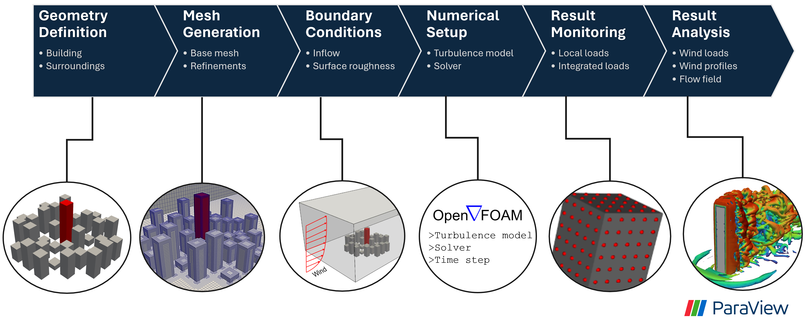
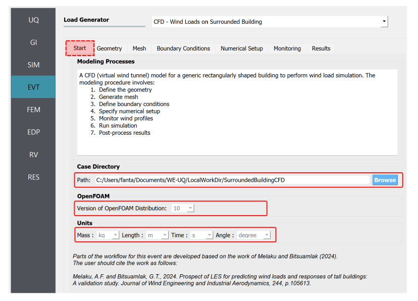
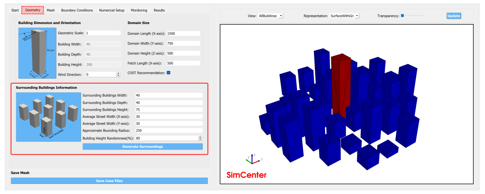
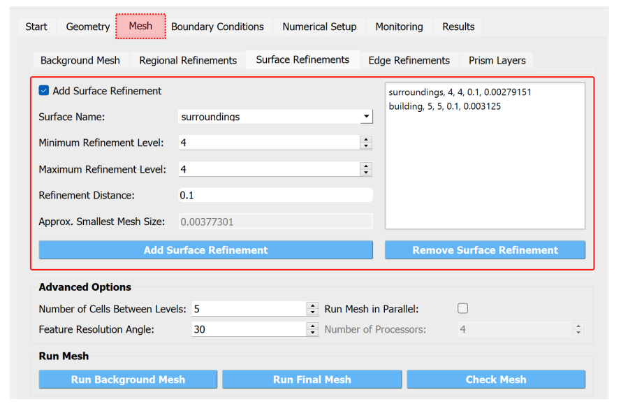
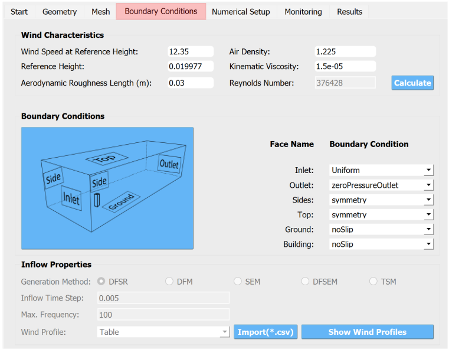
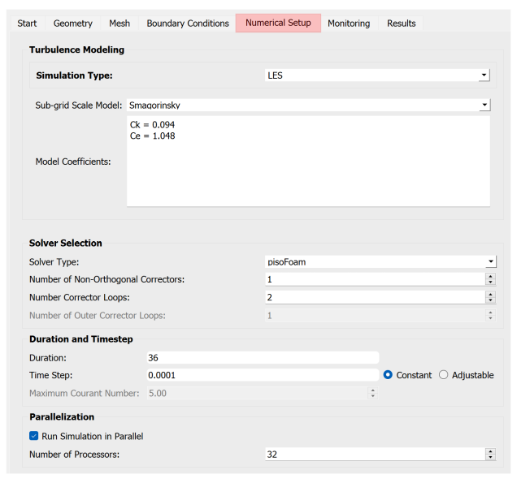
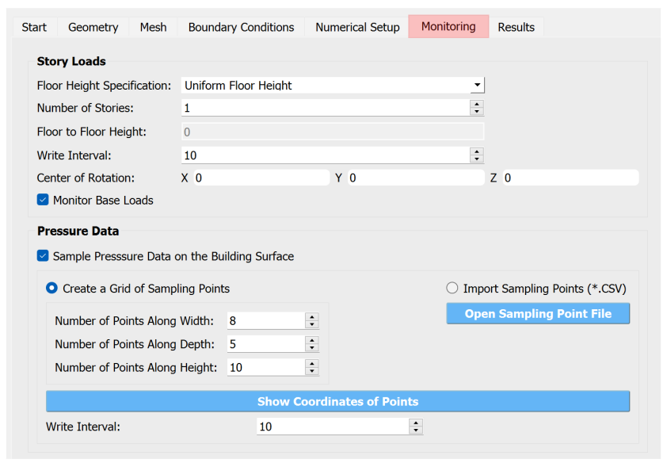

.. _lblSurroundedBuildingCFD:

Surrounded Building CFD Model
============================

The Surrounded Building CFD Model is a Computational Fluid Dynamics (CFD) workflow to simulate wind loads on a building with surroundings. It supports automated generation of the building geometry from only a few user inputs specifying the dimensions and arrangement of the buildings. Once the geometry is defined, the computational grid can be generated using global and local refinement options. The workflow also supports different boundary conditions for modeling the approaching wind given a specific exposure type of the site. :numref:`fig-iso-gui-overview` presents a high-level overview of the steps involved in the workflow. Given the high computation cost of the simulation, the simulation can only be run remotely using HPC resources at DesignSafe. 

.. _fig-sur-cfd-workflow:

	The high-level overview of the CFD-based workflow for a building with surroundings 

The workflow for this feature is similar to :ref:`Isolated Building CFD Model <lblIsolatedBuildingCFD>` and the user needs to refer to this manual for details instructions. Here a brief step-by-step procedure is given.

Start
^^^^^^^
In this tab, the user specifies the path to the working directory, the unit system and the version of the OpenFOAM package to use. First, select the **Path**, where the generated CFD model will be saved. This path can be changed by clicking "Browse" button as shown in :numref:`fig-sur-gui-start`. Furthermore, the user also can change the unit system used in the CFD modeling by specifying suitable **Units**  for mass, length, time and angle. 

.. _fig-sur-gui-start:

   Setup case directory, unit system and version of OpenFOAM to use for the rest of the workflow 

Geometry
^^^^^^^^^^
In the **Geometry** tab, the user needs to input the dimensions of the main building, the surroundings and the computational domain. It is assumed that both the target and the surrounding buildings have a generic shape. For defining the dimensions of the study(main) building and computational domain please refer to the same section in :ref:`Isolated Building CFD Model <lblIsolatedBuildingCFD>`. Here, user inputs needed to set the dimensions and configuration of the surrounding buildings are provided as shown in :numref:`fig-sur-geometry-tab`. 

.. _fig-sur-geometry-tab:

   **Geometry** tab for defining the geometry of the building and surroundings

#. **Surrounding Buildings Width**: Represents the average width of the surrounding buildings. A all the surrounding buildings are assumed to have the same floor dimensions. Note that the dimensions of the surrounding buildings are defined in full-scale. 

#. **Surrounding Buildings Depth**: Represents the average depth of the surrounding buildings. 

#. **Surrounding Buildings Height**: Represents the average height of the surrounding buildings. Height of each individual building can be randomized if a more realistic configuration is needed.   

#. **Average Street Width (X-axis)**: Edge-to-edge distance between buildings in x-direction. 

#. **Average Street Width (Y-axis)**: Edge-to-edge distance between buildings in y-direction. 

#. **Building Height Randomness (%)**: The level of randomness used when generating the building heights. If set to zero, all the surrounding buildings will have the same height specified for **Surrounding Buildings Height**. 

Finally, the geometry of the model can be instantly created by clicking the **Generate Surroundings** button. Each time this button is pressed, a new realization of the geometry of the surrounding buildings will be generated. 

Meshing
^^^^^^^^^^
In this tab, the user specifies options to generate a computational grid in an automated way. The mesh generation procedure starts by defining a background structured mesh. Then, regional refinements are added by specifying bounding boxes. Finally, refinements close to the target building and surrounding models can be specified by adding surface/edge refinements or inserting prism layers. For the detailed step-by-step procedure, please follow the instructions in the *Mesh* section of :ref:`Isolated Building CFD Model <lblIsolatedBuildingCFD>`.

.. _fig-sur-mesh-tab:

   
   **Mesh** tab for generating the computational grid using *snappyHexMesh* tool.

After the mesh generation is completed the *Model View Window* is updated automatically. This window provides the user with different options for visualizing the mesh. The user can look into the geometry/mesh of the target building, surroundings or the whole mesh as seen in seen :numref:`fig-sur-mesh-view`. 

.. _fig-sur-mesh-view:

.. figure:: figures/SurroundedBuildingCFD/mesh_view_tab.svg
   :align: center
   :width: 75%
   
   *Model View Window* for viewing and checking the generated mesh. 

Boundary Conditions
^^^^^^^^^^^^^^^^^^^^

In the *Boundary Conditions* tab, the user defines the values of wind fields at the domain boundaries. First, the user specifies the general characteristics of the approaching wind in the *Wind Characteristics* group. Then, specific boundary conditions for each face of the domain are provided in the *Boundary Conditions* group. If the user selects turbulent inflow condition at the inlet, in the *Inflow Generation* group the method and the inputs needed to generate artificial inflow boundary conditions will be specified.  

.. _fig-iso-bc-tab:

	Boundary condition specification. 

Approaching Wind Characteristics
"""""""""""""""""""""""""""""""""""
The workflow offers the user a means to perform the CFD simulation at a reduced scale. If the simulation is done at a reduced scale, the characteristics of the approaching wind must be defined in the same scale.    

1. **Velocity Scale**: This represents a factor to scale the velocity. 
2. **Wind Speed at Reference Height**: Mean wind speed at the reference height (e.g. at the roof height). If the simulation is done at a reduced scale, the wind speed in the model scale needs to be provided. 
3. **Reference Height**: Reference height where the **Wind Speed at Reference Height** is defined. By default, this value will be the building height. 
4. **Aerodynamic Roughness Length**: Surrounding terrain aerodynamic roughness length for the particular wind direction being simulated.
5. **Time Scale**: Time scale of the simulation. It is automatically calculated from the **Geometric Scale** in *Geometry* tab and the **Velocity Scale**. 
6. **Air Density**: Density of air at the particular region where the building is located. By default, a value of 1.225 is specified for a :math:`15^\circ C` temperature and atmospheric pressure at sea level.  
7. **Kinematic Viscosity**: This represents the ratio of absolute air viscosity to air density. The default value is set to :math:`1.5 \times 10^{-5} m^2/s`.   
8.  **Reynolds Number**: Reynolds number is calculated based on the building height and reference wind speed. Reynolds number expressed the ratio of inertial forces to viscous forces. This field cannot be edited, and the value for this simulation can be determined by clicking the **Calculate** button.
     
Initial and Boundary Conditions
"""""""""""""""""""""""""""""""""
Types of boundary conditions corresponding to each face of the domain are defined here. The names for the boundary conditions are based on *OpenFOAM* dictionary files. 

#. **Inlet**: Defines the boundary conditions at the inlet of the computational domain. Here we have three options:
    
	* **Uniform**: Specify a constant uniform value at the inlet taking the value specified for **Wind Speed at Reference Height**.   
	* **MeanABL**: Defines mean velocity profile based on the logarithm law of the wall. To calculate the logarithmic profile the reference height and velocity defined in *Wind Characteristics* ground are used. This boundary condition assumes the approaching wind is a smooth flow. 
	* **TInf**: Specifies synthetic turbulent inflow at the inlet that varies with space and time. When this option is selected, *Inflow Generation* group will be automatically enabled and the user can control the inflow turbulence generation procedure. 
    
#.  **Outlet**: The boundary condition used at the outlet. By default, it is set to *zeroPressureOutlet* which makes the pressure field at the outlet zero. Hence, the reference pressure used for the wind load calculation can be assumed to be zero.    

#.  **Sides**: The boundary conditions used on side boundaries (front and back) of the domain are selected here. The value can assume four options:     

    * **symmetric**: Specifies zero normal gradient boundary condition for the velocity on the side faces of the domain. Sets  
    * **slip**: Specifies slip but impermeable boundary conditions for side faces. This will set zero normal gradient boundary conditions for the flow parallel to the surface.
    * **noSlip**: Sets the velocity on the side faces to zero. 
    * **cyclic**: This option will link the side patches together by setting the cyclic boundary condition for pressure and velocity fields.

#.  **Top**: The boundary condition used on the top boundary of the domain. It can assume three options:     

    * **symmetric**: Specifies zero normal gradient boundary condition for the velocity.   
    * **slip**: Specifies slip but impermeable boundary conditions for top faces. This will set zero normal gradient boundary conditions for the flow parallel to the surface.
    * **noSlip**: Sets the velocity on the top faces to zero. 

#.  **Ground**: Define the boundary condition on the ground surface. There are three boundary condition types:     

    * **noSlip**: Sets the velocity on the ground face to zero. 
    * **smoothWallFunction**: Specifies a smooth wall function on the ground surface.
    * **roughWallFunction**: Defines a rough wall boundary condition. This will be defined based on the aerodynamic roughness length defined previously.
  
#.  **Building**: Define the boundary condition on the building surface. There are three boundary condition types:     

    * **noSlip**: Sets the velocity on the building face to zero. 
    * **smoothWallFunction**: Specifies a smooth wall function on the building surface.
    * **roughWallFunction**: Defines a rough wall boundary condition based on sand grain roughness.

Inflow Generation
"""""""""""""""""""
If *TInf* option is specified at the *inlet* of the boundary, inputs for the inflow generation are specified here. 

#.  **Generation Method**: The technique for generating the inflow turbulence. Five different methods commonly used in the computational wind engineering community are implemented.

    * **DFSR**: Uses Divergence-free Spectral Representation (DFSR) method developed by [Melaku2021]_.   
    * **DFM**: Uses Digital Filtering Method (DFM) developed by [Klein2003]_ and [Xie2008]_. 
    * **SEM**: Uses Synthetic Eddy Method (SEM) developed by [Jarrin2006]_.   
    * **DFSEM**: Uses Divergence-free Synthetic Eddy Method (DFSEM) developed by [Poletto2013]_.  
    * **TSM**: Uses Turbulent Spot Method (TSM) developed by [Kröger2018]_.  

#.  **Inflow Time Step**: The time step used for generating inflow turbulence.  Can assume a value different from the solver time step.  For intermediate time steps, a linear interpolation is used. 
#.  **Max. Frequency**: Define the maximum cut-off frequency for the inflow generation. Directly calculated from the inflow time step as :math:`f_{max} = 1/(2\Delta t)`.  
#.  **Wind Profile**: Provides options to define wind profiles used for the inflow generation in a tabular form. 

Numerical Setup
----------------
In this tab, selections related to turbulence modeling, solver type, duration and time step options are specified. First, the user will specify the type of simulation to run. Both transient and steady-state options are available. Then, the type of solver suitable for the selected simulation is specified. Finally, options related to the duration and time step of the simulation are defined.  

.. _fig-iso-numerical-setup-tab:

	Specification of the numerical setup. 

Turbulence Modeling
""""""""""""""""""""
The Reynolds number for wind load simulation is usually high in the order of :math:`Re = 10^7` (full-scale). This makes it highly challenging to resolve all scales of the wind fluctuations. We need to use an appropriate turbulence model to represent the effect of small-scale turbulence.  

#.  **Simulation Type**: Specifies the type of turbulence modeling scheme to be used. Three turbulence modeling options are supported:

    * **LES**: Should be selected if the user wants to run a large-eddy simulation with subgrid scale formulation for the unresolved scale of the flow. This option is the default choice for the wind load simulation.  
    * **RANS**: Used for steady-state simulation using Reynolds-averaged Navier–Stokes equations. Suitable only for modeling mean flow quantities and mean wind loads. 
    * **DES**: Uses a detached eddy simulation (DES) turbulence model. DES model uses a RANS model close to the wall and switches to LES for regions far enough from the wall.   
 
#.  **Sub-grid Scale Model**: Provides options to select Sub-grid scale (SGS) model. Three SGS models are supported in the current version.

    * **Smagorinsky**: Specifies a standard Smagorinsky model with model coefficients :math:`C_k = 0.094` and :math:`C_e = 1.048`  
    * **WALE**: Used the Wall-Adapting Local Eddy-viscosityWALE (WALE) SGS model with model coefficients :math:`C_k = 0.094, C_e = 1.048` and :math:`C_w = 0.325`. 
    * **kEqn**: Uses a one-equation eddy-viscosity model with an addition momentum balance equation for turbulent kinetic energy. 
    * **dynamicKEqn**: Specifies a dynamic one-equation eddy-viscosity model with model constants dynamically calculated. 

#.  **RANS Model Type**: Specifies the type of RANS closure model to use. Supports three options:

    * **kEpsilon**: Specifies the standard two-equation K-Epsilon model   
    * **kOmega**: Specifies two-equation K-Omega model.
    * **SST**: Uses a shear stress transport (SST) turbulence model. 

#.  **DES Model Type**: Specifies the type of DES model to use:

    * **SpalartAllmarasDES**: Specifies Spalart-Allmaras Detached Eddy Simulation (DES) model   
    * **SpalartAllmarasDDES**: Uses Spalart-Allmaras Delayed Detached Eddy Simulation (DDES) model

Solver Selection
""""""""""""""""""""
Depending on the type of simulation selected (i.e. steady-state and transient), the type of solver must be selected appropriately. For LES and DES turbulence models, use transient solvers such as Pressure-Implicit with Splitting of Operators (PISO) and for RANS models, recommended to use a steady-state solver like Semi-Implicit Method for Pressure Linked Equations (SIMPLE).  

#.  **Solver Type**: Specifies the type of DES model to use:

    * **pisoFoam**: Uses a transient solver for incompressible, turbulent flow, using the PISO algorithm
    * **pimpleFoam**: Uses a transient solver based on PISO on the (PISO) algorithm and supports a dynamic type stepping.
    * **simpleFoam**: Uses a steady-state for incompressible, turbulent flow, using the SIMPLE algorithm

#.  **Number of Non-Orthogonal Correctors**: Additional correction loops to account for mesh non-orthogonality. The default value is set to one. For highly non-orthogonal mesh, a higher value needs to be used. 

#.  **Number of Corrector Loops**: Specifies the number of pressure-corrector loops per each time iteration. The default value is set to 2. This value is valid only for transient solvers. 

#.  **Number of Outer Corrector Loops**: Specifies the number of PISO loops to run for each time step. This value is valid only for the *pimpleFoam* solver. The *pimpleFoam* solver works by running multiple PISO iterations, and if this field is set to 1, it will run in a PISO mode. 

Duration and Time Step
""""""""""""""""""""""
The duration and time step of the simulation must be specified in line with the *Time Scale* used for the model. For wind load simulation it is recommended to have a 1 hour equivalent duration in full scale. However, for integrated wind loads, a statical convergence can be achieved at a much shorter duration.   

#.  **Duration**: The length of the simulation (physical time) at chosen *Time Scale* in seconds. The simulation will end once the solver reaches this time. 
 
#.  **Time Step**: The time increment used for the solver. Note that the numerical stability of the solver is highly sensitive to the time step. To estimate the recommended time step that will keep the maximum Courant number (:math:`C_o`) below unity, click the **Calculate** button next to it. The estimated time step can always be edited to make a slightly higher or lower value that is easy to remember. Time advancement has two options:   

    * **Constant**: Makes the time step constant and does not change at each time iteration. 
    * **Adjustable**: Makes the time step change every iteration by checking the simulation does not exceed the maximum Courant number (:math:`C_o`) specified. It works only with *pimpleFoam*.

#.  **Maximum Courant Number**: The maximum value of Courant number (:math:`C_o`) also known as Courant–Friedrichs–Lewy (CFL) number. It needs to be specified only for *pimpleFoam* solver and a value as high as 7 can be used.   

Parallelization
""""""""""""""""""
#.  **Run Simulation in Parallel**: If checked, the simulation will run in parallel and the user needs to specify the number of processors. Otherwise, the simulation is conducted in serial. For the high-fidelity simulation, it is recommended to run in parallel. 

#.  **Number of Processors**: This represents the number of subdomains that will be used in the OpenFOAM case. It needs to match the computational resources availed when the job gets submitted to *DesignSafe* to run remotely. 

Monitoring
----------------
The CFD simulation is typically run using millions of grids. Saving all the simulation data at each time step slows down the solver and takes lots of space. Therefore, in this event, we monitor only relevant quantities (wind loads and flow fields) that will be used in the workflow. Under this tab, the user selects the type of wind loads to monitor which include integrated loads on the structure as well as surface pressure fluctuations at specific points on the building walls. Integrated loads represent the wind forces the building structure experiences. Two types of integrated loads are monitored, which include *Base Loads* and *Story Loads*.

.. _fig-iso-monitoring-tab:

	Results to monitor from the CFD simulations 

Base Loads
"""""""""""
This will monitor the time history of the base shear forces and overturning moment on the building. The values are calculated by integrating the pressure fluctuations over the building surface.

#.  **Monitor Base Loads**: If checked the base loads will be monitored. By default, this option is checked.  
#.  **Write Interval**: Represents the frequency (interval measured in time steps) at which the base loads will be recorded. For example, if the user specifies 10, then the base loads will be written at every :math:`10 \times \Delta t` seconds, where :math:`\Delta t` is the solver **Time Step**. It can only take an integer value.  

Story Loads
""""""""""""
Since the story forces are needed for the main workflow, they are always monitored from the CFD simulation. 

#.  **Floor Height Specification**: Specifies if the floor heights are *Uniform Floor Height* or not.    
#.  **Number of Stories**: The number of floors. This field cannot be changed here and is directly taken from the **GI** panel. 
#.  **Floor to Floor Distance**: The floor-to-floor height in the model scale, and cannot be edited here. 
#.  **Write Interval**: The interval at which the story loads are written. This time step is the one that the structural solver will use. If checked the base loads will be monitored.  

Cladding Loads
""""""""""""""
For the cladding loads, local pressure fluctuations on the building surface can be monitored. The cladding loads can be monitored on points automatically created by the application or on a set of points imported from an existing *.CSV* file.

#.  **Sample Pressure Data on the Building Surface**: If checked, the surface pressure data will be monitored on the building surface.  
#.  **Create a Grid of Sampling Points**: If checked, the pressure monitoring points on the building surface are automatically created as a regularly spaced grid of points on each face of the building. Three inputs are needed to create these points aromatically: 

    * **Number of Points Along Width**: The number of grid points along the building width. 
    * **Number of Points Along Depth**: The number of grid points along the building depth. 
    * **Number of Points Along Height**: The number of grid points along the building height. 

#.  **Import Sampling Points(*.CSV)**: If this option is checked, the user needs to click the **Open Sampling Point File** button and select a *CSV* file containing a table of :math:`x`, :math:`y` and :math:`z` coordinates of the points.  
#.  **Write Interval**: The interval at which the pressure data is written.

The sampling points can be visualized on the building surface by clicking **Show Coordinate of Points**. This will open the STL file of the building with points marked on the building surface. A sample demo is shown in :numref:`fig-iso-monitoring-tab` . On the left side of the opened window, a table for the coordinates is shown, while on the right side, the 3D visualization is displaced.    

.. [Greenshields2015] Greenshields, C.J. (2015). OpenFOAM Programmer's Guide. OpenFOAM Foundation Ltd.

.. [Franke2007] Franke, J., Hellsten, A., Schlünzen, K.H. and Carissimo, B., 2007. COST Action 732: Best practice guideline for the CFD simulation of flows in the urban environment.

.. [Greenshields2022] Greenshields, C.J. (2022). https://doc.cfd.direct/openfoam/user-guide-v10/snappyhexmesh

.. [Melaku2021] Melaku, A.F. and Bitsuamlak, G.T., 2021. A divergence-free inflow turbulence generator using spectral representation method for large-eddy simulation of ABL flows. Journal of Wind Engineering and Industrial Aerodynamics, 212, p.104580.

.. [Klein2003] Klein, M., Sadiki, A. and Janicka, J., 2003. A digital filter-based generation of inflow data for spatially developing direct numerical or large eddy simulations. Journal of Computational Physics, 186(2), pp.652-665.

.. [Xie2008] Xie, Z.T. and Castro, I.P., 2008. Efficient generation of inflow conditions for large eddy simulation of street-scale flows. Flow, turbulence and combustion, 81, pp.449-470.

.. [Jarrin2006] Jarrin, N., Benhamadouche, S., Laurence, D. and Prosser, R., 2006. A synthetic-eddy-method for generating inflow conditions for large-eddy simulations. International Journal of Heat and Fluid Flow, 27(4), pp.585-593.

.. [Poletto2013] Poletto, R., Craft, T. and Revell, A., 2013. A new divergence-free synthetic eddy method for the reproduction of inlet flow conditions for LES. Flow, turbulence and combustion, 91, pp.519-539.

.. [Kröger2018] Kröger, H. and Kornev, N., 2018. Generation of divergence-free synthetic inflow turbulence with arbitrary anisotropy. Computers & Fluids, 165, pp.78-88.
