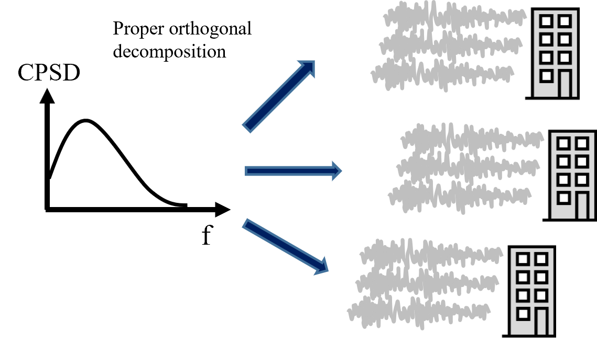
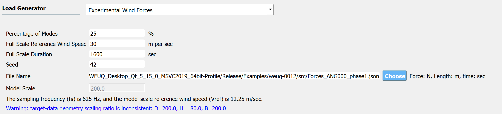
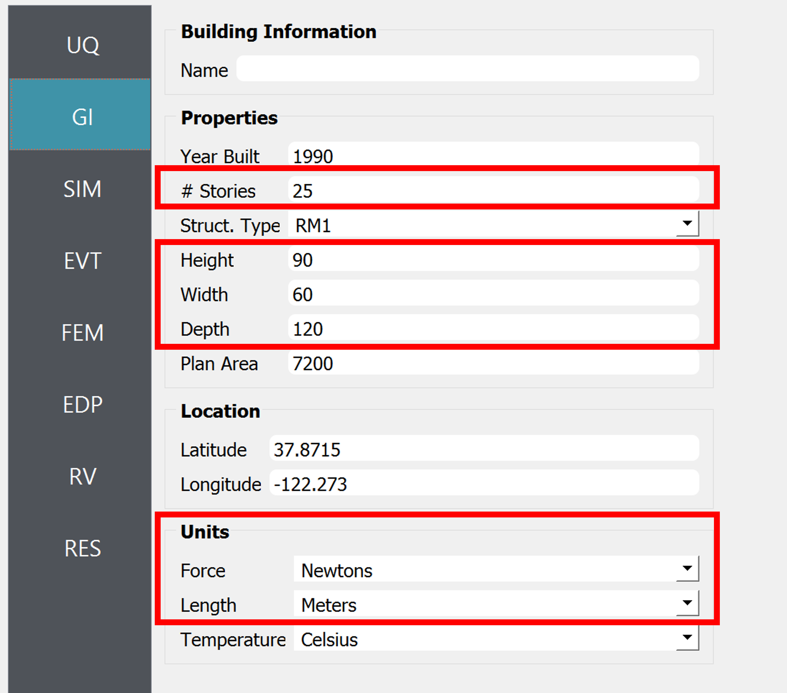
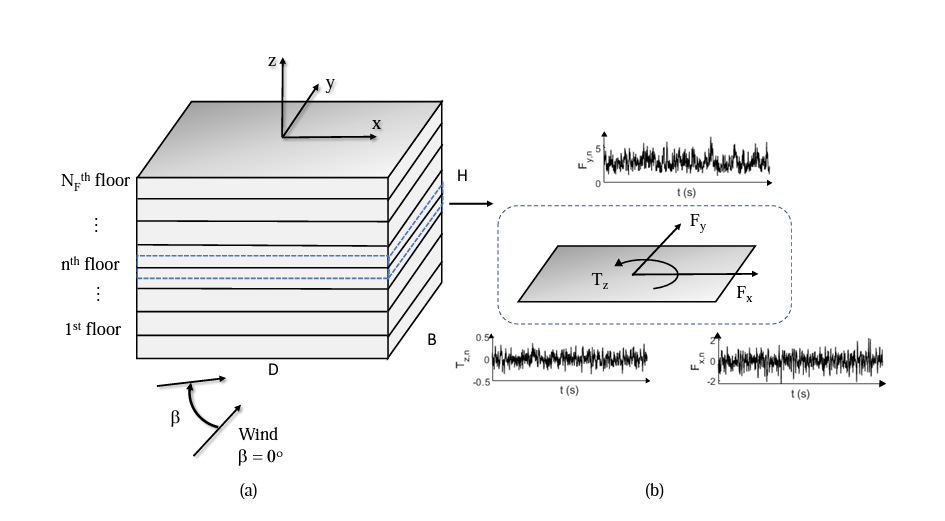
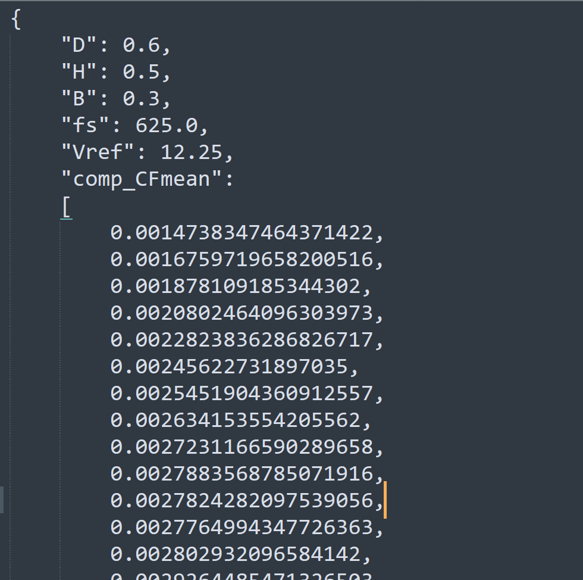

.. _lblWindForceSpectrum:

Wind Force Spectrum
------------------------

This application generates stochastic wind force time histories from a user-provided cross-power spectrum density (CPSD) function, which the user obtained by post-processing a wind tunnel experimental data. The wind load is assumed to follow a Gaussian stochastic process. This algorithm follows the implementation details in [Duarte2023]_.

	Generating full-scale wind time history from a model-scale cross-power spectrum density (CPSD) function

User Inputs
^^^^^^^^^^^^^^^^^^^^^^^^^^

.. _fig-ExperimentalWind1:

	Option to import experimental wind force time history

* **Percentage of Modes**: The truncation criteria for the proper orthogonal decomposition.
* **Full Scale Reference Wind Speed**: The wind speed at the reference point of the building (e.g. top of the building). The reference point location should match that of the model.
* **Full Scale Duration**: The duration of wind force time series that will be generated by this engine.
* **Seed**: The seed for the random number generator.
* **File Name**: "Wind Force Time History File" that contains model geometry and wind tunnel experiment details. The data can be provided either in a matlab binary file (.mat) or a json (.json) file. Please see the next section for the details of the variables (keys) needed in the file.
* **Model Scale**: This is the model scaling ratio. This value is automatically estimated after reading the "Wind Force Time History File", as a ratio between the full-scale and model-scale building dimensions. Only if the file is imported in a json format, the model scale ratio will be displayed. 
* The units can be modified at GI tab. 

The **Full Scale Building Geometry** and the **Units** are specified in the GI tab. The correct **number of stories** should also be provided. 

.. _fig-ExperimentalWind5:

	GI tab (Only the variables in the red box are relevant to the current module.)

.. warning::
		This algorithm assumes that **the building is uniformly scaled in all dimensions**, meaning if model height is scaled by 1/200 for the experiment, width (breath) and depth is also scaled by 1/200. Therefore the ratio of model-scale dimensions (B,H,D) provided in the "Wind Force Time History File" should match that of the full-scale dimensions (Height, Width, Depth) specified in the GI tab. Otherwise, WE-UQ will give a warning message in blue font color as shown in the screen capture above.
Wind Force Spectrum File
^^^^^^^^^^^^^^^^^^^^^^^^^

.. _fig-ExperimentalWind6:

	Schematic representation of the building and the loads, and the coordinate system ([Duarte2023]_ )

The details of the wind force spectrum obtained by the experimental wind test should be provided either in a matlab binary (.mat) or json (.json) file. The following variables (or keys) need to be included (``nfreq``: number of frequency discretization, ``ncomp``: number of components of interest, equal to number of floor times 3)

* **B**: Scalar. Breath (Width) of the building model used in the experiment (Length unit defined in GI tab)
* **D**: Scalar. Depth of the building model used in the experiment (Length unit defined in GI tab)
* **H**: Scalar. Height of the building model used in the experiment (Length unit defined in GI tab)
* **fs**: Scalar. Sampling frequency (Hz)
* **comp_CFmean**: 1D array with size [``ncomp`` x 1]. Mean (model scale) wind force used to transform the force coefficients into forces (Force unit defined in GI tab). Note that the order of components should follow **Fx**-**Fy**-**Tz**, i.e. the first ``ncomp``/3 rows should correspond to x-directional force at each floor (denoted **Fx**), the next ``ncomp``/3 is the y-directional force at each floor (denoted **Fy**), and the last ``ncomp``/3  is the z-directional moment at each floor(denoted **Tz**)
* **norm_all**: 1D array with size [``ncomp`` x 1]. Scaling factor in transforming the force coefficients into forces (Force unit defined in GI tab). The order of components should follow **Fx**-**Fy**-**Tz**.
* **Vref**: Scalar. Model Scale Reference Wind Speed at the reference point of the building. The reference point of the model should match that of the full-scale building (Velocity unit defined in GI tab)
 
If the inputs are provided in a matlab binary file, the below additional variable is needed.

* **s_target**: 3D complex number array with size [``ncomp`` x ``ncomp`` x ``nfreq``]. CPSD values for each combination of components at frequency values of f_target. This CPSD is obtained in the standardized Wind Force with mean **comp_CFmean** and scaling factor **norm_all** (1/Hz). The order of components should follow **Fx**-**Fy**-**Tz**.

If the inputs are provided in a json file, s_target should be split into real and imaginary parts.

* **s_target_imag**: 3D imaginary number array with size [``ncomp`` x ``ncomp`` x ``nfreq``]. Imaginary part of the CPSD values (without *i*) for each combination of components at frequency values of f_target (1/Hz)
* **s_target_real**: 3D real number array with size [``ncomp`` x ``ncomp`` x ``nfreq``]. The real part of the CPSD values for each combination of components at frequency values of f_target (1/Hz)

.. _fig-SpectrumWind3:

.. figure:: figures/weuqWindForceSpectrum1.png
	:align: center
	:figclass: align-center
	:width: 500

	Example of information inside a matlab binary file (.mat) (``nfloor`` = 25, ``ntimesteps`` = 20,000, units: meter, Newton, second)

.. _fig-SpectrumWind4:

	Example of information inside a Json file (.json) (``nfloor`` = 25, ``ntimesteps`` = 20,000, units: meter, Newton, second)

.. [Duarte2023] Duarte, T. G. A., Arunachalam, S., Subgranon, A., & Spence, S. M. (2023). Uncertainty Quantification of a Wind Tunnel-Informed Stochastic Wind Load Model for Wind Engineering Applications. arXiv preprint arXiv:2305.06253.
