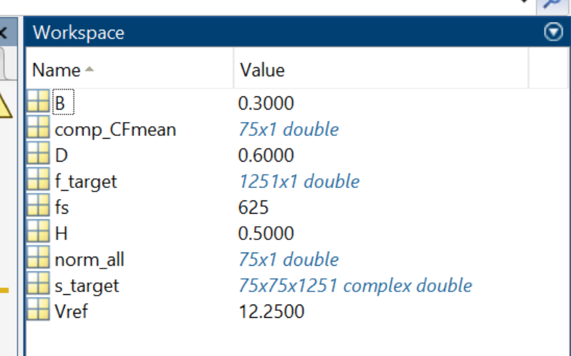

.. _lblWindForceSpectrum:

Wind Force Spectrum
------------------------

This application generates stochastic wind force time histories based on the cross-power spectral density (CPSD) matrix which the user derives from the wind tunnel data. This algorithm follows the implementation details in [Duarte2023]_ and the theory manual is available :ref:`here<lblDataInformedWindTheory>`.

.. figure:: figures/weuqWindForceSpectrum0.png
	:align: center
	:figclass: align-center
	:width: 600

	Generating full-scale wind time history from a model-scale cross-power spectrum density (CPSD) function

User Inputs
^^^^^^^^^^^^^^^^^^^^^^^^^^

.. _fig-ExperimentalWind1:

.. figure:: figures/weuqExperimentalWindForces.png
	:align: center
	:figclass: align-center

	Option to import experimental wind force time history

The input parameters for the application interface are provided below. 

* **Percentage of Modes**: Percentage of modes (dominant modes) that will be included to obtain the loading process. If 100% of modes are included, the simulated process is exact up to the second order, but additional computation cost is expected. It is recommended to include at least 25% of modes to have negligible errors in the simulation at a reasonable computational cost [Duarte2023]_
* **Full Scale Reference Wind Speed**: The full-scale wind speed at the reference point of the building (e.g., top of the building). The reference point location should match that of the model used in the wind tunnel testing.
* **Full Scale Duration**: The duration of wind force time series that will be generated by this engine.
* **Seed**: The seed for the random number generator.
* **File Name**: “Wind Force Time History File” that contains model geometry and wind tunnel experiment details. The data can be provided either as a MATLAB binary file (.mat) or a json (.json) file. Please see the next section for the details of the variables (keys) needed in the file.
* **Model Scale**: This is the geometric length scale. This value is automatically estimated after reading the “Wind Force Time History File”, as a ratio between the full-scale and model-scale building dimensions. Only if the file is imported in a json format, the model scale ratio will be displayed.
* The units can be modified at GI tab. 

The **Full Scale Building Geometry** and the **Units** are specified in the GI tab. The correct **number of stories** should also be provided. 

.. _fig-ExperimentalWind5:

.. figure:: figures/weuqExperimentalWindForces5.png
	:align: center
	:figclass: align-center
	:width: 500

	GI tab (Only the variables in the red box are relevant to the current module.)

.. warning::
		This algorithm assumes that **the building is uniformly scaled in all dimensions**, meaning if model height is scaled by 1/200 for the experiment, width (breath) and depth is also scaled by 1/200. Therefore the ratio of model-scale dimensions (B,H,D) provided in the "Wind Force Time History File" should match that of the full-scale dimensions (Height, Width, Depth) specified in the GI tab. Otherwise, WE-UQ will give a warning message in blue font color as shown in the screen capture above.
Wind Force Spectrum File
^^^^^^^^^^^^^^^^^^^^^^^^^

.. _fig-ExperimentalWind6:

	Schematic representation of the building and the loads, and the coordinate system ([Duarte2023]_ )

The wind force spectra obtained from the experimental data should be provided either as a MATLAB binary (.mat) or json (.json) file. The following variables (or keys) need to be included (``nfreq``: number of frequency discretization, ``ncomp``: number of components of interest, equal to number of floor times 3)

* **B**: Scalar. Breath (Width) of the building model used in the experiment (Length unit defined in GI tab)
* **D**: Scalar. Depth of the building model used in the experiment (Length unit defined in GI tab)
* **H**: Scalar. Height of the building model used in the experiment (Length unit defined in GI tab)
* **fs**: Scalar. Sampling frequency (Hz)
* **comp_CFmean**: 1D array with size [``ncomp`` x 1]. Mean wind force coefficients array initially used to standardize the signal, as in the equation: CF_std = CF_data – comp_CFmean)/norm_all, where CF_std is the standardized force coefficient, CF_data is the force coefficient time series, and norm_all is the normalization factor. After simulation, the array is subsequently used to destandardize the signal and obtain the forces (Force unit defined in GI tab). Note that the order of components should follow **Fx**-**Fy**-**Tz**, i.e. the first ``ncomp``/3 rows should correspond to x-directional force at each floor (denoted **Fx**), the next ``ncomp``/3 is the y-directional force at each floor (denoted **Fy**), and the last ``ncomp``/3  is the z-directional moment at each floor(denoted **Tz**)
* **norm_all**: 1D array with size [``ncomp`` x 1]. Scaling factor used to transform (destandardize) force coefficients, and subsequently obtain the Forces (Force unit defined in GI tab). The values are estimated as the standard deviation of each force coefficient times the reduction factor previously used (e.g., 3.5 in the case of the example provided). The order of components should follow **Fx**-**Fy**-**Tz**.
* **Vref**: Scalar. Model Scale Reference Wind Speed at the reference point of the building. The reference point of the model should match that of the full-scale building (Velocity unit defined in GI tab)
* **f_target**: Frequency vector [1 x ``nfreq``].

If the inputs are provided in a matlab binary file, the below additional variable is needed.

* **s_target**: 3D complex number array with size [``ncomp`` x ``ncomp`` x ``nfreq``]. CPSD matrix for each pair of components at frequency values of f_target. The CPSD should be estimated using Welch’s averaged, modified periodogram method for the standardized force coefficient signals (1/Hz). The order of components should follow **Fx**-**Fy**-**Tz**.

If the inputs are provided in a json file, s_target should be split into real and imaginary parts.

* **s_target_imag**: 3D imaginary number array with size [``ncomp`` x ``ncomp`` x ``nfreq``]. The imaginary part of the CPSD values (without *i*) for each combination of components at frequency values of f_target (1/Hz).
* **s_target_real**: 3D real number array with size [``ncomp`` x ``ncomp`` x ``nfreq``]. The real part of the CPSD values for each combination of components at frequency values of f_target (1/Hz).

.. _fig-SpectrumWind3:

	Example of information inside a matlab binary file (.mat) (``nfloor`` = 25, ``ntimesteps`` = 20,000, units: meter, Newton, second)

.. _fig-SpectrumWind4:

.. figure:: figures/weuqWindForceSpectrum2.png
	:align: center
	:figclass: align-center
	:width: 500

	Example of information inside a Json file (.json) (``nfloor`` = 25, ``ntimesteps`` = 20,000, units: meter, Newton, second)

.. [Duarte2023] Duarte, T.G., Arunachalam, S., Subgranon, A. and Spence, S.M., (2023). Uncertainty Quantification and Simulation of Wind-Tunnel-Informed Stochastic Wind Loads. Wind, 3(3), pp.375-393.
