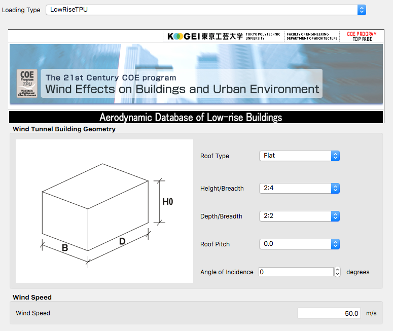

***************************************
Data from Tokyo Polytechnic University
***************************************
For this event type, full-scale floor loads are generated utilizing wind tunnel data made available by Tokyo Polytechnic University, specifically their `TPU Aerodynamic Database <http://wind.arch.t-kougei.ac.jp/system/eng/contents/code/tpu>`_. The TPU Aerodynamic database provdes a number of databases. Currently this tool utized data provided for `Low Rise Buildings Without Eaves <http://www.wind.arch.t-kougei.ac.jp/info_center/windpressure/lowrise/mainpage.html>`_. That database provides wind tunnel data of wind-loads on low-rise buildings: gable, hip, and flat roofed buildings. Information on the data and how it was obtained is provided in their `documentation <http://www.wind.arch.t-kougei.ac.jp/info_center/windpressure/lowrise/Introductionofthedatabase.pdf>`_. The important wind field information: The turbulence density at a height of 10cm was about 0.25.  The test mean wind velocity at this height was about 7.4m/s, corresponding to about 22m/s at a height of 10m in full scale. The tests were performed on a limited number of buildings with different aspect ratios and wind coming from different angles on the building.

As will be discussed in the theory section, the wind loads are obtained from the pressure tap data by determining a length factor and a velocity factor. The length factor is determined from the building height. The forces, unlike in DEDM-HRP, are determined given the building dimensions provided in the general information sheet and the length and velocity factors.

.. _fig-lowRise-TPU:

	Low Rise TPU Wind Loading Event

In the inputs for the event, as shown in figure :numref:`fig-lowRise-TPU` require the user to specify which of these tests to use:

#. The roof type, currently only flat is an option.

#. The user specifies one of 4 height to breadth ratios.

#. One of three depth to breadth ratios.

#. A roof picth.

#. The angle of incidence, 0 through 90 in 15 degree increments.

#. Mean Wind Speed: The wind speed provided is used in determing the velocity factor and the applied loads. 

Random Variables: For this event, the wind speed can be a random variable.
