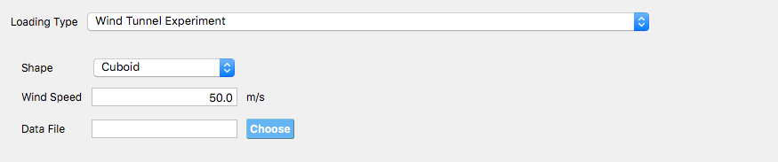

Wind Tunnel Experiment
----------------------

This application will take the wind tunnel data provided and scale it based on wind speed provided in this interface, and the building dimensions provided in the General Information. The theory on scaling wind tunnel data is provided in the theory. The data for the winnd tunnel is provided in a JSON file format. That file contains information on model dimensions, model wind speed, and model frequency, tap locations and time varying pressure tap coefficients.

.. _fig-windTunnelExp:

	Wind Tunnel Experiment Wind Loading Event

#. The user to select the shape of the building, currently onlu Cuboid shapes are permitted.

#. The Wind speed.

#. The file containing the experimental data. The file contains information about the dimensions of the building model in the wind tunnel, the wind speed (the meaning of wind speed dis totally dependent on what wind speed measurement was used in the test), time varying data for the pressure coeffiecients, information on frequency of these data points, and information on th elocations of pressure taps for which pressure coefficients are provided. An abbreviated example is as shown below.

Random Variables: For this event, the wind speed can be a random variable.

The format for the wind tunnel data file is presently a JSON file. Future versions will allow the input of Matlab .mat files. A valid file is as follows:
::

	{
 	 "meanWindSpeed":22.000000,
 	 "shape":"Cuboid",
 	 "depth":24.000000,
 	 "height":12.000000,
 	 "breadth":16.000000,
 	 "frequency":600.000000,
 	 "period": 15.000000,
  	  "units":{
    	"length":"m",
     	"time":"sec"
  	   },
	"tapLocations": [
    	{"id":1,"xLoc":1.000000,"yLoc":15.000000,"face":5},
    	{"id":2,"xLoc":3.000000,"yLoc":15.000000,"face":5},
    	......
	   ],
	"pressureCoefficients": [
		{"id": 1 , "data":[-1.083194,-1.372954, ....]},
		{"id": 2 , "data":[-1.181435,-1.164351, ....]},
		......
	   ]
	}

It should be noted that at present the only valid shape is a Cuboid. Other shapes for example representing low-rise buildings with different roof shapes will be available in future versons.

For a cuboid the input file contains information about the wind tunnel models width, depth, height and wind speed. In addition for each of the 5 faces the user provides information on tap location for which pressure coefficents are given. The coordinate system for each face is x and ym and assumes the origin is at bottom left of an elevation of the building assuming user is looking at that face of the building, as shown in figure.